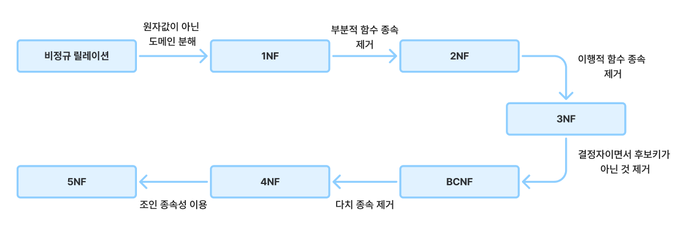

# 정규화 (Normalization)

[정규화(Normalization) | 👨🏻‍💻 Tech Interview](https://gyoogle.dev/blog/computer-science/data-base/Normalization.html)

**<목차>**

---

# **정규화(Normalization)**란?

## 정규화의 개념

<aside>
💡

데이스베이스 설계에서 데이터 중복을 줄이고 데이터 무결성을 높이기 위해, **데이터베이스 테이블을 구조화하는 과정**

→ 데이터베이스를 여러 개의 관련된 테이블로 나누고, 각 테이블이 하나의 주제를 나타내도록 함

</aside>

## 정규화의 목적

목표 = 테이블 간 **중복된 데이터를 허용하지 않는 것**

정규화를 하는 이유

- 데이터 중복을 제거하여 저장 공간을 절약하고, 일관성을 유지 (불필요한 데이터 최소화)
- 데이터의 무결성 보장
- 이상 현상 방지
- 테이블 구성을 논리적이고 직관적으로 구현 가능
- 데이터베이스 구조 확장에 용이

## 정규화의 장/단점

### 정규화의 장점

- 데이터베이스 변경 시, 이상현상이 발생하는 문제점을 해결 가능
- 데이터베이스 구조 확장 시,
  정규화된 데이터베이스는 그 구조를 변경하지 않아도 되거나 일부만 변경해도 됨

### 정규화의 단점

- 릴레이션(테이블) 분해로 인해 릴레이션 간의 연산(JOIN 연산)이 증가
  → 질의에 대한 응답 시간이 느려짐

# **정규화 과정**

**정규화 단계 흐름**



## **제 1 정규형 (1NF : First Normal Form)**

> 테이블의 컬럼이 원자값(Atomic Value)을 가지도록 테이블을 분해하는 것

만족해야 할 조건

1. 어떤 릴레이션에 속한 모든 도메인이 원자값으로만 이루어져 있어야 함 (= 하나의 속성)
2. 기본키를 사용하여 관련 데이터의 각 집합을 고유하게 식별할 수 있어야 함
3. 모든 속성에 반복되는 그룹이 나타나지 않아야 함
4. 하나의 컬럼은 같은 종류나 타입(type)의 값을 가져야 함
5. 각 컬럼이 유일한(unique) 이름을 가져야 함
6. 컬럼의 순서가 상관없어야 함

## **제 2 정규형 (2NF : Second Normal Form)**

> 제1 정규형을 만족한 테이블에 대해 완전 함수 종속을 만족하도록 테이블을 분리하는 것
>
> = 기본 키 중 일부 키에만 종속되는 값이 없어야 함 (부분 종속 X)

만족해야 할 조건

1. 제 1정규형을 만족해야 함
2. 모든 컬럼이 부분적 종속이 없어야 함 (= 테이블의 모든 컬럼이 완전 함수 종속을 만족해야 함)

```
**💡 부분 함수 종속 (Partial Functional Dependency)**
		: 기본키 중에 특정 컬럼에만 종속되는 것

**💡 완전 함수 종속 (Full Functional Dependency)**
		: 기본키의 부분집합이 결정자가 되어선 안 된다는 것
```

ex)


**`(학생번호, 과목) 복합키 = 기본키`**라고 하자

특정 과목의 지도교수는 과목명만 알면 알 수 있음

= 지도교수 컬럼이 (학생번호, 과목)에 종속되지 않고 (과목)에만 종속적…

제 2 정규형을 통해 분리하면?


## **제 3 정규형 (3NF : Third Normal Form)**

> 제 2 정규형을 진행한 테이블에 대해 이행적 종속을 없애도록 테이블을 분해하는 것

만족해야 할 조건

1. 제 2정규형을 만족해야 함
2. 기본키를 제외한 속성들간의 이행 종속성(Transitive Dependency)이 없어야 함

   = 기본키가 아닌 속성들은 기본키에 의존해야 함

```
**💡 이행 함수 종속 (Transitive Functional Dependency)**
		: A → B, B → C 일 때 A → C 를 만족하는 것
```

ex)


`ID → 등급`, `등급 → 할인율`, `ID → 할인율` 을 만족…이행 함수 종속이 존재!

제 3 정규형을 통해 분리하면?


## **보이스-코드 정규화 (BCNF : Boyce-Codd Normal Form)**

> 제 3 정규형을 진행한 테이블에 대해 모든 결정자가 후보키가 되도록 테이블을 분리하는 것

만족해야 할 조건

1. 제 3정규형을 만족해야 함
2. 모든 결정자가 후보키 집합에 속해야 함

ex)


**`(학생번호, 과목)`** 기본키로 지도교수를 알 수 있는 테이블,

그러나 지도교수를 알면 과목도 알 수 있음… **지도교수 → 과목**이 종속적

후보키 집합에 속하지 않은 결정자가 존재 = BCNF를 만족하지 않음!

BCNF를 통해 분리하면?


## **제 4 정규형 (4NF : Fourth Normal Form)**

> 다치 종속을 제거하여 한 속성이 다른 속성에 다치(복수) 종속되지 않도록 하는 것

만족해야 할 조건

1. BCNF를 만족해야 함
2. 다중값 종속(다치 종속)이 없어야 함

```
**💡 다치 종속 (Multi-valued Dependency)**
		: 같은 테이블 내의 독립적인 두 개 이상의 컬럼이 또 다른 컬럼에 종속되는 것
		ex) A → B 인 의존성에서 단일 값 A와 다중 값 B가 존재한다면 다치 종속 (A ↠ B)
```

ex)


**`Person ↠ Mobile`** 과 **`Person ↠ Food_Likes`** 두 가지 의존성을 가지는 테이블

= 다치 종속이 존재!

제 4 정규형을 통해 분리하면?


## 제 5 정규형 (5NF : **Fifth Normal Form**)

> 조인 종속을 제거하여 무손실 분해가 가능한 최소 단위의 관계로 분해하는 것

만족해야 할 조건

1. 4NF를 만족해야 함
2. 더 이상 비손실 분해를 할 수 없어야 함

```
**💡 조인 종속 (Joint dependency)**
		: 하나의 릴레이션을 여러개의 릴레이션으로 분해하였다가 다시 조인했을 때,
		  데이터 손실이 없고 필요없는 데이터가 생기는 것
		  (조인 종속성은 다치 종속의 개념을 더 일반화한 것)
```

ex)

위의 4NF 테이블에 대해 조인 연산을 수행하면 다음과 같은 결과…


위 테이블을 보면 제 4정규화를 수행하기 전 데이터와 다름,

데이터 손실은 없지만 필요없는 데이터가 추가적으로 생김 = 5NF 만족 X

제 5 정규형을 통해 분리하면?


---

_참고 자료_

[정규화 (1NF, 2NF, 3NF, BCNF, 4NF, 5NF)](https://velog.io/@wisdom-one/%EC%A0%95%EA%B7%9C%ED%99%94Normalization)

[[CS] DataBase 정규화(Normaliztion)란 ?](https://chanhan.tistory.com/entry/CS-DataBase-%EC%A0%95%EA%B7%9C%ED%99%94Normaliztion%EB%9E%80)

[[CS] 정규화](https://velog.io/@jae9380/CS-%EC%A0%95%EA%B7%9C%ED%99%94#%EB%B3%B4%EC%9D%B4%EC%8A%A4-%EC%BD%94%EB%93%9C-%EC%A0%95%EA%B7%9C%ED%98%95-bcnf-boyce-codd-normal-form)

[[CS]정규화란?](https://bin-kkwon.tistory.com/entry/CS%EC%A0%95%EA%B7%9C%ED%99%94%EB%9E%80)

[[CS/Database] 정규화 :: 개발 기록](https://hsyr1791.tistory.com/148)

[데이터베이스 정규화(Normalization)란](https://hongcoding.tistory.com/147)
