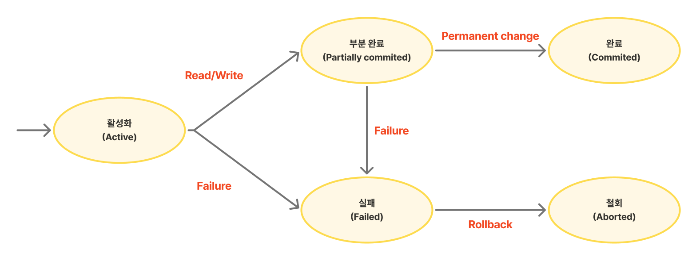

# 트랜잭션 (Transaction)

[DB 트랜잭션(Transaction) | 👨🏻‍💻 Tech Interview](https://gyoogle.dev/blog/computer-science/data-base/Transaction.html)

**<목차>**

---

# **트랜잭션(Transaction)이란?**

## 트랜잭션의 개념

<aside>
💡

데이터베이스의 상태를 변화시키기 위해 수행하는 논리적 작업 단위

= 여러 개의 SQL 명령(INSERT, UPDATE, DELETE 등)을 **하나의 묶음으로 처리**하는 개념

</aside>

하나의 작업을 수행하기 위해 필요한 데이터베이스 연산 기능들을 모아놓은 것

→ 분리되지 않도록 하여 작업의 완전성을 보장해줌

상태를 변화시킨다는 것 → **SQL 질의어를 통해 DB에 접근하는 것**

```sql
- SELECT
- INSERT
- DELETE
- UPDATE
```

## 트랜잭션의 필요성

_ex) 은행에서 A 계좌에서 출금하여 B 계좌로 송금하는 상황 (트랜잭션 = ‘거래’)_

1. A은행에서 출금이 이루어지고, B은행으로 송금이 진행
2. 송금 중 오류가 발생하여 A계좌에서는 돈이 빠져나갔지만 B계좌에는 입금되지 않음
3. 단순히 출금을 취소하거나 다시 송금하는 방법 → 다른 오류 발생 가능성⬆️
4. 이 때 **트랜잭션**을 사용! (거래 안정성 확보)

= 모든 작업이 **성공적으로 완료되어야만** 최종적으로 승인(Commit)되고, 도중에 오류가 발생하면 **처음부터 없었던 것처럼 복구(Rollback)**되도록 하기

DB에서는 처리 과정이 모두 성공했을 때만 최종적으로 데이터베이스에 반영

```sql
DB 작업
1. 사용자 A의 계좌에서 만원을 차감 : UPDATE 문을 사용해 사용자 A의 잔고 변경
2. 사용자 B의 계좌에 만원을 추가 : UPDATE 문을 사용해 사용자 B의 잔고 변경

작업 단위 : 출금 UPDATE문 + 입금 UPDATE문 (= 트랜잭션)
- 위 두 쿼리문 모두 성공적으로 완료되어야만 "하나의 작업(트랜잭션)"이 완료되는 것 (Commit)
- 단위 안의 쿼리 중 하나라도 실패하면, 모든 쿼리문을 취소하고 이전 상태로 복구 (Rolllback)
```

## **트랜잭션의 상태**



- **`활성화(Active)`**
  : 트랜잭션이 작업을 시작하여 실행 중인 상태
- **`실패(Failed)`**
  : 트랜잭션에 오류가 발생하여 실행이 중단된 상태
- **`철회(Aborted)`**
  : 트랜잭션이 비정상적으로 종료되어 Rollback 연산을 수행한 상태
- **`부분 완료(Partially commited)`**
  : 트랜잭션을 다실행하고 commit 요청이 들어온 직후의 상태 (최종 결과를 아직 DB에 반영하지 않음)
- **`완료(Commited)`**
  : 트랜잭션이 성공적으로 종료되어 commit 연산을 실행한 후의 상태

## 트랜잭션의 연산

### **Commit**

> 하나의 트랜잭션이 성공적으로 종료된 후 DB가 일관성있는 상태를 유지할 때, 갱신 연산이 완료되었음을 트랜잭션 관리자에게 알려준 후 결과를 최종적으로 DB에 반영하는 연산

`Commit`을 수행하면? 이전 데이터가 완전히 **UPDATE** 됨

### **Rollback**

> 하나의 트랜잭션이 비정상적으로 종료되어 DB의 일관성을 잃었을 때, 연산 내용을 취소하고 트랜잭션 수행 이전의 상태로 돌아가게 하는 연산 (커밋하여 저장된 것만 복구)


Rollback을 수행하면? → 해당 트랜잭션을 **재시작하거나 폐기**

### Savepoint

> 트랜잭션 내에서 특정 시점을 임시로 저장하는 연산

- save point를 지정하면 rollback시 해당 지정된 위치로 복원이 가능
- save point 명령어로 지점을 지정하고 rollback 명령어로 복원

### Truncate

> 지정된 테이블의 모든 데이터를 지우는 연산

- 지정된 테이블의 모든 데이터를 지움
- 커밋이 자동으로 되므로 Rollback이 불가능 (≠ delete)
- Truncate는 수행하는 순간 바로 커밋을 날리며 이를 DB에 반영하므로 Rollback이 불가능

# 트랜잭션의 특징 - ACID

## 원자성(Atomicity)

> 트랜잭션이 DB에 모두 반영되거나, 혹은 전혀 반영되지 않아야 된다.
>
> → 하나의 트랜잭션에서 일부 연산만 실행되면 안됨

실행 도중에 오류가 발생하여 작업을 완료하지 못함 = 트랜잭션 전체 취소 후 수행 이전으로 돌아가기

## 일관성(Consistency)

> 트랜잭션이 완료된 상태에서도 트랜잭션 이전의 상황과 동일하게 데이터의 일관성이 있어야 한다.

## 독립성(Isolation)

> 트랜잭션은 다른 트랜잭션에 간섭을 주거나 받지 않고 독립적으로 수행되어야 한다.

둘 이상의 트랜잭션이 병행 실행되는 경우, 현재 수행 중인 트랜잭션이 완료되기 전에 현재 트랜잭션이 생성한 중간 연산 결과에 다른 트랜잭션이 접근하면 안 됨

## 지속성(Durability)

> 트랜잭션이 성공적으로 완료되었다면, 해당 결과는 영구적으로 반영되어야 한다.

시스템의 장애가 발생하더라도 결과는 데이터베이스에 그대로 남아있어야 하며, 이러한 지속성을 보장하기 위해서는 회복 기능이 필요함

# **트랜잭션 관리를 위한 DBMS의 전략**

## DBMS의 구조

- DBMS 구조의 종류 (2가지) : Storage System (저장 시스템), Query Processor (질의 처리기)
  - 저장 시스템 = 비휘발성 저장 장치
- 입출력 단위 : 고정 길이의 페이지 단위로 disk에서 입출력이 이루어짐
- 저장 공간 : 비휘발성 저장 장치인 disk에 저장, 일부분을 Main Memory에 저장


## Page Buffer Manager / Buffer Manager

> DBMS의 Storage System에 속하는 모듈 중 하나로, 메인 메모리에 유지하는 페이지를 관리하는 모듈

버퍼가 **언제 디스크에 쓰는지(write)**에 따라…

→ 장애가 발생했을 때 **어떤 복구 방식(UNDO/REDO)**을 써야 하는지 달라짐!

**버퍼 관리 정책**은 트랜잭션 관리에 매우 중요한 결정을 줌

## UNDO

> 트랜잭션이 비정상적으로 종료되었을 때, 이미 반영된 변경 사항을 원래 상태로 되돌리는 복구 연산

**UNDO 필요성**

- DBMS의 버퍼 교체 알고리즘은 트랜잭션과 무관하게 작동…
  버퍼 교체는 **트랜잭션의 완료 여부와 상관없이**, **버퍼 상태**(가득 참, 교체 필요 등)에 따라 발생
      → 아직 커밋되지 않은 수정된 페이지가 디스크에 써질 수도 있음 (= 잘못된 데이터)
  이를 **복구**하기 위해 UNDO가 필요!

**정책 구분 기준**

: 수정된 페이지를 디스크에 쓰는 시점

**UNDO의 정책 종류**

```sql
**STEAL**
 : 수정된 페이지를 언제든지 디스크에 쓸 수 있는 정책
	 (대부분의 DBMS가 채택하는 버퍼 관리 정책, UNDO logging과 복구 필요)

**¬STEAL**
 : 수정된 페이지들을 최소한 트랜잭션 종료 시점(EOT)까지는 버퍼에 유지하는 정책
	 (UNDO 작업이 필요하지 않지만, 매우 큰 메모리 버퍼가 필요)
```

## REDO

> 이미 commit한 트랜잭션의 수정을 재반영하는 복구 작업 (버퍼 관리 정책에 영향을 받음)

**정책 구분 기준**

: 트랜잭션이 종료되는 시점에 해당 트랜잭션이 수정한 페이지들을 디스크에도 쓸 것인지…

**REDO의 정책 종류**

```sql
**FORCE**
 : 수정했던 모든 페이지를 트랜잭션 커밋 시점에 디스크에 반영하는 정책
	 (트랜잭션이 커밋되었을 때 수정된 페이지들이 디스크에 반영되니 REDO 필요 X)

**¬FORCE**
 : 수정했던 페이지를 트랜잭션 커밋 시점에 디스크에 반영하지 않는 정책
	 (트랜잭션이 디스크 상의 DB에 반영되지 않을 수 있으니 REDO 복구 필요)
```

---

_참고 자료_

[[CS] 트랜잭션( Transaction )](https://velog.io/@wonizizi99/CS-%ED%8A%B8%EB%9E%9C%EC%9E%AD%EC%85%98-Transaction)

[[DB] 9. 트랜잭션(Transaction) - (1) 특성, ACID, 연산, 상태](https://rebro.kr/162)

[[TIL][CS] 트랜잭션과 ACID, 트랜잭션의 고립 수준](https://developer-jinnie.tistory.com/31)

[[CS 지식] 트랜잭션의 의미와 특징 — 놓지 말고 꽉 자바](https://defyuil.tistory.com/258)

[[데이터베이스] 트랜잭션개념 및 COMMIT/ROLLBACK 예제](https://infjin.tistory.com/137)

[mysql 학습정리 : 트랜잭션 (rollback, commit, savepoint, truncate)](https://ws-pace.tistory.com/154)

[[데이터베이스] Commit과 Rollback — CHY'S IT](https://choi-hee-yeon.tistory.com/224)

[[DB] DBMS는 어떻게 트랜잭션을 관리할까?](https://velog.io/@sjhgd107/DBMS%EB%8A%94-%EC%96%B4%EB%96%BB%EA%B2%8C-%ED%8A%B8%EB%9E%9C%EC%9E%AD%EC%85%98%EC%9D%84-%EA%B4%80%EB%A6%AC%ED%95%A0%EA%B9%8C)

[DB - 트랜잭션 관리 :: JackCokebb dev blog](https://jackcokebb.tistory.com/17)
