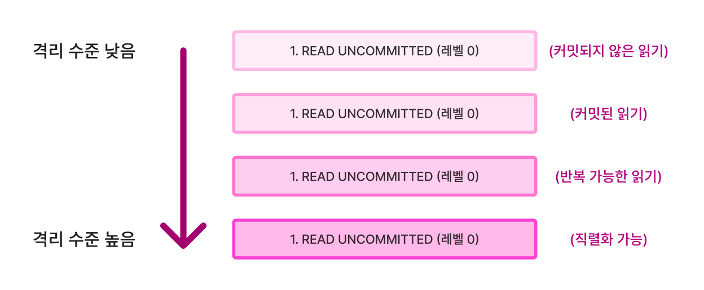

# 트랜잭션 격리 수준 (Transaction Isolation Level)

[트랜잭션 격리 수준(Transaction Isolation Level) | 👨🏻‍💻 Tech Interview](https://gyoogle.dev/blog/computer-science/data-base/Transaction%20Isolation%20Level.html)

**<목차>**

---

# **트랜잭션 격리 수준이란?**

## **트랜잭션 격리 수준의 개념**

<aside>
💡

트랜잭션에서 일관성 없는 데이터를 허용하도록 하는 수준

= 한 트랜잭션이 사용 중인 데이터에 대해 다른 트랜잭션의 **접근 허용 정도**를 결정하는 것

</aside>

## **트랜잭션 격리 수준의 필요성**

- 데이터베이스는 **ACID 원칙** 중, **Isolation(독립성)**을 유지해야 함
- 트랜잭션이 실행되는 동안 다른 트랜잭션이 해당 데이터에 접근하지 못하도록 **Locking**을 통해 제어
- 하지만 모든 트랜잭션에 Lock을 걸면? **동시성이 떨어지고 성능 저하**
- 반대로 Lock의 범위를 너무 줄이면? **잘못된 값(Dirty Read 등)**이 처리될 가능성 ⬆️

**데이터 무결성과 성능 간의 균형**을 맞추기 위해, 효율적인 Locking과 적절한 격리 수준 설정 필요

## 선택 시 고려사항

격리 수준(Isolation Level)에 대한 조정 = 동시성과 데이터 무결성에 연관

**영향 요인**

- 동시성을 증가 → 데이터 무결성에 문제가 발생
- 데이터 무결성 유지 → 동시성 감소
- 레벨을 높게 조정할수록 발생하는 비용 증가

# 트랜잭션 격리 수준의 단계

## 1. READ UNCOMMITTED **(레벨 0)**

> 각 트랜잭션의 변경 내용이 COMMIT, ROLLBACK 여부에 상관 없이 다른 트랜잭션에서 조회 가능한
>
> 격리 수준 (SELECT 문장이 수행되는 동안, 해당 데이터에 Shared Lock이 걸리지 않는 계층)

레벨 0 특징

- 정합성에 문제가 많은 격리 수준이니, 사용하는 것 권장 X
- 데이터베이스의 일관성을 유지하는 것 = 불가능
- DIRTY READ 발생
- 데이터 정합성을 신경쓰지 않음 → DB Lock이 거의 사용되지 않으니 동시성 ⬆️

## 2. READ COMMITTED **(레벨 1)**

> 커밋이 완료된 트랜잭션의 변경사항만 다른 트랜잭션에서 조회할 수 있도록 허용하는 격리 수준
>
> (SELECT 문장이 수행되는 동안 해당 데이터에 Shared Lock이 걸리는 계층)

레벨 1 특징

- 트랜잭션이 수행되는 동안 다른 트랜잭션이 접근 불가능 → 대기하게 됨
- Commit이 이루어진 트랜잭션만 조회 가능
- 대부분의 SQL 서버가 Default로 사용하는 격리 수준

## 3. REPEATABLE READ **(레벨 2)**

> 트랜잭션이 시작되기 전에 커밋된 내용에 대해서만 조회할 수 있는 격리 수준

레벨 2 특징

- 트랜잭션이 범위 내에서 조회한 데이터 내용이 항상 동일함을 보장
- 다른 사용자는 트랜잭션 영역에 해당되는 데이터에 대한 수정 불가능
- MySQL에서 기본으로 사용하는 격리 수준

## 4. SERIALIZABLE **(레벨 3)**

> 하나의 트랜잭션에서 읽고 쓰는 레코드를 다른 트랜잭션에서 절대 접근할 수 없는 격리 수준

레벨 3 특징

- 완벽한 읽기 일관성 모드를 제공
- 다른 사용자는 트랜잭션 영역에 해당되는 데이터에 대한 수정 및 입력 불가능
- 데이터 정합성이 가장 잘 지켜지는 격리 수준
- 데이터 정합성에 엄격 → DB Lock이 많이 걸리니 동시성 ⬇️

# 트랜잭션 격리 수준별 발생 문제

## **Dirty Read**

> 커밋되지 않은 수정 중인 데이터를 다른 트랜잭션에서 읽을 수 있도록 허용할 때 발생하는 현상
>
> = 아직 커밋되지 않은 상태의 데이터를 읽는 것 (변경사항 등…)

발생 Level : **`Read Uncommitted`**

ex)

트랜잭션 1에서 data2를 insert 하고, 커밋 안 된 상태에서 트랜잭션 2가 아직 커밋X인 data2를 읽음

→ 해당 data2는 커밋될지, 롤백될지 알 수 없음

## **Non-Repeatable Read**

> 하나의 트랜잭션에서 같은 쿼리를 두 번 수행할 때, 그 사이에 다른 트랜잭션 값을 수정 또는 삭제하면서 두 쿼리의 결과가 상이하게 나타나는 일관성이 깨진 현상

발생 Level : **`Read Committed`**, **`Read Uncommitted`**

ex)

첫번째 Read와 두 번째 Read 사이에 다른 트랜잭션에서 값을 변경하거나 삭제

→ 결과가 다르게 나타날 수 있음 (트랜잭션의 일관성을 해침)

트랜잭션1은 key=2인 데이터를 두 번 읽는데, select1와 select2 사이에 해당 데이터가 수정됨

**→ select1의 결과와 select2의 결과가 달라지게 됨**

## **Phantom Read**

> 하나의 트랜잭션 안에서 일정 범위의 레코드를 두 번 이상 읽었을 때, 첫 번째 쿼리에서는 없던 레코드가 두번째 쿼리에서 나타나는 현상 (중간에 레코드를 새로 삽입하면 나타날 수 있음)

발생 Level : **`Repeatable Read`**, **`Read Committed`**, **`Read Uncommitted`**

ex)

트랜잭션 1은 key = 1 ~ 3의 데이터를 두 번 조회하고,

트랜잭션 2에서 Select1과 Select2 사이의 시점에 data3을 저장하고 커밋

→ Select1에서는 두 개의 데이터가 조회되고, Select2에서는 세 개의 데이터가 조회됨

---

_참고 자료_

[[데이터베이스] 트랜잭션 격리 수준(Isolation level)](https://velog.io/@yujiniii/%EB%8D%B0%EC%9D%B4%ED%84%B0%EB%B2%A0%EC%9D%B4%EC%8A%A4-%ED%8A%B8%EB%9E%9C%EC%9E%AD%EC%85%98-%EA%B2%A9%EB%A6%AC-%EC%88%98%EC%A4%80)

[[DB] 트랜잭션 격리 수준 알아보기 — 성장하는 성하 Blog](https://ksh-coding.tistory.com/118)

[[Database] 트랜잭션의 격리성 문제 - Dirty Read / Non-Repeatable Read / Phantom Read — HS_dev_log](https://innovation123.tistory.com/166)

[트랜잭션 격리 수준이란 무엇이고 왜 필요할까](https://velog.io/@balparang/%ED%8A%B8%EB%9E%9C%EC%9E%AD%EC%85%98-%EA%B2%A9%EB%A6%AC-%EC%88%98%EC%A4%80%EC%9D%B4%EB%9E%80-%EB%AC%B4%EC%97%87%EC%9D%B4%EA%B3%A0-%EC%99%9C-%ED%95%84%EC%9A%94%ED%95%A0%EA%B9%8C)
