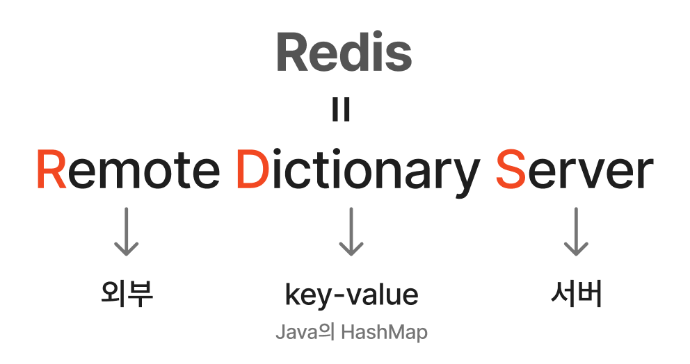

# 레디스 (Redis)

[Redis | 👨🏻‍💻 Tech Interview](https://gyoogle.dev/blog/computer-science/data-base/Redis.html)

**<목차>**

---

# 레디스(Redis)란?

## 레디스의 개념

<aside>
💡

모든 데이터를 메모리로 불러와서 처리하는 메모리 기반의 key-value 구조의 데이터 관리 시스템(DBMS) → 일종의 NoSQL

= 비정형 데이터를 저장하는 비관계형 데이터베이스 관리 시스템

</aside>

보통 데이터베이스는 하드 디스크나 SSD에 저장됨

→ Redis는 메모리(RAM)에 저장하기 때문에 디스크 스캐닝이 필요없어 매우 빠름!

_(디스크 스캐닝 : 디스크에 저장된 데이터를 탐색하고 읽어오는 과정)_

**[추가 기능]**

Redis는 캐싱도 가능 → 실시간 채팅에 적합,

세션 공유(= 세션 데이터를 여러 서버 간에 공유)를 위해서 세션 클러스터링에도 활용

RAM은 휘발성, 즉 전원이 꺼지면 데이터가 사라질 수 있음

백업 과정

- snapshot : 특정 지점을 설정하고 디스크에 백업
- AOF(Append Only File) : 실행된 명령(쿼리)을 기록해두며, 시스템 재시작 시 이를 복구

## 레디스 사용 방법

### 1. 로컬 환경에서 직접 설치하여 사용

- ex) AWS EC2 인스턴스에 Redis를 설치해, 해당 인스턴스의 메모리를 활용하는 방식
- 인스턴스 메모리에 여유가 있다면 **비용적/사용적 측면으로 성능 ⬆️**

### 2. 클라우드 서비스(외부 리소스) 이용

- ex) AWS ElastiCache, Redis Labs 등 **서드파티 Redis 서비스** 활용
- 여러 웹 서버가 하나의 Redis 인스턴스를 **공유 메모리처럼 사용** 가능
- 서버 간 세션이나 캐시를 **중앙에서 통합 관리**할 때 적합

## 레디스 사용 이유

- **데이터 캐싱으로 성능 향상 가능**
  1. Redis에 데이터를 **임시로 캐싱(cache)** → 자주 접근하는 데이터를 메모리에서 즉시 처리 가능
  2. 일정 주기마다 RDS에 동기화 → 부하⬇️, **응답 속도와 성능⬆️**
- **세션 관리 및 사용자 상태 유지 가능**
  1. Redis는 사용자의 로그인 세션이나 활동 정보를 저장하고 **여러 서버 간에 공유 가능**
  2. 사용자의 세션을 유지하거나 불러오고, 여러 활동들을 추적하는 것에 매우 효과적
- **메시지 큐로 활용 가능**
  1. Redis는 **매우 빠른 처리 속도**를 가지고 있어 메시지 큐잉에도 사용 가능

# **캐시 서버(Cache Server)**

데이터베이스는 데이터를 디스크에 저장 → **안정성은 높지만, 접근 속도가 느림…**

즉, 사용자가 많아질수록 디스크 접근이 반복되어 **DB 부하가 증가하고 성능이 저하될 가능⬆️**

이를 해결하기 위해 **캐시 서버(Cache Server)**를 사용하며, **Redis**가 해당 역할을 수행 가능!

캐시 서버의 역할

- 자주 요청되는 데이터를 **임시 메모리 공간(RAM)에 저장**하여 빠르게 응답 가능
- 같은 요청이 반복될 때, DB를 다시 조회하지 않고 **캐시된 결과를 즉시 반환**
- DB 부하를 줄이고 **서비스 속도와 효율을 향상**시킴

# 레디스의 자료 구조

개발의 편의성⬆️, 난이도 ⬇️

### 문자열 (String)

- 가장 기본적인 데이터 타입
- 대부분의 데이터가 문자열 형태로 표현됨
- 512MB까지 저장 가능

### 집합 (Set)

- 중복이 없는 String 집합
- 특정 값의 존재 여부 확인이나 교집합/합집합 연산에 유리
- **Sorted Set(정렬된 집합)**을 사용하면 특정 기준 값에 들어온 데이터만 필터링 가능

### 해시 (Hash)

- 하나의 키에 여러 필드(field)와 값을 저장 가능
- 관계형 DB의 “행(Row)”처럼 구조화된 데이터 저장에 적합

### 리스트 (List)

- 연결 리스트 형태로, 왼쪽 또는 오른쪽에서 엘리먼트를 추가/삭제 가능 (push/pop)
- 메시지 큐, 작업 대기열(queue) 등 순차적 데이터 처리에 유용
- 양방향 연결리스트도 가능

---

_참고 자료_

[[CS 지식] redis](https://alpha.velog.io/@hsshin0602/%EC%BA%A1%EC%8A%A4%ED%86%A4-%EB%94%94%EC%9E%90%EC%9D%B8-redis)
