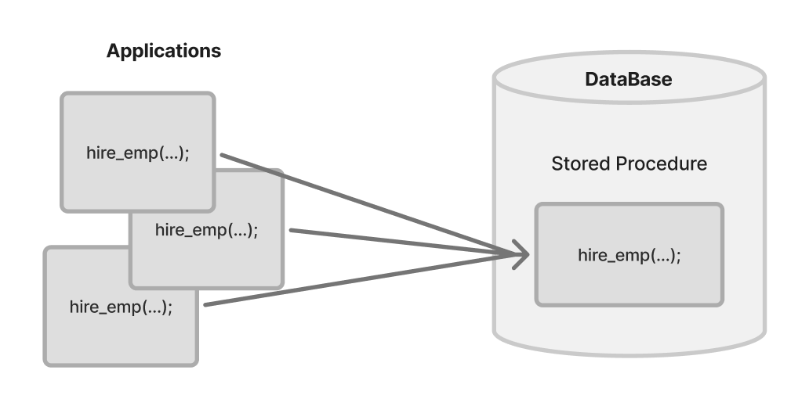

# 저장 프로시저 (Stored PROCEDURE)

[저장 프로시저(Stored PROCEDURE) | 👨🏻‍💻 Tech Interview](https://gyoogle.dev/blog/computer-science/data-base/Stored%20PROCEDURE.html)

**<목차>**

---

# **저장 프로시저(Stored PROCEDURE)란?**

<aside>
💡

DB 내부에 저장된 일련의 SQL 명령문들을 하나의 함수처럼 실행하기 위한 쿼리의 집합

=  **특정 로직의 쿼리를 함수로 만들어 놓은 것**

</aside>



**프로시저의 특징**

- 어떠한 동작을 일괄 처리하기 위한 용도로 사용 가능
- 자주 사용되는 일반적인 쿼리를 모듈화시켜서 필요할 때마다 호출 가능
- 테이블처럼 각 데이터베이스 내부에 저장

**프로시저를 사용하는 경우**

- 여러줄의 쿼리문을 한 번의 요청으로 실행하여 결과물을 얻고자 할 때…
- 인자 값만 상황에 따라 바뀌고 동일한 로직의 복잡한 쿼리문을 여러 번 작성해야 할 때…

**프로시저와 함수의 비교**

- 프로시저
  - 일련의 작업을 저리한 절차
  - 리턴값이 없거나 많음
  - 서버에서 실행되어 속도가 빠름
- 함수
  - 여러 작업을 위한 기능
  - 리턴값 필수
  - 클라이언트에서 실행되어 프로시저보다 느림

# **일반 쿼리문 vs 저장 프로시저**

## 일반 쿼리문 작동 방식


일반 방식은 쿼리문 한 줄만 실행하려 해도 위처럼 많은 과정을 계속 거쳐야 함…

### **일반 쿼리문 작동 방식 세부 내용**

_ex) 예시 쿼리문_

```sql
SELECT name FROM userTbl;
```

1. **`구문 분석`** : 구문 자체에 오류가 없는지 분석하고, 오타가 있다면 이 단계에서 에러 메시지 출력
2. **`개체 이름 확인`** : “userTbl” 이라는 테이블이 현재 DB에 있는지 확인하고, 만약 “userTbl”이 있으면 안에 “name”이라는 열이 있는지를 확인
3. **`사용 권한 확인`** : “userTbl”을 현재 접근 중인 사용자가 권한이 있는지 확인
4. **`최적화`** : 해당 쿼리문이 가장 좋은 성능을 낼 수 있는 경로 결정
5. **`컴파일 및 실행 계획 등록`** : 해당 실행 계획 결과를 **메모리(캐시)**에 등록
6. **`실행`** : 컴파일된 결과 **실행**

## 저장 프로시저 작동 방식

### **1. 저장 프로시저 정의 단계**


- **`구문분석`** : 구문의 오류 파악
- **`지연된 이름 확인`** : 저장 프로시저를 정하는 시점에서 해당 개체가 존재하지 않아도 상관없음
      → 프로시저 실행 당시에 테이블 존재 여부를 확인함(개체 이름 확인)
- **`생성 권한 확인`** : 현재 사용자가 저장 프로시저를 생성할 권한이 있는지 확인
- **`시스템 테이블 등록`** : 저장 프로시저의 이름 및 코드가 시스템 테이블에 등록

### 2. **처음으로 저장 프로시저를 실행**


지연된 이름 확인에서 미루어 두었던 해당 **개체 존재 유무**를 개체 이름 확인을 통해 수행

### 3. **이후의 저장 프로시저 실행**


두 번째 실행부터는 메모리(캐시)에 있는 것을 그대로 가져와 재사용 = **수행 시간 단축**

# **저장 프로시저의 장/단점**

## 저장 프로시저의 장점

**1. SQL Server의 성능 향상 가능**

- 프로시저 최초 실행 시 최적화 상태로 컴파일 & 그 이후부터 프로시저 캐시에 저장 (속도 ⬆️)
- 여러 개의 쿼리를 한번에 실행 가능

**2. 유지보수 및 재활용 측면에서 효율적**

- 작업이 변경될 때, 다른 작업은 건드리지 않고 프로시저 내부에서 수정만 하면 됨
- 한번 저장 프로시저를 생성해 놓으면, 언제든 다시 실행 가능 = 재활용 가능

**3. 보안 강화 가능 - 권한 체계**

- 사용자에게 테이블 접근 권한이 아닌 프로시저 접근 권한을 부여 → 프로시저에서 선택한 정보만 보여줌
  (모든 정보에 대한 노출을 막아 보안 ⬆️)

**4. 네트워크의 부하(전송량) 감소**

- 프로시저를 사용하면, 서버 내부에서 이동하는 모든 데이터를 임시 테이블 혹은 변수에 저장 가능
- 클라이언트가 직접 SQL문을 작성하지 않고, 프로시저 명에 매개변수만 담아 전달
  → SQL문이 서버에 이미 저장되어 있으니 클라이언트와 서버 간 네트워크 상의 트래픽 감소

## 저장 프로시저의 단점

**1. DB 확장의 어려움 (호환성이 낮음)**

- 서버의 수를 늘려야 할 때, DB의 개수를 늘리는 것이 어려움
- DB 교체가 거의 불가능
- 구문 규칙이 SQL / PSM 표준과의 호환성이 낮음 → 코드 자산으로의 재사용성 ⬇️

**2. 데이터 분석의 어려움 (디버깅 문제)**

- 개발된 프로시저가 여러 곳에서 사용 될 경우, 수정했을 때 영향의 분석이 어려움
  (별도의 Description 사용)
- APP에서 SP를 호출하여 사용하는 경우, 문제가 생겨도 해당 이슈에 대한 추적이 어려움
  (별도의 에러 테이블 사용)
- 배포, 버전 관리 등에 대한 이력 관리가 어려움

**3. 낮은 처리 성능**

- 문자, 숫자열 연산에 SP를 사용하면 C, Java보다 성능 저하

# 저장 프로시저 문법 & 예시

**MySQL용 프로시저 문법**

```sql
DELIMITER $$

CREATE PROCEDURE 프로시저명(
    IN 변수1 데이터타입,
    OUT 변수2 데이터타입
)
BEGIN
    SET 변수2 = CONCAT('입력값은 ', 변수1);
END$$

DELIMITER ;

CALL 프로시저명('테스트', @결과);
SELECT @결과;
```

**ex1) IN**

```sql
DELIMITER $$

CREATE PROCEDURE test_in(IN name VARCHAR(50))
BEGIN
    SELECT CONCAT('내 이름은 ', name) AS result;
END$$

DELIMITER ;

-- 호출
CALL test_in('규글');
```


_예시1 출력 결과_

**ex2) OUT**

```sql
DELIMITER $$

CREATE PROCEDURE test_out(OUT name VARCHAR(50))
BEGIN
    SET name = 'Gyoogle';
END$$

DELIMITER ;

-- 호출
CALL test_out(@out_name);
SELECT CONCAT('내 이름은 ', @out_name) AS result;
```


_예시2 출력 결과_

---

_참고 자료_

[저장 프로시저 (Stored Procedure)](https://velog.io/@sweet_sumin/%EC%A0%80%EC%9E%A5-%ED%94%84%EB%A1%9C%EC%8B%9C%EC%A0%80-Stored-Procedure#%EC%A0%80%EC%9E%A5-%ED%94%84%EB%A1%9C%EC%8B%9C%EC%A0%80%EB%9E%80)

[[DB/데이터베이스] 저장 프로시저(Stored Procedure)](https://eunsun-zizone-zzang.tistory.com/52)

[저장 프로시저, 트리거](https://willgetjob.tistory.com/39)

[[CS] 저장 프로시저(Stored Procedure)의 정의와 활용 :: 하루하루 개발 일기](https://daily-programmers-diary.tistory.com/16)
