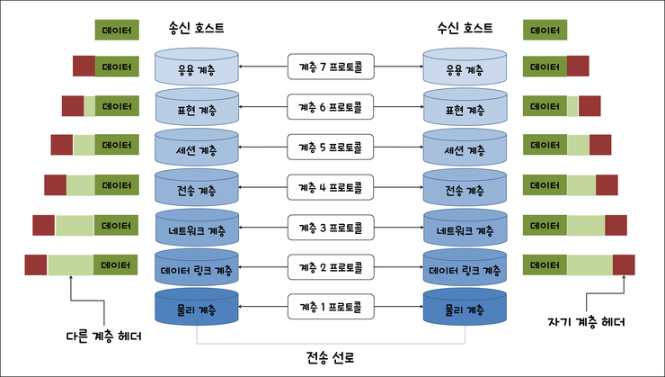

# OSI 7 계층

[OSI 7 계층 | 👨🏻‍💻 Tech Interview](https://gyoogle.dev/blog/computer-science/network/OSI%207%EA%B3%84%EC%B8%B5.html)

**<목차>**

---

# **OSI 7계층이란?**

## OSI 7계층의 개념

<aside>
💡

OSI(Open Systems Interconnection) 7계층은 **국제 표준화 기구(ISO)에서 개발한 컴퓨터 네트워크 프로토콜 모델**

</aside>

- 네트워크에서 통신이 일어나는 과정을 7단계로 나눈 것
- 시스템 상호 연결에 있어 개방(열려있다, 표준)된 모델을 뜻함
- 실제 인터넷에서 사용되는 TCP/IP OSI 참조 모델을 기반으로, 상업적이고 실무적으로 이용될 수 있도록단순화된 현실화의 과정에서 채택된 모형

## OSI 7계층의 등장 배경

OSI 7계층(Open System Interconnection 7 Layer)은 ISO(국제 표준화 기구)에서 1977년에 발표됨

당시에는 **서로 다른 통신 시스템**이 존재했고, 네트워크 장비를 업체마다 제각각 만들면서 결국 통신 과정에서 여러 가지 **충돌**이 생길 수 있는 상황…

네트워크의 구조에 대한 **호환성 향상 &네트워크간 통신 시스템을 통합**하기 위해 등장한 **표준화된 모델**

## OSI 7계층의 분리 이유

**_네트워크의 안정성, 신뢰성, 유지보수성을 위해서…_**

계층을 분리하니 문제가 생겨도 해당 계층에서만 수정이 이루어지니, 개발 및 유지보수가 용이함

(각 계층은 자신의 책임 범위 내에서 독립적으로 작동)

= 문제를 진단 & 해결하는 시간 단축 + 전체 시스템의 안정성과 신뢰성 ⬆️

계층적인 구조를 가짐으로써 각 계층이 추상화되고 인터페이스를 정의

# OSI 7계층의 구조

임의의 호스트에서 실행되는 계층 N 모듈은 상대 호스트의 계층 N 모듈과 논리적으로 통신 = **N 프로토콜**

동일 계층에 위치한 통신 양단은 같은 프로토콜을 사용하여 통신 = **동료 프로세스(Peer Process)**

## **1. 물리 계층(Physical Layer)**

> 실제 장치들을 연결하기 위해 필요한 전기적, 물리적 세부 사항들을 정의하는 계층

- 데이터 링크 개체 간의 비트 전송을 위한 물리적 연결을 설정, 유지, 해제 하기 위한 수단을 제공
      = 데이터를 전송하는 역할만 진행
- 데이터 전송 단위 : Bit
- 프로토콜 : RS-232
- 장비 : 허브(Hub), 리피터(Repeater), 케이블(cable) 등…

## 2. **데이터 링크 계층(Data Link Layer)**

> 링크의 설정과 유지 및 종료를 담당하며 노드 간의 오류제어, 흐름제어, 회선제어 기능을 수행하는 계층

- 네트워크 계층에 데이터를 전달하고, 물리 계층에서 발생할 수 있는 오류를 탐지 & 수정하는 기능 제공
- 상위 계층에서 받은 패킷을 프레임으로 변환하여 물리계층으로 전송 (시스템 간에 오류 없는 데이터 전송)
- 헤더의 끝에는 물리 주소 정보가 들어있고, 트레일러에는 오류를 검출하는 비트를 포함
- Mac 주소를 통해 통신하며, 프레임에 Mac 주소를 부여하고 에러검출, 재전송, 흐름제어를 진행
- 프로토콜 : HDLC, PPP, 프레임 릴레이, ATM
- 장비 : 스위치(Switch), 브리지(Bridge)

## 3. **네트워크 계층(Network Layer)**

> 다양한 길이의 패킷을 네트워크들을 통해 전달하고, 그 과정에서 전송 계층이 요구하는 서비스 품질(QoS)을 위한 수단을 제공하는 계층

- 데이터를 목적지까지 가장 안전하고 빠르게 전달하는 기능 담당 (최적의 경로 선택)
- 라우팅, 흐름 제어, 오류 제어, 세그먼테이션, 패킷 포워딩, 인터 네트워킹 등을 수행
- 데이터를 전송할 데이터의 주소 확인 후 전송 계층으로 전달한다.
- 프로토콜 : IP, ARP, RARP, ICMP, IGMP, 라우팅 프로토콜
- 장비 : 라우터(Router), L3 스위치, IP

## 4. **전송 계층(Transport Layer)**

> 상위 계층들이 데이터 전달의 유효성이나 효율성을 생각하지 않도록 해주면서 종단 간의 사용자들에게 신뢰성 있는 데이터를 전달하는 계층 (종단 간 통신을 다루는 최하위 계층)

- 순차번호 기반의 오류 제어 방식을 사용
- 프로토콜(TCP, UDP)로 구성되어 있으며 오류 제어, 흐름제어, 혼잡 제어 등을 담당
- 두 시스템 간에 신뢰성 있는 데이터를 전송 (포트를 열어둠)
- 프로토콜 : TCP, UDP
- 장비 : L4 스위치

## 5. **세션 계층(Session Layer)**

> 응용 프로그램 간의 대화를 유지하기 위한 구조를 제공하고, 이를 처리하기 위해 프로세스들의 논리적인 연결을 담당하는 계층 (= 데이터가 통신하기 위한 논리적 연결을 담당)

- 통신을 하기 위한 세션 확립, 유지, 중단을 수행
- 통신하는 사용자들을 동기화해주며, 오류 복구 명령들을 일괄적으로 처리
- 데이터가 통신하기 위한 논리적 연결을 담당
- TCP/IP 세션을 만들고 없애는 책임을 가짐
- 프로토콜 : PRC, NetBIOS, API, Socket

## 6. **표현 계층(Presentation Layer)**

> 어플리케이션이 다루는 정보를 통신에 알맞은 형태로 만들거나, 하위 계층에서 온 데이터를 사용자가 이해할 수 있는 형태로 만드는 역할을 담당하는 계층

- 응용계층 데이터의 부호화 및 변환 수행을 통해 송신 장치로부터 온 데이터를 해석
- 데이터의 효율과 보안을 위해 압축과 암호화를 수행하고, 전송을 위한 포맷으로 변경을 수행
  - 파일 인코딩, 명령어를 포장, 압축, 암호화
- 프로토콜 : JPEG, MPEG

## 7. **응용 계층(Application Layer)**

> 응용 프로세스와 직접 관계하여 일반적인 응용 서비스를 수행하는 역할을 담당하는 계층

- 다양한 범주의 정보 처리 기능을 위해 여러가지 프로토콜 개체에 대하여 사용자 인터페이스를 제공
- 응용 프로세스 간의 정보 교환, 파일 전송 등의 서비스를 제공
- 프로토콜 : HTTP, FTP, SMTP, POP3, IMAP, Telnet, DNS
- 장비 : L7 스위치

---

_참고 자료_

[[네트워크] OSI 7 계층 개념 정리](https://velog.io/@poiuyy0420/%EB%84%A4%ED%8A%B8%EC%9B%8C%ED%81%AC-OSI-7-%EA%B3%84%EC%B8%B5-%EA%B0%9C%EB%85%90-%EC%A0%95%EB%A6%AC#osi-7%EA%B3%84%EC%B8%B5)

[[CS] OSI 7계층 파헤치기 / OSI 7계층이란 / 계층별 역할, 기능](https://mundol-colynn.tistory.com/167)

[OSI 7 계층이란?, OSI 7 계층을 나눈 이유 :: effortDev](https://shlee0882.tistory.com/110)

[OSI 7 계층과 TCP/IP 계층](https://velog.io/@inyong_pang/OSI-7-%EA%B3%84%EC%B8%B5%EA%B3%BC-TCPIP-%EA%B3%84%EC%B8%B5)
