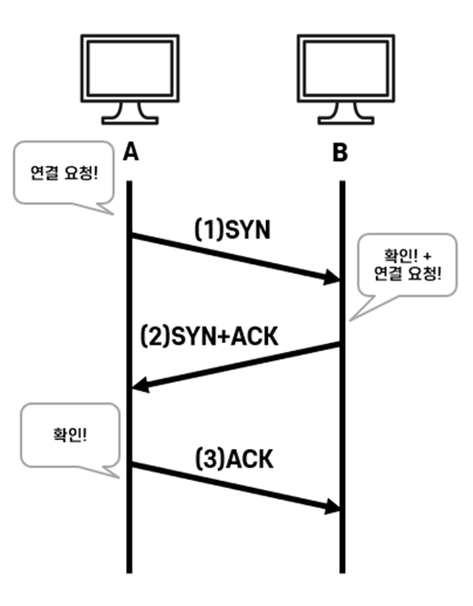

# TCP 3 & 4 way handshake

[[TCP] 3 way handshake & 4 way handshake | 👨🏻‍💻 Tech Interview](https://gyoogle.dev/blog/computer-science/network/TCP%203%20way%20handshake%20&%204%20way%20handshake.html)

**<목차>**

---

# 들어가기 전…

## **TCP(Transmission Control Protocol)란?**

<aside>
💡

- 네트워크 계층 중 **전송 계층(4계층)에서 사용하는 프로토콜**
- 장치들 사이에 논리적인 접속을 성립(establish)하기 위해 연결을 설정하여 **신뢰성을 보장하는 연결형 서비스**
</aside>

TCP의 특징

- 인터넷에서 데이터를 메세지 형태(블록 단위 = **세그먼트**)로 보내기 위해 IP와 함께 사용하는 프로토콜
- **연결형 서비스**로, 가상 회선 방식을 제공
  - `3-way handshaking` 과정을 통해 연결을 설정하고, `4-way handshaking`을 통해 연결을 해제
- 흐름 제어 및 혼잡 제어 제공
- 높은 신뢰성 보장
- UDP보다 느린 속도
- **전이중(Full-Duplex)**, **점대점(Point to Point)** 방식 지원
  - 전이중(Full-Duplex) : 전송이 양방향으로 동시에 일어날 수 있음
  - 점대점(Point to Point) : 각 연결이 정확히 2개의 종단점을 가지고 있음
  - 멀티 캐스팅이나 브로드 캐스팅은 지원X
- 신뢰성있는 전송이 중요할 때 사용 (= 연속성 중요도는 ⬇️인 경우)

# **TCP의 연결 설정 및 해제 과정**

## **3 way handshake - 연결 성립**

<aside>
💡

- TCP 통신을 이용하여 데이터를 전송하기 위해 **네트워크 연결을 설정하는 과정**
- 데이터 전송 전, 정확한 전송을 보장하기 위해 상대방 컴퓨터와 사전에 **세션을 수립**하는 과정
</aside>

3 way handshake 과정

1. 클라이언트가 서버에게 요청 패킷을 보낸다 : `연결 요청`
2. 서버가 클라이언트의 요청을 받아들이는 패킷을 보낸다 : `확인 + 연결 요청`
3. 클라이언트는 이를 최종적으로 수락하는 패킷을 보낸다 : `확인`

총 3번의 과정이라 **3 way handshake**라고 불림

_ex) 3 way handshake 예시_

**1) A->B : `SYN`**

- 접속 요청 프로세스 A가 연결 요청 메세지 전송 (SYN)

- 포트 상태 : A = `CLOSED`, B = `LISTEN`

**2) B->A : `SYN` + `ACK`**

- 접속 요청을 받은 프로세스 B가 요청 수락 + A도 포트를 열어 달라는 메세지 전송 (SYN + ACK)

- 포트 상태 : A = `CLOSED`, B = `SYN_RCV`

**3) A->B : `ACK`**

- 포트 상태 : A = `ESTABLISHED`, B = `SYN_RCV`

- 마지막으로 접속 요청 프로세스 A가 수락 확인을 보내 연결을 맺음 (ACK)

- 전송할 데이터가 있다면, 이 단계에서 데이터를 전송 가능

- 포트 상태 : A = `ESTABLISHED`, B = `ESTABLISHED`

## **4 way handshake - 연결 해제**

<aside>
💡

TCP의 **연결을 해제(Connection Termination)하는 과정**

</aside>

4 way handshake 과정

1. 클라이언트가 서버에게 연결 종료를 요청하는 패킷을 보낸다 : `연결 종료 요청 (FIN)`
2. 서버가 클라이언트의 종료 요청을 확인하는 패킷을 보낸다 : `확인 (ACK)`
3. 서버가 자신의 연결도 종료하겠다는 패킷을 보낸다 : `연결 종료 요청 (FIN)`
4. 클라이언트가 서버의 종료 요청을 확인하는 패킷을 보낸다 : `확인 (ACK)`

총 4번의 과정이라 4 **way handshake**라고 불림

_ex) 4 way handshake 예시_

**1) A->B : `FIN`**

- 프로세스 A가 연결을 종료하겠다는 FIN 플래그를 전송

- 프로세스 B가 `FIN` 플래그로 응답하기 전까지 연결을 계속 유지

**2) B->A : `ACK`**

- 프로세스 B는 일단 확인 메세지를 보내고, 자신의 통신이 끝날 때까지 대기 (**TIME_WAIT** 상태)

- 자신이 전송할 데이터가 남아있다면 이어서 계속 전송

**3) B->A : `FIN`**

- 프로세스 B가 통신이 끝남 → 연결 종료 요청에 합의한다는 의미로 프로세스 A에게 `FIN` 플래그를 전송

**4) A->B : `ACK`**

- 프로세스 A는 확인했다는 메세지를 전송

---

_참고 자료_

[[네트워크] TCP 3 way handshake & 4 way handshake](https://nayoungs.tistory.com/entry/%EB%84%A4%ED%8A%B8%EC%9B%8C%ED%81%AC-TCP-3-way-handshake-4-way-handshake)

[[ 네트워크 쉽게 이해하기 22편 ] TCP 3 Way-Handshake & 4 Way-Handshake](https://mindnet.tistory.com/entry/%EB%84%A4%ED%8A%B8%EC%9B%8C%ED%81%AC-%EC%89%BD%EA%B2%8C-%EC%9D%B4%ED%95%B4%ED%95%98%EA%B8%B0-22%ED%8E%B8-TCP-3-WayHandshake-4-WayHandshake)

[[Network] TCP, 3-Way Handshake & 4-Way Handshake](https://haengsin.tistory.com/47)

[TCP 3-way HandShake & 4-way HandShake :: 개발일G](https://ghs4593.tistory.com/18)
