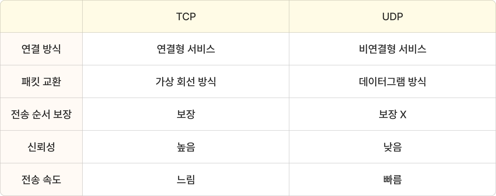

# UDP

[UDP | 👨🏻‍💻 Tech Interview](https://gyoogle.dev/blog/computer-science/network/UDP.html)

**<목차>**

---

# UDP(User Datagram Protocol)란?

## UDP의 개념

<aside>
💡

- 데이터를 데이터그램 단위로 처리하는 프로토콜
- **비연결형, 신뢰성이 없는 전송 프로토콜**
- 전송 계층(Transport layer)에서 사용하는 프로토콜
</aside>

## UDP의 특징

- **속도** : TCP보다 더 빠른 속도를 가짐
- **비연결성** : 데이터를 전송하기 전에 수신 측과 연결을 설정하지 않음
- **데이터그램 단위 전송** : 데이터를 쪼개어 독립적으로 전송 (순서가 꼬이거나 손실 가능성 ⬆️)
- **신뢰성 없는 전송**: 데이터가 목적지에 도달했는지, 손상 없이 도착했는지를 확인하는 메커니즘 X

## UDP의 사용 이유

UDP의 장점은 데이터의 신속성!

UDP는 TCP와 다르게 흐름제어나 오류제어 등이 없기 때문에 속도가 더 빠름…

= 신뢰성보다 **속도**가 중요한 부문에서 UDP를 사용

_ex) 실시간 애플리케이션, 스트리밍 등…_

## TCP와 UDP의 차이

**TCP** = 신뢰성이 높고 느린 연결형 서비스

**UDP** = 신뢰성이 낮고 빠른 비연결형 서비스

### **TCP와 UDP가 나타난 이유**

> **IP (Internet Protocol)란?**
>
> : 데이터를 목적지까지 전달하기 위한 주소 지정 및 경로 설정을 담당하는 프로토콜 (전송 역할)

> **ICMP (Internet Control Message Protocol)란?**
>
> : 네트워크 통신 중 발생한 오류나 상태 정보를 전달하는 제어용 프로토콜 (알림 역할)

- IP의 한계
  - IP는 단순히 Host to Host(장치 간 통신) 만을 지원…
  - 장치 간 이동은 IP로 가능하지만, 한 장비 안에서 여러 프로그램이 동시에 통신할 때는 IP로는 부족
- ICMP의 한계
  - IP에서 발생한 오류를 알려주는 역할
  - ICMP는 오류를 알려주기만 하고, 고치지는 못함 (대처 불가)
  - IP보다 더 위에서 오류를 처리해야 함 (= 처리하기 위한 별도의 상위 계층 필요)

IP의 한계 해결 → 포트 번호 등장

ICMP의 한계 해결 → TCP와 UDP 등장

### **TCP와 UDP의 오류 해결 방법**

- **TCP** : 데이터의 분실, 중복, 순서 뒤바뀜 등을 자동으로 감지하고 복구
  → 송수신 데이터의 정확한 전달 보장 (신뢰성)
- **UDP** : IP가 제공하는 정도의 수준만을 제공하는 간단한 IP 상위 계층의 프로토콜…
  → 속도는 빠르지만 에러, 순서 뒤바뀜 등의 문제 발생 가능성 ⬆️ = 처리의 번거로움 존재

# 각 프로토콜의 Header 비교

## TCP Header

TCP는 설계가 오래되었고 많은 기능이 있기 때문에 헤더에 많은 것들이 들어 있음

**TCP Header의 구성 요소**

- **`Source Port`** : 데이터를 생성한 애플리케이션에서 사용하는 포트번호 (= 시작 포트)
- **`Destination Port`** : 목적지 애플리케이션이 사용하는 포트 번호 (= 도착지 포트)
- **`Sequence Number 필드`** : 세그먼트 순서를 맞추기 위한 필드
- **`Acknowledgement Number 필드`** : 다음 세그먼트 수신 준비 및 모든 데이터 수신 확인 역할
- **`Data Offset 필드`** : TCP 헤더의 크기
- **`Reserved 필드`** : 차후의 사용을 위한 예약된 필드
- **`Control Flags (SYN, ACK, FIN ...등)`** : 긴급, 혼잡, 확인, 수신 거부 등의 기능
- **`Window size 필드`** : 수신자가 한번에 받을 수 있는 데이터의 양
  (송신자는 Window size만큼 ACK를 기다리지 않고 데이터를 전송 가능)
- **`Checksum`** : 세그먼트 내용의 유효성과 손상 여부 검사 (= 오류 검출)

## UDP Header

UDP는 데이터 전송 자체에만 초점을 맞추고 설계되었기 때문에, 헤더가 거의 비어 있음

= TCP 보다 용량이 가볍고 송신 속도가 빠르게 작동하지만, TCP보다 신뢰성이 낮음

**UDP Header의 구성 요소**

- **`Source port`** : 데이터를 생성한 애플리케이션에서 사용하는 포트번호 (= 시작 포트)
- **`Destination port`** : 목적지 애플리케이션이 사용하는 포트 번호 (= 도착지 포트)
- **`Length`** : UDP 헤더와 데이터의 총 길이 (= 데이터그램의 총 길이)
- **`Checksum`** : 중복 검사의 한 형태로, 오류 정정을 통해 공간(전자 통신)이나 시간(기억 장치) 속에서 송신된 자료의 무결성을 보호하는 단순한 방법 (= 오류 검출)
  (UDP의 Checksum은 선택 사항…TCP에서는 필수인 옵션)

# **DNS UDP 통신 프로토콜 관련**

## DNS**(Domain Name System)**란?

<aside>
💡

사람이 읽기 쉬운 웹사이트 주소(예: `www.naver.com`)를 컴퓨터가 이해하는 숫자로 된 IP 주소(예: `125.209.222.141`)로 변환해주는 인터넷 시스템

</aside>

## DNS에서 UDP를 사용하는 이유

- **작은 데이터 크기**
  대부분의 DNS 요청은 **도메인 이름 → IP 주소** 하나를 묻는 단순한 형태…
  요청과 응답의 데이터 양이 **아주 작으니 TCP가 굳이 필요 X**
- **낮은 오버헤드**
  TCP는 세션 확립을 위한 처리를 하고, 송신된 데이터가 수신 여부를 점검하는 과정이 필요하니 오버헤드가 더 클 가능성 ⬆️
- **신뢰성 보안**
  UDP는 데이터 손실을 스스로 **복구하지 않는** 비신뢰성 프로토콜
  그러나 DNS는 **애플리케이션 계층에서 재요청 기능**을 가짐 → 패킷 손실이 생기면 재요청 가능

## + TCP를 사용하는 경우

DNS는 보통 UDP를 사용하지만, 특정 상황에서는 TCP를 사용하기도

### **1. Zone Transfer을 사용할 때**

**Zone Transfer**란? DNS 서버 간에 전체 데이터베이스(또는 영역 정보)를 복사하는 과정

이 과정을 사용할 땐 전송되는 데이터의 양이 매우 많음 = **신뢰성** 중요

→ 신뢰성에 더 좋은 성능을 가진 TCP 사용

### **2. 데이터 크기가 512 바이트를 초과할 때**

UDP은 65KB까지 전송 가능,

그러나 DNS는 안전성을 위해 보통 **512 바이트까지만 UDP로 전송**하도록 제한…

→ 512 바이트 이상은 TCP 사용

---

_참고 자료_

[🌐 아직도 모호한 TCP / UDP 개념 ❓ 쉽게 이해하자](https://inpa.tistory.com/entry/NW-%F0%9F%8C%90-%EC%95%84%EC%A7%81%EB%8F%84-%EB%AA%A8%ED%98%B8%ED%95%9C-TCP-UDP-%EA%B0%9C%EB%85%90-%E2%9D%93-%EC%89%BD%EA%B2%8C-%EC%9D%B4%ED%95%B4%ED%95%98%EC%9E%90#udp_-_%EC%82%AC%EC%9A%A9%EC%9E%90_%EB%8D%B0%EC%9D%B4%ED%84%B0%EA%B7%B8%EB%9E%A8_%ED%94%84%EB%A1%9C%ED%86%A0%EC%BD%9C)

[[네트워크] UDP란? UDP의 개념과 이해 | UDP checksum](https://code-lab1.tistory.com/25)

[~~[CS] TCP와 UDP란 ?~~](https://chanhan.tistory.com/entry/CS-TCP%EC%99%80-UDP%EB%9E%80)

[[TCP/UDP] TCP와 UDP의 특징과 차이 - MangKyu's Diary](https://mangkyu.tistory.com/15)

[[Computer Science][Network] 🌐 네트워크 프로토콜 완벽 이해: UDP, TCP, 그리고 DNS 🌐](https://velog.io/@ouk/Computer-ScienceNetwork-%EB%84%A4%ED%8A%B8%EC%9B%8C%ED%81%AC-%ED%94%84%EB%A1%9C%ED%86%A0%EC%BD%9C-%EC%99%84%EB%B2%BD-%EC%9D%B4%ED%95%B4-UDP-TCP-%EA%B7%B8%EB%A6%AC%EA%B3%A0-DNS-mpqajk2g)

[[프로토콜] UDP Header / UDP 동작](https://joycecoder.tistory.com/entry/%ED%94%84%EB%A1%9C%ED%86%A0%EC%BD%9C-UDP-Header-UDP-%EB%8F%99%EC%9E%91)
