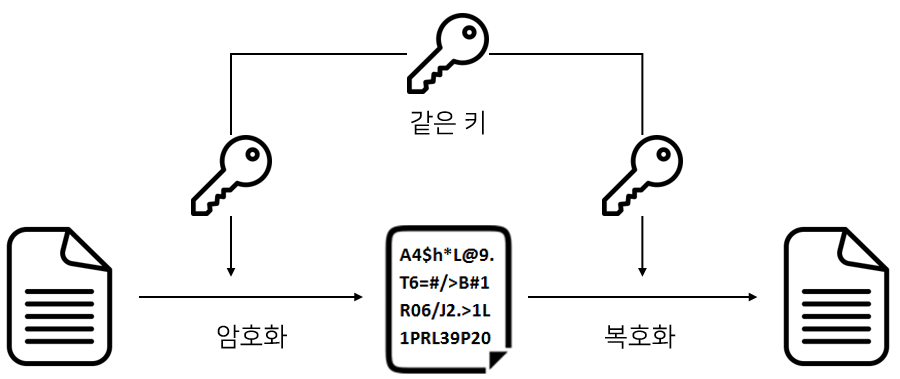

# 대칭키 & 공개키

[대칭키 & 공개키 | 👨🏻‍💻 Tech Interview](https://gyoogle.dev/blog/computer-science/network/%EB%8C%80%EC%B9%AD%ED%82%A4%20&%20%EA%B3%B5%EA%B0%9C%ED%82%A4.html)

**<목차>**

---

# **대칭키 (Symmetric Key)**

<aside>
💡

암호화와 복호화에 사용되는 키가 동일한 암호화 방식

</aside>

암호화 = 키를 사용해 평문을 암호문으로 만드는 것

복호화 = 키를 사용해 암호문을 평문으로 만드는 것

대칭키의 장점

- 공개키보다 암호화 방식의 속도가 빠름
- **대용량 Data 암호화**에 적합

대칭키의 단점

- 대칭키 전달과정에서 해킹 위험에 노출 가능성 ⬆️
- 키 배송 문제가 발생 (어떻게 해당 키를 전달할까?)
- 사람이 증가할수록 관리해야 할 키 증가 (키 관리의 어려움)

대표적인 알고리즘 : DES, 3DES, AES, SEED 등

# **공개키 (Public Key) = 비대칭키**

<aside>
💡

암호화와 복호화에 사용되는 키가 다른 암호화 방식

</aside>

서로 다른 두개의 키인 공개키(Public Key)와 개인키(Private Key)를 사용하여 키 분배 문제 해결

- **공개키(Public Key)** : 배포해도 되는 키
- **개인키(Private Key)** : 절대로 유출해서는 안되는 키

공개키의 장점

- 대칭키 암호화 방식의 키 배송 문제를 해결 가능
- 키 분배의 필요성 X
- **기밀성/인증/부인방지 기능 제공**

공개키의 단점

- 대칭키 암호화 방식보다 속도가 느림

대표적인 알고리즘 : RSA, DSA, ECC 등

## 공개키 암호화 방식의 진행 과정

### 단방향 동작 과정

1. 나에게 암호문을 전달하고 싶은 대상에게 공개키를 전달 (공개키는 바로 네트워크를 통해 전달해도 됨)
2. 공개키를 받은 사람은 공개키를 사용하여 암호화하고 나에게 암호문을 보냄

   (이제 암호문을 복호화 할 수 있는 건 비밀키를 가진 '나' 만 가능)

3. 나는 암호문을 받아 비밀키로 복호화

'나' = 암호문을 복호화하기만 함…'나'도 암호문을 보내려면?

### 양방향 동작 과정

1. A와 B는 각자 개인키와 공개키를 가지고 있음
2. A는 B에게 자신의 공개키를, B도 A에게 자신의 공개키를 전달
3. 상대방에게 전달받은 공개키로 암호화해 암호문을 보냄
   1. 즉 A는 B의 공개키로 암호화하고 B는 A의 공개키로 암호화
   2. 이제 암호문을 복호화 할 수 있는건 비밀키를 가진 '상대방'만 가능
4. 암호문을 받으면 자신의 비밀키로 복호화

---

_참고 자료_

[대칭키, 공개키 암호화 방식 — 하루한방울](https://gunjoon.tistory.com/149)

[대칭키 vs 공개키(비대칭키)](https://velog.io/@gs0351/%EB%8C%80%EC%B9%AD%ED%82%A4-vs-%EA%B3%B5%EA%B0%9C%ED%82%A4%EB%B9%84%EB%8C%80%EC%B9%AD%ED%82%A4)
