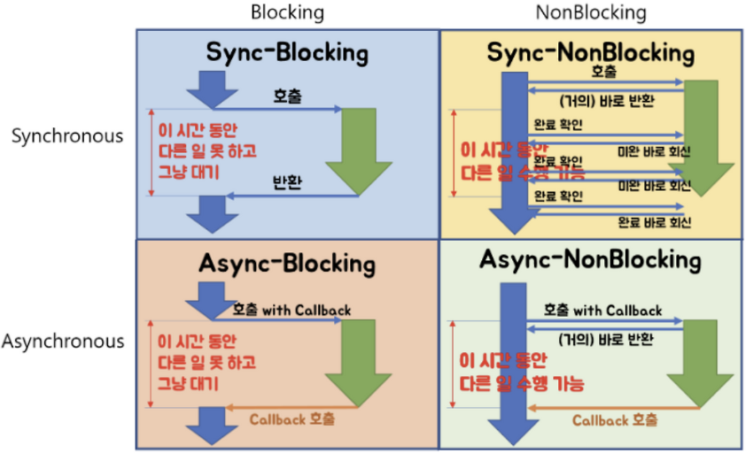

# 10주차 🛜네트워크

## Chap04. Blocking/Non-blocking & Synchronous/Asynchronous

### #1. 각각의 개념

#### Blocking

- "작업이 끝날 때까지 호출한 쪽이 멈추는가?" -> 기다리는가?
- 함수 호출 시, I/O가 끝날 때까지 스레드가 기다림 -> 스레드는 다른 작업을 못함
- 즉, 호출한 함수가 return하기 전까지 스레드는 제어권을 갖지 못함
  - 제어권: CPU가 어떤 코드를 실행할지를 결정할 수 있는 권한 (프로그램 흐름을 이어나가는 주도권)

#### Non-blocking

- "작업이 끝나지 않아도 즉시 반환하는가?" -> 기다리지 않는가?
- 함수를 호출해도 스레드는 멈추지 않고 다른 작업을 계속 함
- 즉, 호출한 함수가 바로 return하여 스레드에게 제어권이 즉시 돌아옴

- **그렇다면 호출된 함수의 결과는 어떻게 받는 것인가?**

  - Non-blocking은 기다리지 않는다만 의미함
  - 결과를 받는 방식으로 Sync/Async의 개념이 등장

  - **Non-blocking + Synchronous (Polling 모델)**
    - 함수는 즉시 끝남
    - 스레드가 결과가 준비되었는지 반복해서 확인함
  - **Non-blocking + Asynchronous (이벤트 기반 모델)**
    - 함수는 즉시 끝남
    - 결과가 준비되면 나중에 콜백/이벤트 등으로 알려줌

#### Synchronous

- "결과를 호출한 사람이 직접 받아야 하는가?"
- 작업 결과를 호출한 주체(스레드)가 직접 확인해야함
- 결과가 준비될 때까지 **블로킹 됨** OR **Polling 함**

#### Asynchronous

- "작업이 끝난 것을 나중에 알려주는가?"
- 호출자는 중간에 다른 작업을 하다가 완료 알림을 받음
- 결과는 작업 완료 시점에 다른 방식으로 도착 -> 콜백, 이벤트 ,Future 등

---

### #2. 조합이 가능함

#### 1. Blocking + Synchronous

- 개념
  - 스레드가 함수 호출 -> 작업 끝날 때까지 기다림 (Block)
  - 결과도 스레드가 직접 받음
- 특징
  - 구현 쉬움
  - 대규모 연결에서는 스레드가 묶여 비효율적
- 예시
  - 일반적인 소켓 서버
  - 대부분의 파일 읽기/쓰기

#### 2. Blocking + Asynchronous

- 개념
  - 스레드는 함수 호출 직후 기다리지만 (Block)
  - 결과는 나중에 알림으로 전달됨 (비동기 전달)
- 특징
  - 실제로 거의 쓰이지 않음
  - 교육용, 개념 명확화를 위한 조합
- 예시
  특정 OS 혹은 라이브러리에서 호출은 블로킹 함수이지만 완료 알림은 이벤트로 받음

#### 3. Non-blocking + Synchronous (Polling 모델)

- 개념
  - 함수는 즉시 return
  - 스레드는 멈추지 않음
  - 결과는 스레드가 반복적으로 직접 확인함
- 특징
  - 스레드는 멈추지 않음
  - 계속 확인해야하는 비용 존재
  - CPU를 많이 쓸 수 있어 대규모에서 부적합
- 예시
  - Non-blocking 소켓
  - 유저 스레드가 반복 확인

#### 4. Non-blocking + Asynchronous (이벤트 기반 모델)

- 개념
  - 함수는 즉시 return
  - 스레드는 멈추지 않음
  - 결과는 나중에 콜백/이벤트로 자동 전달됨
- 특징

  - 효율이 좋음
  - 1 스레드로 수만 연결 처리가 가능

- 예시
  - Node.js 이벤트 루프
  - Linux epoll
  - Java NIO + CompletionHandler
  - Go의 goroutine + async IO

