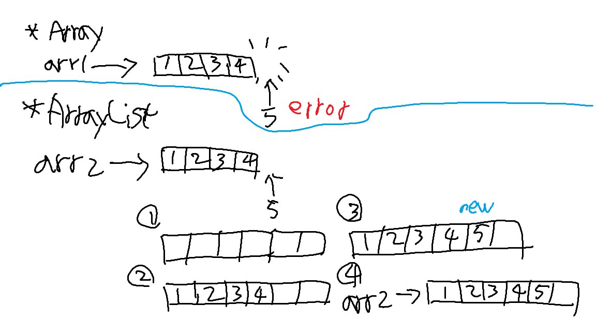

# ⚙️자료 구조 2주차 - Array & ArrayList & LinkedList

- 설명하기 앞서
  - 자료구조를 공부할 때는 자바언어를 통해 진행.
  - 자바는 명시적으로 다양한 자료구조들을 제공.
  - 변수/객체에 객체타입이 지정되어 있어 자료구조의 동작/오류를 명확하게 이해하는데 도움을 줌.

## Array vs ArrayList vs LinkedList

|    구분     |            Array             |              ArrayList               |               LinkedList                |
| :---------: | :--------------------------: | :----------------------------------: | :-------------------------------------: |
|  저장 방식  | 연속적인 메모리 공간에 저장  | 내부적으로 배열 사용, 동적 크기 조절 |      노드들이 포인터로 연결된 구조      |
|  크기 변경  |       불가능(고정크기)       |       가능(동적으로 크기변경)        |         가능(동적으로 크기변경)         |
|  접근 속도  | 매우 빠름 - 인덱스 접근 O(1) |       빠름 - 인덱스 접근 O(1)        |         느림 - 순차적 접근 O(n)         |
|  삽입/삭제  |   불편 - 새배열 생성 필요    |  중간 삽입/삭제시 데이터 이동 필요   | 빠름 O(1) - 삽입/삭제시 노드링크만 변경 |
| 메모리 효율 |        메모리 효율적         |     배열크기 재할당 등 오버헤드      |      추가 노드 포인터 메모리 필요       |
|  사용 용도  |  크기고정 + 빠른 조회 필요   |  크기 변동 있음 + 조회가 많은 경우   |             삽입/삭제 빈번              |

### 각 자료구조 선언방법 feat. java

1. Array
   ```java
   int[] arr = new int[5];  // 선언 및 초기화
   int[] arr = new int[] {1,2,3,4,5};    // 선언과 초기화를 따로.
   int[] arr = {1,2,3,4,5};  // 선언과 초기화를 동시에.
   ```
2. ArrayList : List 인터페이스 구현

   ```java
   ArrayList<Integer> numbers = new ArrayList<>();
   numbers.add(10);
   numbers.add(20);
   numbers.add(30);
   System.out.println(numbers);     // add() : 요소추가

   numbers.add(1, 15);
   System.out.println(numbers);

   int num = numbers.get(1);
   System.out.println(num);         // get() : 요소확인

   numbers.remove(1);
   System.out.println(numbers);     // remove() : 요소삭제
   ```

3. LinkedList : List 인터페이스 구현

   ```java
   LinkedList<Integer> numbers = new LinkedList();
   numbers.add(10);
   numbers.add(20);
   numbers.add(30);
   System.out.println(numbers);

   numbers.addFirst(5);
   numbers.addLast(40);
   System.out.println(numbers);

   int head = numbers.getFirst();  // getFirst()
   int center = numbers.get(2);
   int tail= numbers.getLast();    // getLast()
   System.out.println("head: "+head+" center: "+center+" tail: "+tail);

   numbers.remove(Integer.valueOf(20));    // remove(T.valueOf(요소값))
   System.out.println(numbers);
   ```

4. ArrayDeque를 Deque로 구현할때와 Queue로 구현할때의 차이
   - 사용가능한 메서드가 달라짐
   - Queue
     - offer()/poll()/peek() // 각각 앞쪽에 추가, 뒤쪽 확인, 뒤쪽 확인+삭제
     - 양끝 추가/삭제 기능 사용 불가
   - Deque
     - addFirst(), addLast(), removeFirst(), removerLast() // 첫번째 추가/삭제, 마지막 추가/삭제 -> 양끝 추가/삭제
     - push(), pop() // 각각 앞쪽 추가, 뒤쪽 확인+삭제

### 차이점에 관한 추가설명

    - Array와 ArrayList의 데이터 접근속도 : 내부구조와 오버헤드의 차이
        - Array
            - 크기가 고정되어 있기때문에 추가/삭제시에 오버헤드가 거의 없음
        - ArrayList
            - get()메서드를 통해 접근하므로 메서드 호출 오버헤드 발생 (인덱스로 접근한다는건 동일하지만 ArrayList는 메서드를 사용한다는 차이점)
            - 배열에 요소추가할때, 용량이 부족하면 새로운 배열생성 및 복사가 일어나는 오버헤드 발생
            - 
            - 제네릭 박싱 및 언박싱으로 비용
    - LinkedList의 접근속도가 느린 이유
        - 인덱스 방식을 사용하지 않음
        - 각 노드는 다음노드의 주소만 알고있음
        - 순차적 탐색을 통해 찾아야함
        - 삽입/삭제시의 시간복잡도 O(1)인 이유
            - 넣으려는 위치의 앞뒤 노드의 연결만 하면됨
            - 넣으려는 위치까지 찾는 시간복잡도는 O(n)이긴함
            - 전체 삽입 시간 = O(n) + O(1)

### 용어

        - **클래스** : 객체가 가지는 속성(데이터)과 기능(메서드)을 정의. 객체를 만드는 틀의 개념.
        - **객체** : 클래스에서 정의된 속성과 메서드를 지닌 실체. 메모리에 생성된 객체는 인스턴스.
        - **컬렉션** : 여러 데이터를 한데 묶어 저장/관리할 수 있는 자료구조. 제네릭타입을 전용으로 사용함.
        ---
        - **기본형 타입**
            - Primitive Type이라고 함.
            - 정수 4가지, 실수 2가지, 문자형 1가지, 불린형 1가지로 총 8가지. 실제 값을 저장하며 스택영역에 할당.
            - 메모리 사용량이 적으며 연산속도 빠름. 객체메서드 지원X
        - **참조형 타입**
            - Reference Type이라고 함.
            - 기본형 타입을 제외한 모든 타입.
            - 변수가 실제 데이터값을 갖는게 아닌, 데이터가 저장된 메모리 주소값을 가짐.
        ---
        - **제네릭 타입**
            - 프로그래밍 기법
            - 클래스/메서드에 다양한 타입을 지원하도록 타입을 변수화 하는것.
            - 타입 안정성 및 코드 재사용성을 높여줌.
            ```java
            class Box<T> { // T는 관례적으로 사용하는것.
                private T item;

                public void set(T item) {
                    this.item = item;
                }

                public T get() {
                    return item;
                }
            }

            Box<String> stringBox = new Box<>();
            stringBox.set("Hello");
            String s = stringBox.get();
            ```

        - **박싱** : 제네릭 박싱. 기본타입을 참조타입(래퍼 클래스) 객체로 변환하는 과정.
        - **언박싱** : 참조타입 객체를 기본타입으로 변환하는 과정.
        - **래퍼 클래스** : 기본타입값을 객체로 감싸서 참조형타입으로(처럼) 사용할 수 있도록 만든 클래스. 불변으로 값 변경 불가.
            ```java
            ArrayList<Integer> list = new ArrayList<>();
            int num = 10;
            list.add(num);              // 오토박싱. int값인 10을 Integer객체로 변환
            int value = list.get(0);    // 오토언박싱. Integer 객체인 10을 int 값으로 변환
            ```
        ---
        - **스택 영역**
            - 자바에서 프로그램 실행시 메모리를 관리할 때 쓰는 주요 공간 중 하나
            - 변수(지역변수, 참조변수, 매개변수), 변수의 값, 메서드 실행상태가 저장되는 임시공간
        - **힙 영역**
            - 실제 데이터(인스턴스. 동적으로 생성되는 객체)가 저장되는 공간
            - new 연산자로 생성된 객체, 배열 등
            - 더이상 참조되지 않을때 메모리에서 해제 (가비지 컬렉터에 의해)

    | 구분 | 스택 영역 | 힙 영역 |
    |:--:|:--:|:--:|
    | 저장 대상 | 지역 변수,메소드 호출 정보 | 객체, 배열 |
    | 메모리 관리 | 메서드 실행 완료시 해제 | 가비지 컬렉터가 관리 |
    | 크기 | 정적, 제한적 | 동적, 크기 제한 없음 |
    | 속도 | 빠름 | 상대적으로 느림 |
    | 메모리 공유 | 각 스레드마다 독립적으로 존재 | 모든 스레드가 공유 |
