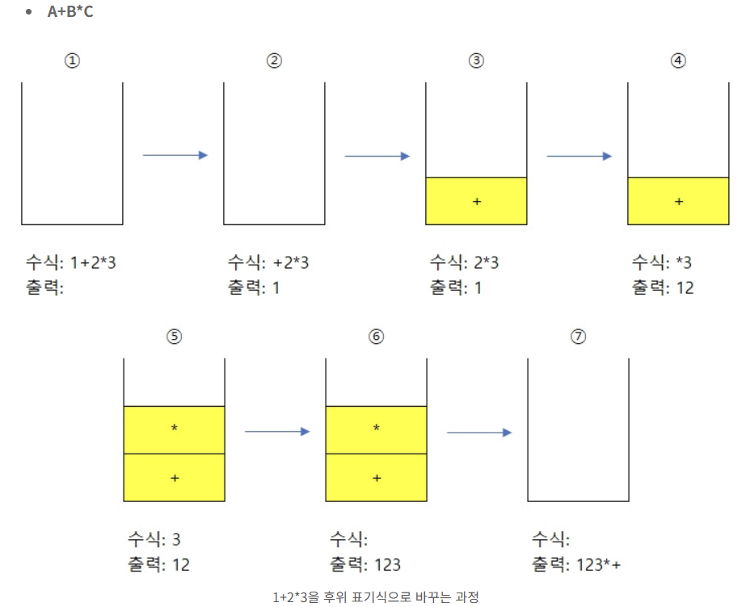
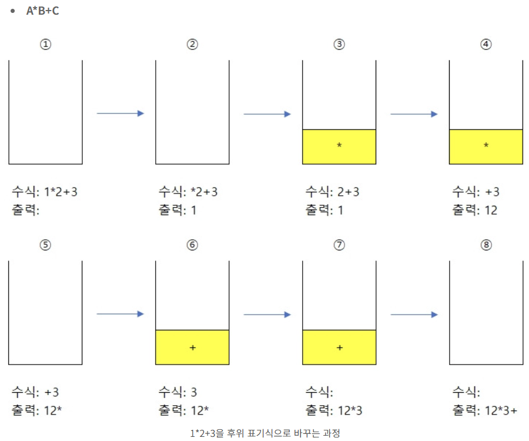
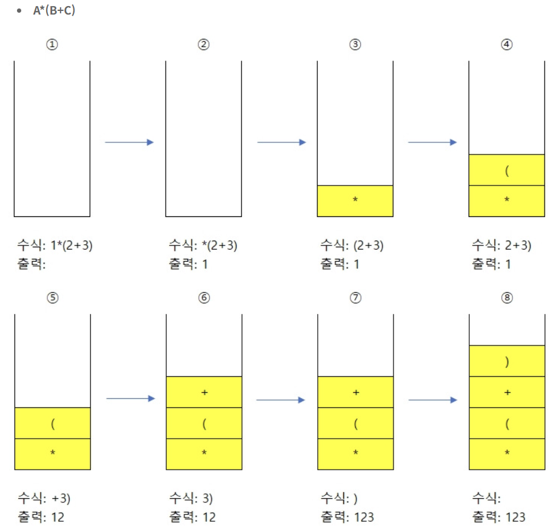
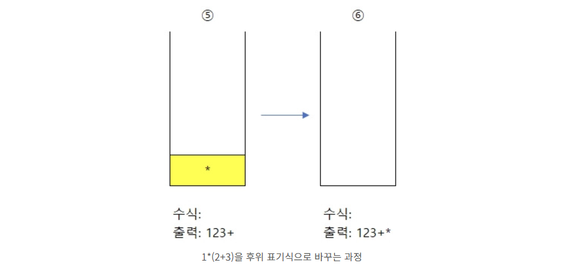
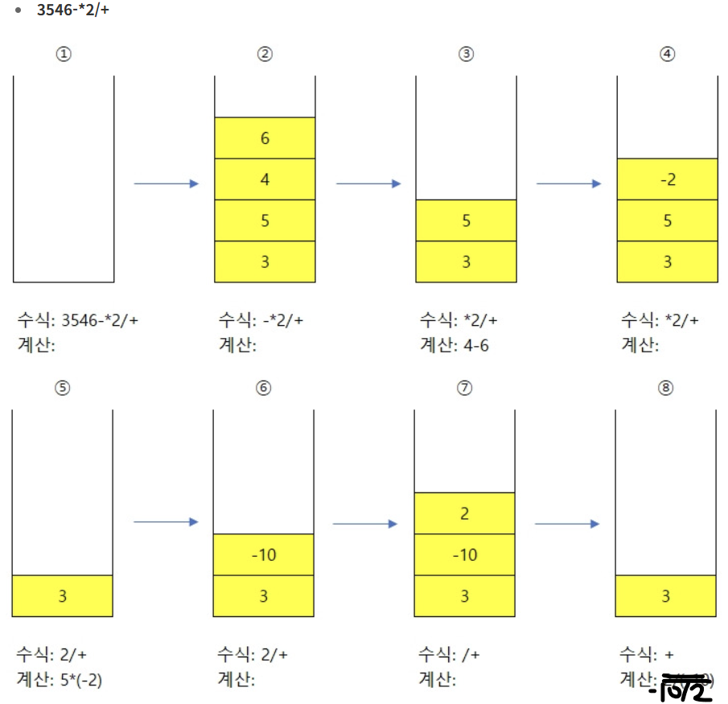
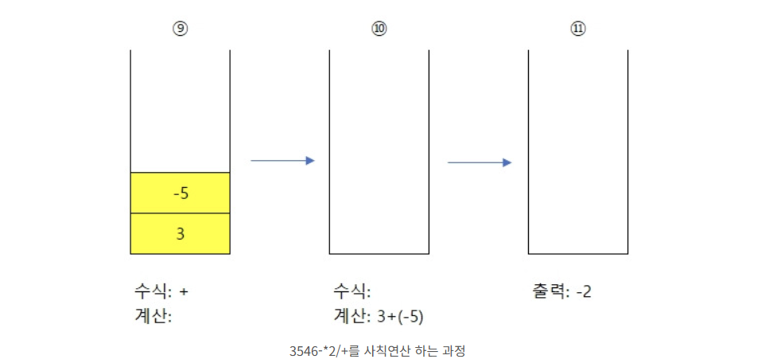
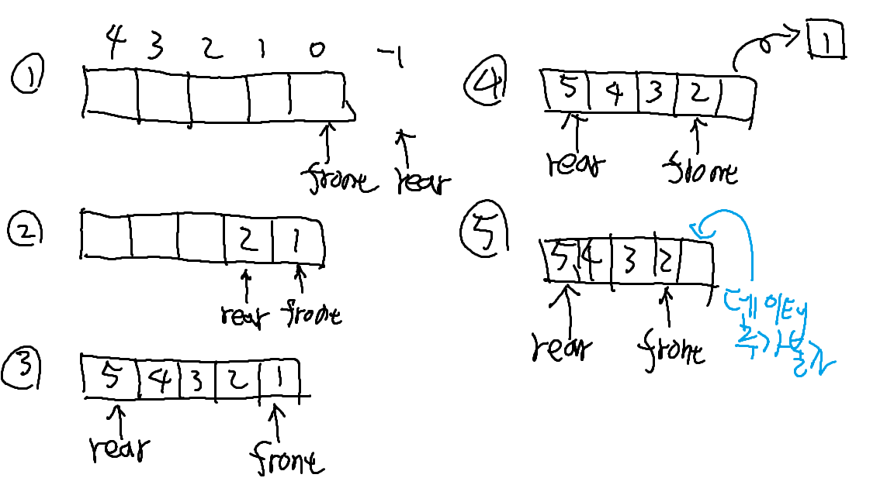

# ⚙️자료 구조 2주차 - Stack & Queue

## Chap01. 스택 (Stack)

- 스택(Stack)은 선형구조의 자료구조 중 하나이다.
- 특징
  - 입출력이 한곳에서 이루어짐.
  - LIFO(Last In First Out) : 가장 나중에 들어온것이 가장 먼저 나오는 구조.
- 자바에서 Stack 사용방법

  ```java
  Stack<Integer> stack1 = new Stack<>();
  for (int i=1; i<=4; i++){
  	stack1.push(i);
  }
  stack1.push(5);             // push() : stack의 맨위에 원소 추가
  int top1 = stack1.peek();   // peek() : 맨위의 원소 확인+삭제X
  System.out.println("top1: "+top1+" stack1: "+stack1); // [1,2,3,4,5]
  int top2 = stack1.pop();    // pop() : 맨위의 원소 확인+삭제O
  System.out.println("top2: "+top2+" stack1: "+stack1); // [1,2,3,4]

  while(!stack1.isEmpty()) {  // isEmpty() : stack이 비어있으면 true 반환
  	System.out.print(stack1.pop()+" "); // 4 3 2 1
  }
  ```

- 주된 사용상황

  1. 함수의 콜스택

  - 함수가 호출되면 함수의 상태(매개변수, 지역변수, 반환주소 등)가 발생하는데 이를 스택 프레임이라는 단위로 콜스택에 쌓음.
  - 함수들이 실행되면 함수의 상태들이 콜스택에 쌓이게 되고, 가장 마지막에 호출된 함수가 먼저 종료됨.
  - 함수실행 종료시 스택에서 해당 프레임을 제거하고 이전 함수로 돌아감.
  - 재귀함수와 밀접한 관련.
    - 재귀 호출이 기저조건에 도달할때 까지 콜스택에 스택프레임이 계속 쌓여감.
    - 재귀는 반복문과 콜스택으로도 구현이 가능.

  2. 문자열 역순 출력

  - 문자열의 각 문자들을 스택에 넣음
  - 스택 출력시 문자들이 원래 문자열의 반대로 나옴.
  - 문자열을 배열로 변환 후 reverse()를 사용하는 방법
    - Stack을 사용하는 방법이 조금더 오버헤드가 있음
    - 단, 시간복잡도는 O(N)으로 유사하여 문자열이 매우 긴 상황이 아닌 한 사용자의 취향에 맞게 사용하여도 무방

  3. 연산자 후위 표기법

  - 수식을 후위표기법으로 변환/계산할 때 스택 사용.
  - 우리가 주로 사용하는 표기법은 중위 표기법 e.g. 1+1, 1+2x3, 4\*5+6, ...
  - 컴퓨터가 연산을 하기 쉽게 표현하는 후귀 표기법 e.g. 11+, 123*+, 45*6+

  <br>

  - 후위표기법 변환 예시1 - A+BxC -> ABCx+

    1. 숫자는 출력, 부호는 스택에 push()
    2. 스택 내에 부호가 있을 경우, 해당 부호와 우선순위를 비교하고 높을시 삽입
    3. 수식을 전부 처리했으면, 스택에 있는 부호들을 차례로 pop()
    4. 후위 표기법 변환 완료

  <br>

  - 후위표기법 변환 예시2 - AxB+C -> ABxC+
    1. 숫자는 출력, 부호는 스택에 push()
    2. 스택 내에 부호가 있을 경우, 해당 부호와 우선순위를 비교하고 낮을시 스택내의 부호 pop(), 후에 push()
    3. 수식을 전부 처리했으면, 스택에 있는 부호들을 차례로 pop()
    4. 후위 표기법 변환 완료

  <br>
  <br>

  - 후위표기법 변환 예시3 - Ax(B+C) -> ABC+x

    1. 숫자는 출력, 부호(x)는 스택에 push()
    2. 여는괄호는 스택에 push()
    3. 숫자는 출력, 부호(+)는 스택에 push()
    4. 숫자는 출력, 닫는괄호 발견시 스택에 있는 부호를 여는괄로까지 pop(), (괄호는 출력X)

  <br>
  <br>

  - 후위표기법 계산 예시

    1. 숫자는 스택에 push()
    2. 부호 발견시, 숫자2개를 pop()하여 첫번째로 꺼낸수를 두번째값으로, 두번째로 꺼낸수를 첫번째값으로 하여 연산.
    3. 결과를 스택에 넣는다.

    - 1-3을 반복

  - [연산자 후위 표기법 출처](https://todaycode.tistory.com/73)

  4. DFS 알고리즘에 활용

---

## Chap02. 큐 (Queue)

- 큐(Queue)도 선형구조 중 하나이다.
- 특징
  - 입력과 출력이 따로 존재함.
  - FIFO(First In First Out) : 가장 처음에 들어온 것이 가장 처음으로 나오는 구조.
- 자바에서 Queue 사용방법 (ArrayDequeue 혹은 LinkedList로 구현)

  ```java
  Queue<Integer> queue1 = new ArrayDeque<>();
  // Queue<Integer> queue1 = new LinkedList<>();
  for (int i=1; i<=4; i++) {
  	  queue1.add(i);
  }
  queue1.offer(5);              // offer() : queue의 맨 뒤쪽(rear)에 원소를 추가
  int head1 = queue1.peek();  // peek() : 맨 앞쪽(front) 원소를 확인+삭제X
  System.out.println("head1: "+head1+" queue1: "+queue1);   // queue : [1,2,3,4,5]
  int head2 = queue1.poll();  // poll() : 맨 앞쪽(front) 원소를 확인+삭제O
  System.out.println("head2: "+head2+" queue1: "+queue1);   // queue : [2,3,4,5]
  while(!queue1.isEmpty()) {
  	System.out.print(queue1.poll()+" "); // 2 3 4 5
  }
  ```

- 주된 사용상황

  1. 버퍼
  2. BFS 알고리즘에 활용

- 큐의 종류

  1. 일반큐

  - 메모리 공간 활용성이 떨어짐 <br>
    

  2. 원형큐

  - (rear+1) % size로 하는 이유 -> rear가 인덱스끝에서 입력 받을때 (front도 마찬가지)
  - 한칸씩 비워놓는 이유 -> 빈상태와 꽉찬상태를 비교하기 위함
    - 이해가 안가는 부분
      - size가 5인 원형큐에 요소를 5개 삽입한 상황(꽉채운 상황)이라면 front == 0, rear == 4인 상황.
      - 이 상황에서 (rear+1)%5 = 0 이고, front = 0 이므로 (rear+1)%5 == front인 상황이니까 가능한 상황.
      - 그런데 한칸을 비워놓아야한다는 것이 무슨뜻인지 모르겠음...

  3. 연결리스트 큐

  - 원형큐는 배열로 구현되어 있어 메모리크기가 제한.
  - 메모리 제한 극복을 위해 LinkedList를 사용하는 것이므로 ArrayDeque를 사용해도 됨.

- ArrayDeque와 LinkedList의 차이점
  - ArrayDeque <-> LinkedList
    - 동적 배열 기반으로 구현하며 원형 배열형태이다. <-> 이중 연결 리스트 기반.
    - 메모리 사용이 적음. 배열형태로 연속적으로 메모리를 사용하기 때문. <-> 메모리 사용이 많음. 노드들이 퍼져있을 수 있기 때문.
    - 캐시 지역성 좋음. 연속 메모리. <-> 캐시 지역성 나쁨. 분산된 메모리에 존재 가능성.
- ArrayList로도 구현을 할 수 있는가?
  - 가능함.
  - 요소를 추가할때는 효율적.
  - 맨앞 요소 제거마다 ArrayList의 모든 요소들을 한칸씩 당겨야하므로 삭제연산 비용이 커짐. -> 비효율적 ()
