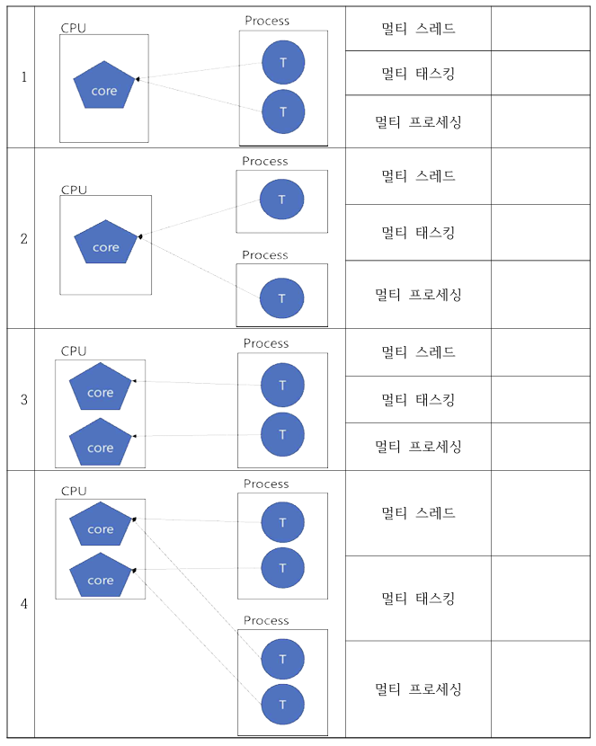
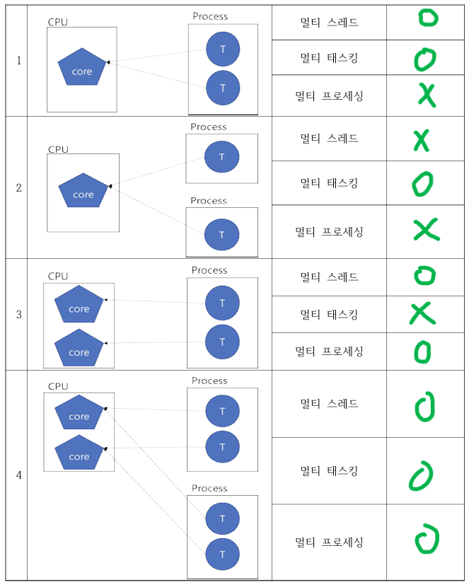

# 🖲️운영체제 4주차

## Chap02. 프로세스와 스레드

### #1. 프로세스 (Process)

#### 1. 개념

- 프로그램 : 저장장치에 저장되어 있는 정적인 상태의 소프트웨어 (명령어 집합)
- 프로세서 : 명령을 실행하는 하드웨어 (e.g. CPU, MPU, MCU, ...)
- 프로세스 = 프로그램 + PCB + 사용자 데이터
  - 실행을 위해 메모리에 올라온 동적인 상태의 소프트웨어
  - 프로세스 제어 블록 (PCB)를 할당 받음.
  - 독립된 메모리 사용
  - 운영체제 입장에서의 작업단위 <-> 스레드 : CPU 입장에서의 작업단위

#### 2. 프로세스 제어 블록

- 개념
  - 프로그램이 프로세스로 전환될 때 운영체제가 만드는 작업지시서
  - 운영체제가 각 프로세스를 관리하기 위해 정의한 자료구조 (데이터 구조체)
- 구성
  |구성|의미|
  |:--|:--|
  |포인터|대기상태의 프로세스들을 연결리스트로 관리할때 프로세스를 가리키는 역할|
  |프로세스 상태|생성, 준비, 실행, 대기, 보류 등의 상태를 저장|
  |프로세스 구분자|프로세스를 구분하기 위한 ID|
  |프로그램 카운터|다음에 실행될 명령어의 위치값|
  |프로세스 우선순위|실행순서를 결정하는 우선순위|
  |각종 레지스터 정보|실행되는 중에 사용하던 레지스터 값|
  |메모리 관리 정보|프로세스의 메모리 위치 정보, 경계 레지스터/한계 레지스터 값|
  |할당된 자원 정보|입출력 자원, 오픈 파일 등에 대한 정보|
  |계정 정보|계정 번호, CPU 할당 시간 등|
  |PPID, CPID|부모 프로세스 식별자, 자식 프로세스 식별자|

#### 3. 프로세스 상태

- 개념 : 운영체제가 프로세스를 관리하기 위해 구분하는 여러 단계
- 분류

  - 활성화 상태 : 프로세스가 메모리에 적재되어 프로세스가 직접관리하는 상태
  - 비활성화 상태 : 메모리에서 쫓겨나 스왑영역(보조저장장치)에 저장된 상태

  | 상태              | 역할                                                                                            | 활성화 여부 |
  | :---------------- | :---------------------------------------------------------------------------------------------- | :---------- |
  | 생성 (Create)     | 프로세스가 메모리에 올라와 실행 준비 완료한 상태 (PCB 생성됨)                                   | O           |
  | 준비 (Ready)      | 프로세스가 CPU를 얻을 때까지 기다리는 상태                                                      | O           |
  | 실행 (Running)    | CPU를 얻어 실제 작업을 수행하는 상태                                                            | O           |
  | 대기 (Waitting)   | 실행 중인 프로세스가 입출력작업/이벤트가 완료되기를 기다리며 CPU를 사용하지 않고 멈춰 있는 상태 | O           |
  | 보류 (Terminated) | 메모리 부족 등의 이유로 프로세스가 스왑영역(보조기억장치)로 이동된 상태                         | X           |
  | 완료 (Suspended)  | 주어진 시간동안 작업을 마치고 진입한 상태 (PCB 사라짐)                                          | X           |

- 문맥 교환 (Context Switching)
  - 개념 : CPU를 차지하던 프로세스를 옮기고 새로운 프로세스를 실행
  - 과정
    1. 실행중인 프로세스를 중단
    2. 실행중인 프로세스의 상태정보를 PCB에 저장
    3. 다음에 실행할 프로세스를 선택하고 해당 프로세스의 PCB의 상태 정보를 복원하여 CPU에 적재
    4. 실행 재개
  - 발생 상황 (상태 기준)
    - 준비 -> 실행
    - 실행 -> 준비
    - 실행 -> 대기

#### 4. 프로세스 구조

1. 코드 영역 : 프로그램의 본문이 기술된 곳
2. 데이터 영역 : 코드가 실행되면서 사용하는 변수, 파일 등의 각종 데이터를 모아놓은 곳 (e.g. 전역변수, 정적변수 등)
3. 힙 영역 : 동적으로 생성(new/malloc)한 데이터 영역. 유일하게 런타임시 크기가 결정됨.
4. 스택 영역 : 프로세스 실행에 운영체제가 필요한 부수적인 데이터를 모아놓은 곳 (e.g. 지역변수, 매개변수, 리턴값, 함수가 복귀할 주소 등)

---

### #2. 스레드 (Thread)

- 개념

  - 프로세스 내에서 실행되는 가장 작은 실행단위
  - CPU 스케줄러가 CPU에 전달하는 일들 중 하나
  - 하나의 프로세스가 여러개의 스레드를 가질 수 있음.
  - 하나의 프로세스가 생성될 때, 하나의 스레드가 같이 생성됨.

- 특징

  - 경량성 : 프로세스 보다 생성/소멸/전환이 빠름. + 자원소모 적음.
  - 동시성/병렬성 : 여러 스레드가 동시에 실행되어 프로그램의 병렬처리와 응답성을 높일 수 있음. (멀티스레드)
  - 자원공유
    - 프로세스 내 스레드들은 메모리(코드, 데이터, 힙 영역)을 공유하여 효율적으로 자원을 활용
    - 한 스레드에 오류 발생시 다른 스레드에 문제가 생길 수 있음.
  - 프로세스 내 통신 용이 : 스레드 간 데이터 교환이 쉽고 빠름.
  - 동기화 필요
    - 스레드들이 공유자원에 동시에 접근할 경우에 발생하는 문제를 방지하기 위해 순차적으로 접근하도록 조절하는 기법이 필요
    - e.g. 임계 구역, 뮤텍스, 세마포어 등

---

### #3. 동시성과 병렬성

#### 1. 동시성 (Concurrency)

- 개념
  - 여러 작업을 논리적으로 동시에 처리하는 것처럼 보이게 하는 것
  - 실제로는 하나의 CPU가 여러 작업을 빠르게 전환하며 실행함. (시분할 작업)
  - 즉, 논리적 동시 실행이며, 실제로는 순차적
  - 작업을 소프트웨어적으로 분할하는 것
  - 병렬성을 포함하기도 함. (병렬성은 동시성의 부분집합)
- 시분할 작업이란?
  - CPU의 시간을 짧은 단위(타임 슬라이스)로 쪼개 여러 작업에 번갈아 할당하는 방식
  - 실제로는 하나의 작업만 실행되는 것
  - 매우 빠른 전환으로 여러 작업이 동시에 실행되는 것으로 보임.

#### 2. 병렬성 (Parallelism)

- 개념
  - 여러 작업을 물리적으로 동시에 처리하는 것
  - 멀티 코어 혹은 멀티 프로세서 환경에서 여러 코어 혹은 여러 CPU가 각각 다른 작업을 동시에 수행하는 것
  - 작업을 하드웨어적으로 분할하는 것
- 방식
  - 멀티 프로세서 시스템
    - 여러개의 독립적인 CPU가 한 시스템에 장착
    - 각 CPU가 동시에 서로 다른 작업을 처리
  - 멀티 코어 시스템
    - 하나의 CPU칩 안에 여러개의 코어가 내장
    - 각 코어가 독립적으로 명령을 실행

| 구분              | 동시성                        | 병렬성                      |
| :---------------- | :---------------------------- | :-------------------------- |
| 실행 방식         | 논리적 동시 실행              | 물리적 동시 실행            |
| 하드웨어 요구사항 | 싱글 코어 가능                | 멀티 코어 이상              |
| 처리 방식         | 시분할, 문맥 교환             | 여러 CPU/코어에서 병렬 처리 |
| 목적              | 효율적 자원 활용, 응답성 향상 | 처리속도/처리량 향상        |

---

### #4. 멀티 프로세스와 멀티 스레드

#### 1. 멀티 프로세스

- 개념 : 여러 개의 독립된 프로세스가 동시에 실행되는 구조
- 특징
  - 각 프로세스는 독립적
    - 안정성 높음.
    - 다른 프로세스의 메모리에 직접 접근이 불가해 IPC 필요 (단, IPC 비용은 큼)
  - 동시성 : 싱글 코어 CPU 환경에서는 여러 프로세스가 시분할 방식으로 실행됨.
    - 이때 문맥교환이 이뤄지는데 성능저하의 원인이 될 수 있음.
  - 병렬성 : 멀티 코어/멀티 프로세서 환경에서는 서로 다른 코어에서 실제로 동시에 실행됨.

#### 2. 멀티 스레드

- 개념 : 하나의 프로세스 내에서 여러 스레드가 동시에 실행되는 구조
- 특징
  - 스레드들은 같은 프로세스 내 메모리/자원을 공유 -> 통신이 빠르고 효율적임.
  - 한 스레드의 오류가 전체 프로세스(다른 스레드)에 영향을 줄 수 있음.
    - 안정성 떨어짐.
    - 임계 구역을 통해 단점을 해소
  - 동시성 : 싱글 코어 CPU 환경에서는 여러 스레드가 시분할 방식으로 실행됨.
  - 병렬성 : 멀티 코어 환경에서는 여러 스레드가 각 코어에서 동시에 실행됨.

#### 3. 멀티 태스킹

- 개념
  - 하나의 코어(논리적 CPU)에서 여러 작업을 번갈아가며 실행함.
  - 사용자가 여러작업이 동시에 실행되는 것처럼 느끼게 하는 방식
  - 즉, 동시성, 소프트웨어적 분할, 시분할 시스템과 연관된 개념

#### 4. 멀티 프로세싱

- 개념
  - 여러개의 CPU(코어, 프로세서)가 동시에 여러작업을 물리적으로 병렬로 처리하는 방식
  - 실제로 작업들이 동시에 실행되는 방식
  - 즉, 병렬성, 하드웨어적 분할과 연관된 개념

