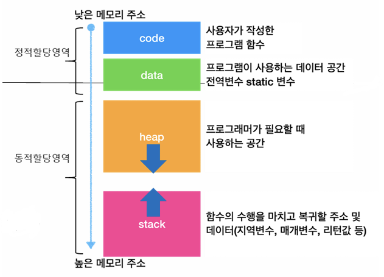

# 🖲️운영체제 4주차

## Chap03. 프로세스 주소 공간

#### 1. 개념

- 운영체제가 프로세스마다 독립적으로 할당하는 메모리 영역
- 메모리에 할당된 프로세스의 구조로 볼 수 있음.
- 구조

  1. 코드 영역
     - 프로그램의 본문이 기술된 곳
     - 프로그램의 실행 명령어 코드가 저장됨.
     - 읽기만 가능
  2. 데이터 영역
     - 코드가 실행되면서 사용하는 변수, 파일 등의 데이터를 모아놓은 곳
     - 초기화된 전역 변수, static 변수 등
     - 프로그램 시작 시 할당. 종료시 소멸.
     - 읽기/쓰기 가능
  3. 힙 영역
     - 동적으로 생성한 데이터 영역
     - 유일하게 런타임시 크기가 결정 (런타임 중 크기/위치가 유동적)
     - malloc이나 new 명령으로 관리
     - 개발자/가비지 컬렉터가 수동적으로 메모리 해제를 해줘야함.
     - 읽기/쓰기 가능
  4. 스택 영역
     - 운영체제가 프로세스 실행을 위해 부수적으로 필요한 데이터를 모아놓은 곳
     - 함수 호출 시마다 지역 변수, 매개 변수, 리턴 주소 등 실행 정보가 스택 영역에 쌓임. (함수 종료 시 해제됨.)
     - 프로세스 마다 독립적으로 존재
     - 읽기/쓰기 가능

- 메모리 배치 순서 : 낮은주소에서 코드 -> 데이터 -> 힙 -> 스택 순으로 배치
  

#### 2. 메모리 보호와 안정성

- 의미 : 각 프로세스는 자신만의 주소 공간을 가지므로 다른 프로세스가 침범하지 못함.
- 방식 : 한계 레지스터와 경계 레지스터 활용
  1.  경계 레지스터에 메모리영역의 시작주소 저장, 한계 레지스터에 메모리 영역의 크기(끝주소-시작주소) 저장
  2.  CPU가 메모리 접근 시 주소가 범위 내에 있는지 검사
      - 경계 <= 접근주소 < 경계+한계
  3.  벗어나면 메모리 오류관련 인터럽트 발생
