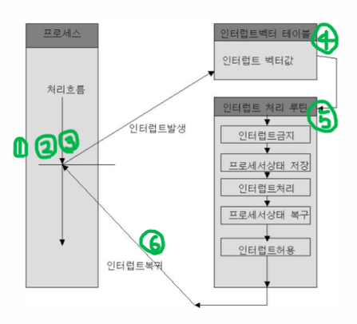

# 🖲️운영체제 4주차

## Chap04. 인터럽트 (Interrupt)

### #0. CPU와 I/O장치 간의 이벤트 처리 방식

#### 0. 이벤트의 예시

1. 입출력 작업 완료 : 디스크에서 파일을 읽거나 쓸때, 데이터 전송이 끝날 때
2. 사용자 입력 : 사용자가 입력장치(키보드, 마우스 등)에 action을 취할 때
3. 장치 상태 변화 : 프린터가 인쇄를 끝냈을 때, 네트워크 카드가 패킷 수신을 완료했을 때 등
4. 타이머 알림 : 일정 시간이 경과했을 때
5. 오류 발생 : 장치에 에러가 발생했을 때

#### 1. 폴링(Polling) 방식

- 개념 : CPU가 주기적으로 I/O장치의 상태를 직접 확인하여 이벤트 발생여부를 확인하는 방식
- 특징
  - 구현 쉬움. 우선순위 변경 용이 (운영체제, 앱 등에서 코드를 수정)
  - 지속적인 감시로 시스템 자원을 많이 소모
  - 이벤트 발생 지점에 즉각적으로 반응 못할 수 있음.

#### 2. 인터럽트(Intertupt) 방식

- 개념
  - I/O장치에서 이벤트 발생 시 CPU에 직접 신호를 보내 즉시 처리하도록 요청하는 방식
  - 입출력 관리자가 입출력을 대신 해주는 방식
- 특징

  - 구현이 상대적으로 복잡함.
  - 시스템 부하가 상대적으로 적음.
  - 이벤트 발생한 순간에 반응이 빠름.
  - CPU를 효율적으로 사용가능 (이벤트 발생 시점에만 개입하므로.)

---

### #1. 인터럽트 관련 용어

- **인터럽트**

  - 개념 : CPU가 명령을 수행하는 도중 이벤트가 발생했을 때, 작업을 중단하고 이벤트를 우선적으로 처리하도록 하는 **신호**

- **인터럽트 번호** (IRQ - Interrupt ReQuest)

  - 개념
    - 발생한 인터럽트의 종류를 식별하기 위한 숫자(코드)
    - 인터럽트 마다 고유 번호가 부여되어 있음.
    - CPU/운영체제는 인터럽트 번호를 기준으로 어떤 처리가 필요한지 결정

- **인터럽트 벡터** (Interrupt Vector)

  - 개념
    - IRQ에 따라 실행할 ISR의 주소
    - 인터럽트 마다 해당 인터럽트 처리 루틴으로 진입하는 주소정보

- **인터럽트 벡터 테이블**

  - 개념
    - 인터럽트 벡터(주소)를 한곳에 모아둔 테이블 형태의 자료구조
    - 인터럽트 벡터들의 집합

- **인터럽트 서비스 루틴** (ISR - Interrupt Service Routine = 인터럽트 핸들러)

  - 개념 : 인터럽트 신호를 처리하기 위해 CPU가 실행하는 함수 혹은 코드블록

- **중첩 인터럽트** (Nested Interrupt)
  - 개념 : ISR을 실행하고 있는 도중에 더 높은 우선순위의 인터럽트가 발생하면, 현재 ISR을 일시 중단하고 새로운 ISR(더 높은 우선순위)을 먼저 처리하는 것을 의미
- **입출력 관리자** (I/O Manager)

  - 개념 : CPU와 I/O장치 간의 입출력 작업을 효율적이고 안전하게 관리/중재하는 담당하는 운영체제의 구성요소
  - 특징
    1. 운영체제의 커널영역에 구현되어있음.
    2. CPU가 내린 입출력 작업 명령을 수행하고, 완료 시 CPU에 인터럽트 신호를 보내 알려줌.
    3. 외부 인터럽트에서 동작함.

- **직접 메모리 접근** (DMA - Direct Memory Access)
  - 개념 : 입출력 관리자가 CPU가 요청한 데이터를 메모리에 가져다 놓을 때, CPU의 허락 없이 메모리에 접근할 수 있는 권한
  - 사이클 훔치기 (Cycle Stealing) : CPU와 DMA가 동시에 메모리에 접근할 때, DMA가 CPU보다 우선적으로 메모리에 접근하는 상황 (DMA가 더 느리므로.)

---

### #2. 인터럽트의 종류

#### 1. 외부 인터럽트 (External Interrupt = Hardware Interrupt)

- 개념 : 컴퓨터 시스템 외부의 하드웨어 장치가 발생시키는 인터럽트
- 예시 : 키보드 입력, 마우스 클립, 타이머 알림, 디스크 입출력 완료 등
- 특징
  - 비동기적 : CPU가 언제 어떻게 이벤트가 발생하는지 알 수 없음. 명령어(프로그램 실행 흐름)와 무관.
  - 입출력(I/O)장치나 외부 이벤트에 의해 발생
  - 입출력 관리자를 통해 인터럽트를 처리하므로, 인터럽트 처리 중 다른 동작 수행 가능.

#### 2. 내부 인터럽트 (Internal Interrupt = Exception)

- 개념
  - CPU 내부에서 명령어 실행 중 발생하는 예외상황에 의한 인터럽트
  - 잘못된 명령/데이터 사용 시 발생
- 예시 : 0으로 나누기(계산이 안되므로), 오버플로우, 잘못된 명령어 실행 등
- 특징
  - 동기적 : 프로그램 실행 흐름과 연관. 명령어 실행결과에 따라 발생.
  - 오류나 예외상황 발생 시 CPU가 자동으로 발생시킴.
  - CPU 내부에서 처리하는 인터럽트이므로, 처리 중 다른 동작 수행 불가능
- 유형
  1. 트랩(Trap)
     - 의미 : 프로그래머가 의도적으로 발생시키는 예외로 인한 인터럽트
     - 특징 : 정상 제어 흐름의 일부. 다음 명령어로 복귀. 사용자의 의도한 동작.
     - 예시 : 시스템 콜, Breakpoint 트랩 등
  2. 폴트(Fault)
     - 의미 : 프로그램 실행 중 오류상황이 발생한 경우. 복구가 가능한 잠정적 에러.
     - 특징 : 예외가 발생한 명령어를 재실행 가능. 운영체제가 문제 해결시 이어서 실행 가능.
     - 예시 : 0으로 나누기, 페이지 폴트, 세그먼테이션 폴트 등
  3. 어보트(Abort) : 복구 불가능한 심각한 오류, 프로그램 강제 종료

#### 3. 소프트웨어 인터럽트 (Software Interrupt)

- 개념
  - 프로그램이 처리중 명령어를 통해 의도적으로 인터럽트를 발생시키는 방식
  - 사용자가 운영체제 서비스를 요청 OR 프로그래머가 코드상에서 호출
- 예시 : 시스템 콜, 디버깅 목적의 중단 등
- 특징
  - 동기적
  - 소프트웨어 명령어에 의해 발생
  - 운영체제 서브 호출 등에 사용됨.

---

### #3. 인터럽트 발생 처리 과정

#### 인터럽트 발생 처리 과정

1. 인터럽트 신호 감지
2. 현재 작업 중단 : 수행중인 작업의 상태를 CPU의 스택영역에 저장 (복원이 가능하도록)
3. 인터럽트 우선순위 확인

   - 여러개의 인터럽트의 우선순위를 정하는 상황
   - 혹은 현재 수행중인 명령어와 인터럽트 중 우선순위를 판단하는 상황

4. 인터럽트 벡터 확인 : 인터럽트 벡터 테이블에서 해당 인터럽트에 해당하는 ISR 확인
5. 인터럽트 서비스 루틴 실행 : ISR로 점프. 이벤트 처리.
6. 상태 복원 및 복귀 : ISR 종료. 원래 작업 복원 및 복귀.

---

### #4. 퀴즈

#### 1번 : 다음 중 내부 인터럽트에 해당하지 않는 것은?

    1. 0 나누기
    2. 오버플로우
    3. 시스템 콜
    4. 입출력 준비 완료

#### 2번 : 중첩 인터럽트가 발생한다면 위의 이미지의 어느 부분에서 발생하는가?

    (1) (2) (3) (4) (5) (6)

#### 3번 : 입출력장치는 DMA를 통해 메모리를 사용할 수 있다. 사이클 훔치기는 DMA가 CPU보다 우선적으로 메모리에 접근하는 상황을 의미하는데, 이는 CPU의 작업 속도보다 입출력 장치의 속도가 더 느리기 때문이다. 이렇게 설계한 이유는 무엇일까?

- CPU 효율성이 향상됨 : 외부 인터럽트는 입출력 관리자의 역할이 수행됨으로써 이뤄진다. 하지만, CPU의 우선순위가 더 높을 경우 입출력 작업의 결과가 지연되면서 CPU의 효율성 역시 떨어지게 된다. 따라서 DMA의 우선순위가 더 높아야 외부 인터럽트가 원활하게 진행될 것이고, 이는 CPU의 효율성 향상으로 이어진다.
- 입출력 장치의 아사현상을 방지하기 위함 : CPU의 우선순위가 더 높은 경우 (DMA의 우선순위를 높여주지 않은 경우), CPU가 계속해서 메모리 버스를 계속해서 점유하게 되고, 이는 입출력 작업이 지연되거나 실패하는 상황으로 이어질 수 있다.
