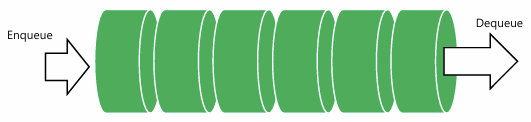

# 🖲️운영체제 5주차

## Chap07. 프로세스 간 통신 (IPC : Inter-Process Communication)

### #1. IPC의 개념

#### 개념

- 각 프로세스는 운영체제에서 격리된 메모리 영역을 가지므로 일반적으로는 직접 정보를 교환 불가능
- IPC란 분리된 프로세스 간의 데이터와 정보를 안전하고 효율적으로 교환할 수 있도록 통신 수단을 제공하는 메커니즘

#### 목적

- 프로세스 협력 및 동기화에 필요
- 멀티 프로세스 환경에서 작업 분할과 효율적인 데이터 교환을 지원
- 시스템 전반의 안정성을 높임
- 자원 활용도를 향상시킴

#### 특징

- 서로 격리된 프로세스 간 데이터 교환
- 동기화 지원 : 여러 프로세스가 동시에 자원에 접근할 때, 경쟁 조건이 발생하지 않도록 세마포아, 뮤텍스 등을 지원
- 협력 지원 : 프로세스 협력, 상태 분배, 작업 분산에 필수적
- 자원 공유 가능 : 파일, 메모리 등 여러 프로세스가 자원을 공동으로 사용 가능

---

### #2. IPC의 분류

#### 통신 방식의 범위에 따른 분류

1. 프로세스 내부 데이터 통신
   - 프로세스 내 스레드 간 통신
   - 스레드는 전역변수/파일을 이용하여 데이터 공유
2. 프로세스 간 데이터 통신
   - 같은 컴퓨터(동일 호스트)에 있는 프로세스간 통신
   - 공용 파일, 공용 자원(운영체제가 제공)을 이용
3. 네트워크를 이용한 데이터 통신
   - 여러 컴퓨터가 네트워크로 연결되어 있을 때 통신
   - 소켓(like 택배박스)을 이용한 데이터 공유

#### 방향성에 따른 분류

1. 단반향 통신
   - 한쪽으로만 데이터 전송
   - e.g. 파이프
2. 양방향 통신
   - 데이터를 동시에 양쪽 방향으로 전송
   - e.g. 소켓 통신
3. 반양방향 통신
   - 양쪽 방향으로 전송 + 동시 전송 불가
   - e.g. 메세지 큐, 공유 메모리

#### 동시성에 따른 분류

1. 대기가 있는 통신
   - 동기화 지원 O
   - 데이터 받는 쪽은 데이터가 도착할 때까지 자동 대기 상태(블로킹)
2. 대기가 없는 통신
   - 동기화 지원 X
   - 다른 작업을 하는 중에 데이터가 수신되면 처리

---

### #3. IPC 기법 종류

1. 시그널

   - 운영체제가 프로세스를 관리하기 위한 시그널을 정의
   - 시그널 수신한 프로세스는 그에 맞는 행위 수행
   - e.g.
     - 9. SIGKILL : 프로세스 강제 종료
     - 14. SIGALRM : 잠들어 있는 프로세스 깨움

2. 공유 파일

   - 개념 : 서로 다른 프로세스가 동일한 파일을 공유하는 방식
   - 특징
     - 파일은 하드디스크에 저장 -> 장치의 읽기/쓰기 속도에 영향
     - 파일 기술자(fd) 사용
       - 프로세스가 운영체제의 입출력 자원을 사용할 때 시스템으로부터 할당받는 인덱스(번호)로 사용됨
       - 커널 내부에 저장된 열린 파일 정보를 찾아가는 용도의 참조 값
       - 파일에서 하나이며 맨앞에서 생성, 전진하는 방식

   

3. 파이프

   - 개념 : 프로세스 간 데이터를 단방향으로 전달하는 데 사용되는 기법
   - 특징
     - 파이프는 fork()로 복사되지 않음
     - A 프로세스의 출력을 B 프로세스의 입력으로 처리 (반대 방향 불가능)
       - 바이프 내부 버퍼에 기록된 데이터는 주인이 없음
       - 읽기를 하지 않을 경우, 데이터를 입력한 프로세스가 그대로 다시 읽는 문제가 발생
     - 파일 기술자는 길이가 2인 정수형 배열
       - pipefd[0] : 읽기용
       - pipefd[1] : 쓰기용
   - 종류
     1. 단방향 파이프 : 기본 파이프
     2. 양방향 파이프
        - 양방향 통신이 필요할 때 파이프를 2개 생성하여 사용
        - 2쌍(4개)의 파일 기술자

   

4. 메세지 큐

   - 개념
     - 프로세스 간의 데이터(메세지)를 외부에 있는 큐를 통해 송수신하는 기법
     - 외부에 있는 큐 : 운영체제 커널이 관리하는 큐 형태의 버퍼
     - 송신 프로세스가 데이터를 큐에 넣으면, 수신 프로세스가 큐에서 데이터를 꺼냄
   - 특징
     - 비동기적 : 송신자, 수신자가 동시에 동작하지 않아도 됨
     - 여러 프로세스가 동일한 메세지 큐에 접근 가능 -> 확장성/공유성
     - 메세지 단위로 데이터 송수신 -> 안정적
     - 동기화 작업 분산에 유리

   

5. 공유 메모리

   - 개념
     - 여러 프로세스가 운영체제 커널이 할당해준 특정 메모리 영역을 함께 사용하는 방식
     - 프로세스는 시스템 콜을 통해 해당 영역을 연결/생성하여 데이터를 직접 읽고 씀
   - 특징
     - IPC 기법 중 가장 빠름 : 커널의 개입이 없으므로
     - 동기화 필요 : 여러 프로세스가 동시에 접근하므로 데이터 일관성/경쟁 상태 방지를 위함
     - 프로세스는 해당 영역을 포인터로 접근
     - 공유 메모리 영역은 커널이 생성/관리하므로 프로세스가 모두 종료되어도 해제하지 않을 시 남아 있을 수 있음

   

6. 소켓

   - 개념
     - 여러 컴퓨터에 있는 프로세스들이 네트워크를 공유하여 통신하는 방식
     - 소켓은 엔드포인트로써 운영체제가 제공하는 API를 통해 생성됨
   - 특징
     - 네트워크 기반 통신
     - 양방향 통신 : 구현 방식에 따라 동기적/비동기적 특성이 정해짐
     - 확장성 : 다양한 네트워크 애플리케이션(클라이언트-서버 구조, P2P 구조)에 활용됨
     - 유연성 : 다양한 프로토콜(TCP, UDP 등)을 선택할 수 있으며 보안 적용도 가능

   
