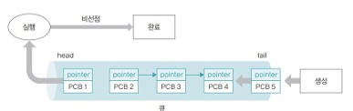
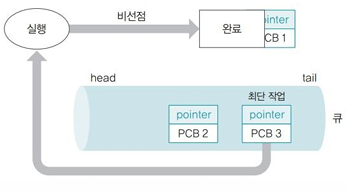
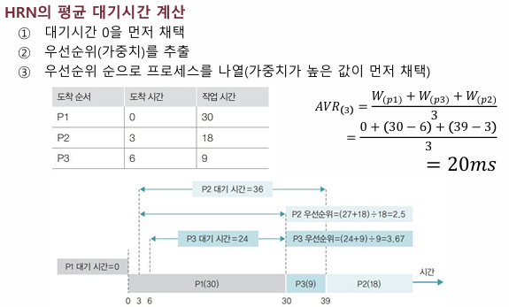
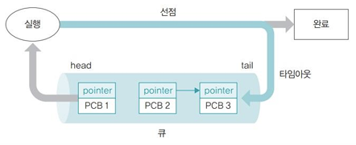
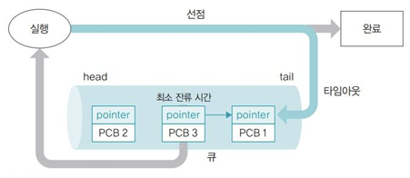
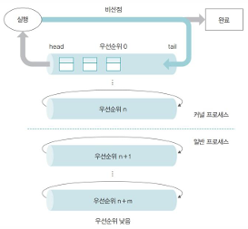
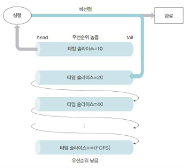

# 🖲️운영체제 5주차

## Chap08.CPU 스케줄링

### #0. 프로세스 상태

- 개념 : 운영체제가 프로세스를 관리하기 위해 구분하는 여러 단계
- 분류

  - 활성화 상태 : 프로세스가 메모리에 적재되어 프로세스가 직접관리하는 상태
  - 비활성화 상태 : 메모리에서 쫓겨나 스왑영역(보조저장장치)에 저장된 상태

| 상태              | 역할                                                                                            | 활성화 여부 |
| :---------------- | :---------------------------------------------------------------------------------------------- | :---------- |
| 생성 (Create)     | 프로세스가 메모리에 올라와 실행 준비 완료한 상태 (PCB 생성됨)                                   | O           |
| 준비 (Ready)      | 프로세스가 CPU를 얻을 때까지 기다리는 상태                                                      | O           |
| 실행 (Running)    | CPU를 얻어 실제 작업을 수행하는 상태                                                            | O           |
| 대기 (Waitting)   | 실행 중인 프로세스가 입출력작업/이벤트가 완료되기를 기다리며 CPU를 사용하지 않고 멈춰 있는 상태 | O           |
| 보류 (Suspended)  | 메모리 부족 등의 이유로 프로세스가 스왑영역(보조기억장치)로 이동된 상태                         | X           |
| 완료 (Terminated) | 주어진 시간동안 작업을 마치고 진입한 상태 (PCB 사라짐)                                          |

- 주요 상태 전이 과정
  1. 생성 -> 준비 : 프로세스가 메모리에 적재됨. PCB가 생성됨.
  2. 준비 -> 실행 : CPU 스케줄러가 하나의 프로세스를 선택하여 CPU 할당 (디스패치)
  3. 실행 -> 준비 : 타임 슬라이스 종료. 혹은 우선순위가 높은 프로세스가 생김(선점형 스케줄링)
  4. 실행 -> 대기 : 입출력 요청/특정 이벤트 대기 시에 발생
  5. 대기 -> 준비 : 입출력 완료/특정 이벤트 발생/자원 사용 가능 시에 발생
  6. 실행 -> 종료 : 프로세스의 모든 명령어 완료됨. PCB 제거됨.

---

### #1. CPU 스케줄링이란?

#### 1. CPU 스케줄링

- 개념 : 운영체제가 준비상태의 프로세스들 중에서 CPU에 할당할 프로세스를 결정하는 과정
- 목적

  - CPU 이용률 향상
  - 처리량 증가 : 단위 시간당 처리되는 프로세스 수 늘림
  - 응답 시간 단축 : 사용자에게 빠른 반응 제공
  - 대기 시간 최소화 : 큐에서 기다리는 시간 줄임
  - 공정성 보장 : 특정 프로세스가 오래 기다리지 않게함

- 발생 시점
  - 프로세스 상태 : 대기 -> 준비
  - 프로세스가 종료될 때
  - 실행 중인 프로세스의 타임 슬라이스가 끝났을 때
  - 우선순위가 높은 프로세스가 준비 상태로 들어올 때

#### 2. CPU 스케줄러

- 개념 : CPU 스케줄링을 수행하는 주체(운영체제의 모듈)
- 특징

  - 준비 큐에 있는 프로세스들 중 하나를 선택하여 CPU에 할당
  - 효율성 : 시스템 자원의 사용률 극대화
  - 정책 : 기준(우선순위, 실행시간)에 따라 결정
  - 공정성 : 특정 프로세스가 오래 기다리지 않게 함

- 작동 상황
  - 프로세스 상태 : 실행 -> 준비
  - 프로세스 상태 : 실행 -> 대기
  - 준비 상태인 프로세스가 새로 생길 때
  - 입출력 대기 중인 프로세스가 완료되어 준비 상태로 돌아올 때

#### 3. 디스패처 (Dispatcher)

- 개념 : CPU 스케줄러의 결정 결과를 실행으로 옮기는 담당자
- 주요 기능
  - 문맥 교환 : 기존 프로세스의 **상태를 저장하고** 새로운 프로세스의 **상태를 불러오는** 작업
  - 디스 패치 : 준비 상태의 프로세스들 중 **하나를 선택**하고 **CPU를 할당**하여 실행 상태로 전환하는 과정
  - 사용자 모드 전환
  - 프로그램 카운터(PC) 설정

---

### #2. 스케줄링의 단계

- 상위단계 스케줄링
  - 실행할 프로세스 총 개수 정의 (전체 프로세스 수 결정)
  - 작업 승인 여부 결정
  - 디스크(대기) <-> 메모리(준비) 간 작업 이동 관리
- 중위단계 스케줄링
  - 하위단계 스케줄링 부담 완충
  - 활성화된 프로세스 조절 (스왑아웃/스왑인 결정)
  - 스왑아웃 : 메모리의 프로세스를 임시로 디스크로 내림
  - 스왑인 : 스왑아웃의 반대
- 하위단계 스케줄링
  - 메모리의 준비상태 프로세스들 중 어떤 것을 CPU에 할당할지 결정
  - 속도, 실행빈도가 높음
  - 선점/비선점 등의 스케줄링 알고리즘이 적용됨

---

### #3.스케줄링의 분류

#### 1. 비선점형 스케줄링

- 개념
  - 실행 상태의 작업이 완료될 때까지 다른 작업 불가능
  - 프로세스가 CPU를 한번 점유하면 스스로 종료하거나 대기 상태가 되기 전까지 계속 실행
- 특징
  - 문맥교환 오버헤드가 적음
  - 응답속도 느림 -> 대기시간 길어짐
  - 일괄 작업 방식 스케줄링에 사용
- 종류
  1. FCFS 방식
  2. SJF 방식
  3. HRN 방식 (SJF 단점을 보완한 방식)

#### 2. 선점형 스케줄링

- 개념
  - 실행 상태의 작업을 중단시키고 새로운 작업 실행 가능
  - 우선순위가 높은 프로세스가 나타나면 현재 프로세스의 CPU를 뺏는 방식
- 특징
  - CPU 자원 효율성 및 응답속도 높음
  - 문맥 교환 오버헤드가 큼
  - 시분할 방식 스케줄링에 사용
- 종류
  - 라운드 로빈 방식
  - SRTF 방식
  - 우선순위 방식 (비선점형/선점형 모두 가능)

---

### #4. 스케줄링 알고리즘

#### 1. FCFS(First Come First Served) 방식

- 개념 : 큐에 도착한 순서대로 CPU를 할당
- 특징
  - 비선점형, 우선순위 동일
  - 효율성 낮음 -> 처리시간이 긴 프로세스가 CPU를 차지한 경우
  - 작업효율 낮음 -> 작업 중인 프로세스가 입출력 작업 요청 시 대기상태로 감 + 다시 자기 차례를 기다려야 함 (비선점형 방식으로...)
  - 콘보이 효과 : 앞의 작업이 오래걸려 뒤의 작업이 지연되는 현상

#### 2. SJF(Shortest Job First - 최단 작업 우선) 방식

- 개념 : 준비 큐에 있는 프로세스 중에서 실행시간이 가장 짧은 작업 부터 CPU를 할당
- 특징
  - 비선점형
  - 콘보이 효과 완화
  - 아사 현상 발생 : 작업시간이 긴 작업은 계속 뒤로 밀림 + 공평성 떨어짐
  - 운영체제가 프로세스의 종료 시간을 예측하기 어려움

#### 3. HRN(Highest Response Ratio Next - 최고 응답률 우선) 방식

- 개념 : 대기시간과 CPU 사용시간을 고려하여 스케줄링하는 방식
- 특징
  - 비선점형
  - 우선순위 [= (대기시간 + CPU 사용시간)/CPU 사용시간] 를 기준으로 결정
  - 아사 현상 해결
  - 공평성 여전히 위배

#### 4. 라운드 로빈 (RR) 방식

- 개념
  - 한 프로세스가 할당받은 시간 동안 작업
  - 작업 완료를 못하면 준비 큐의 맨 뒤로 이동하여 자기 차례 기다림
  - 작업 완료할 때까지 순환
- 특징
  - 선점형
  - 준비 큐에 도착한 순서대로 CPU 할당
  - 적절한 타임 슬라이스(할당 받은 시간) 설정이 관건
    - 타임 슬라이스가 큰 경우 : FCFS 스케줄링과 다를게 없음
    - 타임 슬라이스가 작은 경우 : 문맥교환 오버헤드로 성능저하 발생

#### 5.SRTF (Shortest Remaining Time First) 방식

- 개념
  - SJF의 선점형 버전
  - SJF + 라운드 로빈
  - 남은 작업 시간이 가장 적은 프로세스를 CPU에 할당
- 특징
  - 선점형
  - 프로세스 종료 시간 예측하기 어려움
  - 아사 현상 발생

#### 6. 선점형 우선순위 방식

- 개념 : 프로세스 중요도에 따른 우선순위를 반영한 스케줄링 방식
- 특징
  - 우선순위가 낮은 프로세스는 아사 현상 발생
  - 비선점형 방식도 가능

#### 7. 멀티레벨 큐 (MLQ - Multi-Level Queue) 방식

- 개념
  - 우선순위에 따라 준비 큐를 여러개 사용
  - 우선순위에 따라 해당 우선순위 큐에 삽입
- 특징
  - 상단 큐의 모든 작업이 완료된 후 하단 큐 진행
  - 아사 현상 유발

#### 8. 멀티레벨 피드백 큐 (MLFQ - Multi-Level Feedback Queue) 방식

- 개념
  - 프로세스가 실행될 때마다 프로세스의 우선순위를 동적으로 조정하는 방식
  - 다단계 큐의 낮은 우선순위 프로세스의 아사현상 해결한 방식
- 특징

  - 선점형
  - CPU 사용 패턴에 따라 우선순위가 동적으로 조정됨

    - CPU를 오래 쓰면 우선순위 낮아짐
    - CPU를 잠깐 쓰면 우선순위 높아짐

  - 우선순위에 따라 타임 슬라이스 크기가 다름
    - 우선순위가 높으면 타임 슬라이스 짧음
    - 짧은 프로세스에 빠른 응답
    - 긴 프로세스도 결국 처리 가능

