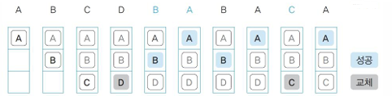
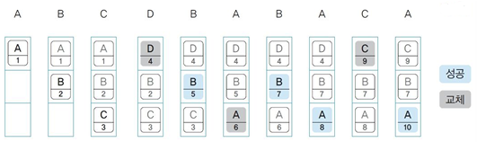
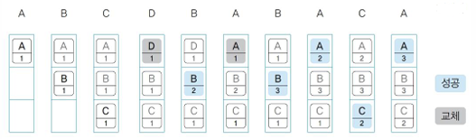

# 🖲️운영체제 6주차

## Chap13. 페이지 교체 (Page Replacement)

### #1. 페이지 교체란?

#### 개념

- 페이지 폴트(페이지 부재)가 발생했을 때 어떤 페이지(희생 페이지)를 선택하여 내보내고, 새로운 페이지를 적재하는 과정

#### 특징

- 배경 : 가상 메모리 환경은 물리 메모리 보다 큰 프로그램을 대상으로 메모리를 할당할 수 있으며 이는 프로세스의 모든 페이지가 메모리에 있을 수 없는 상황이 존재할 수 있음 (메모리가 꽉 찬 상황)
- 페이지 폴트(Page Fault) : 프로세스가 접근하려는 페이지가 현재 메모리에 없는 상황에서 발생하는 현상
- 희생 페이지(Victim Page) : 페이지 교체로 인해 메모리에서 내보내지는 페이지

---

### #2. 페이지 교체 알고리즘

#### 전제

- 페이지 폴트가 발생하면 아래 2가지의 경우가 생김

  1.  메모리에 여유공간 O -> 필요한 페이지를 스왑인
  2.  메모리에 여유공간 X -> 희생 페이지를 스왑아웃한 후에 필요한 페이지를 스왑인

- 페이지 폴트가 발생 && 메모리에 여유공간 X -> 페이지 교채 알고리즘 사용

#### 개념

- 가상 메모리 시스템에서 페이지 교체를 할 때 희생 페이지를 결정하는 전략

#### 종류

1. **무작위 페이지 교체 알고리즘**
   - 개념 : 특별한 로직 없이 무작위로 대상을 선정하는 방식
   - 특징 : 지역성을 고려하지 않아 성능이 떨어짐
2. **FIFO (First-In-First-Out) 페이지 교체 알고리즘**
   - 개념 : 시간상으로 가장 먼저 들어온 페이지를 대상으로 선정하는 방식
   - 특징 : 자주 사용되는 페이지를 고려하지 않아 성능이 떨어짐
3. **OTP (Optimal) 페이지 교체 알고리즘**
   - 개념 : 앞으로 사용하지 않을 페이지를 대상으로 선정하는 방식
   - 특징
     - 메모리가 앞으로 사용할 페이지를 미리 살펴보고, 사용 시점까지 가장 멀리 있는 페이지를 선정
     - 이상적이지만, 실제 구현은 불가능

4. **LRU (Least Recently Used) 페이지 교체 알고리즘**
   - 개념 : 페이지에 접근한 지 가장 오래된 페이지를 대상으로 선정하는 방식
   - 특징
     - 실제 사용 패턴에 잘맞는 알고리즘
     - 구현이 복잡한 편에 속함
     - 구현 과정에서 메모리가 추가적으로 필요함 (메모리 낭비 요소 발생)

5. **LFU (Least Frequently Used) 페이지 교체 알고리즘**
   - 개념 : 페이지가 몇 번 사용 되었는지를 기준으로 대상을 선정하는 방식
   - 특징
     - 현재 프레임에 있는 페이지 중에서 사용된 횟수가 가장 적은 페이지를 선정
     - 구현 과정에서 메모리가 추가적으로 필요함

