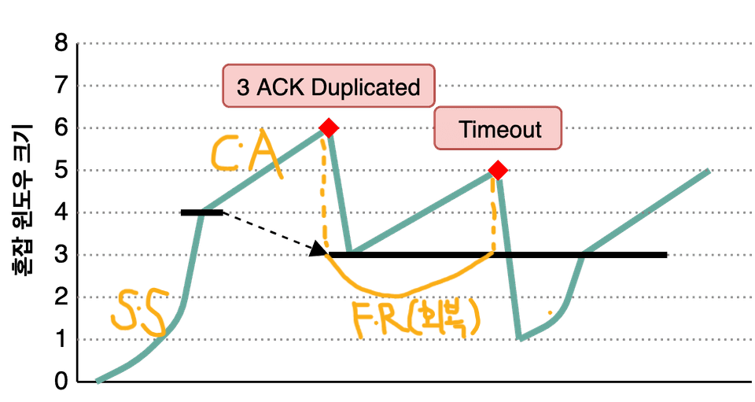

# 9주차 🛜네트워크

## Chap03. TCP/IP 흐름제어 & 혼잡 제어

### #0. TCP와 IP

#### IP (Internet Protocol)

- 개념

  - 출발지에서 목적지까지 데이터를 전달하기 위한 주소를 지정하는 기능을 제공하는 프로토콜
  - 논리적 주소(IP Address) 부여하고 이를 기반으로 패킷을 전달함
  - 네트워크 내 여려 라우터를 통해 목적지까지의 경로 선택을 수행
  - 네트워크 계층 (3계층)에 속함

- 특징
  - 전달 데이터 단위(PDU): 패킷
  - 비연결형: 연결 설정 없이 바로 패킷을 전송
  - 비신뢰성: 전달 보장 X (오류 복구 기능 없음)
  - 패킷 손실, 순서 바뀜, 중복 발생 가능

#### TCP (Transmission Control Protocol)

- 개념

  - 신뢰성 있는 종단 간 통신(E2E)를 제공하는 프로토콜
  - IP의 비신뢰적인 전송을 보완하여 데이터를 정확하고 안정적으로 전달
  - 전송 계층 (4계층)에 속함

- 특징
  - 전달 데이터 단위(PDU): 세그먼트
  - 연결 지향: 3-way handshake로 통해 연결 설정, 4-way handshake로 연결 종료
  - 신뢰성 제공
    - 데이터 분할 및 재조립
    - 순서 제어
    - 오류 검출 및 재전송
    - 흐름 제어 및 혼잡 제어
  - 포트 번호 관리: 동일 시스템 내 여러 프로세스 식별

---

### #1. 흐름 제어 (Flow Control)

#### 개념

- 송신자와 수신자의 처리 속도 차이 때문에 발생하는 문제를 막기 위해, 수신자가 감당할 수 있을 만큼만 데이터를 보내도록 조절하는 기법
- 수신자의 버퍼 용량, 처리 속도는 제한적임
- 송신자가 데이터를 너무 빠르게 보낼 시
  - 수신 버퍼 오버플로 발생
  - 패킷 폐기 -> 재전송 증가 -> 비효율

#### 특징

1. **수신자 처리 능력을 기준**으로 조절함
2. 수신자의 **버퍼 오버플로 방지**: 버퍼가 가득 파면 데이터가 유실됨
3. **종단 간(E2E) 동작**: 네트워크 중간 장비는 개입 X
4. TCP의 **Receive Window**(RcvWnd) 기반
   - 수신자는 버퍼 내 남은 공간을 송신자에게 알려줌
   - 송신자는 **SendWindow <= RcWnd** 조건을 유지
   - 전송량의 감소 원인은 수신의 상태 (RcvWnd가 줄어들면 전송량 줄어듬)

#### 방식

1. **Stop-and-Wait (정지-대기 방식)**

   - 개념: 하나를 보내고, ACK가 올 때까지 기다렸다가, 다음 걸 보내는 방식

   - 동작 과정

     1. 송신자: 세그먼트 1개 전송
     2. 수신자: 세그먼트 수신 후 ACK 전송
     3. 송신자: ACK를 받으면 다음 세그먼트 전송
     4. 반복

   - 장점
     - 구현이 간단함
     - 수신자가 과부화될 가능성이 현저히 낮음
   - 단점
     - 왕복 지연이 큰 환경에서는 대기 시간이 너무 많음 -> 비효율적
     - 항상 1개를 보내고 기다리므로 대역폭 활용률이 낮음

2. **Sliding Window (슬라이딩 윈도우 방식)**

   - **개념**

     - 수신자가 처리 가능한 범위(RcvWnd) 내에서 여러 개의 세그먼트를 연속으로 보내고,
     - 수신자의 ACK에 따라 윈도우를 밀어가며 전송량을 조절하는 방식

   - **특징**

     - Stop-and-Wait 대비 대역폭 활용 극대화
     - 왕복 지연(RTT)이 크더라도 파이프를 채워 효율적 전송 가능

   - **수신 윈도우 (Receive Window = RcvWnd) 란?**

     - Sliding Window의 내부 요소로 흐름 제어의 기준값
     - 수신자가 "내가 지금 받을 수 있는 데이터 용량"을 알려주는 값
     - RcvWnd는 동적으로 변화
       - 버퍼가 차면 줄어듬
       - 버퍼를 처리하면 늘어남
     - 즉, 수신자의 최대 수신 가능량을 의미 (**현재 시점 기준의 상한값**)
     - TCP 헤더의 Window Size필드를 통해 송신자에게 전달

   - **전송 윈도우 (Send Window) 란?**

     - 개념

       - Sliding Window의 내부 요소
       - 송신자가 지금 보낼 수 있는 데이터 양
       - 처음 전송할 때, 윈도우 크기 안에서는 ACK 여부 없이 연속 전송 가능
       - ACK가 오면, 그만큼 밀면서 다른 데이터 전송 가능
       - Send Window = RcvWnd - unACKed data (RcvWnd에서 도착하지 않은 패킷을 뺀 값)

   - **동작 과정**

     1. 송신자가 보낼 수 있는 범위(전송 윈도우) 내에서 연속적으로 세그먼트 전송
     2. 수신자는 도착한 세그먼트를 수신하고 ACK로 응답
     3. 송신자는 ACK에 따라 윈도우를 밀고, 세그먼트를 전송

   - **동작 예시** (윈도우 크기 = 3 세그먼트 = RcvWnd)

     1. 송신자: [1번, 2번, 3번] 세그먼트 연속 전송
     2. 수신자: 세그먼트 [1번, 2번] 수신 -> ACK(3) 전송
     3. 송신자: 슬라이딩 및 연속 전송 -> 윈도우 시작위치를 SEQ=3으로 이동 (Slide) -> [4번, 5번] 전송 가능

     ```
     윈도우 크기 = 3

      [송신 전]

      Buffer:   1   2   3   4   5   6 ...
      Window:  [1] [2] [3]
                ↑
            Send Window Start = 1 (크기: 3, 윈도우 시작 위치: 1)

      [송신 후 - 슬라이딩 전 = ACK 수신 전]

      Buffer:   1   2   3   4   5   6 ...
      Window:  [1] [2] [3]
                ↑
            Send Window Start = 1 (크기: 3, 윈도우 시작 위치: 1)

      [송신 후 - 슬라이딩 후 = ACK(3) 수신 후]

      Buffer:   (1)   (2)   3   4   5   6 ...
      Window:              [3] [4] [5]
                            ↑
                        Send Window Start = 3 (크기: 3, 윈도우 시작 위치: 3)
     ```

   - **ACK 번호의 의미**

     - 수신자가 다음에 받을 SEQ 번호를 의미
     - 송신자는 보냈던 데이터의 SEQ번호 중 ACK번호와 같은 것이
       - 있다면, Sliding 후 데이터 전송
       - 없다면, 데이터 전송 (Send Window = RcvWnd)
       - 원래는 이게 맞음: Send Window = min(RcvWnd, Congestion Window) - unACKed data -> 혼잡제어 설명 시 완성됨

   - **윈도우 크기 조절 방식** 이란?

     - 송신자가 실제로 보낼 수 있는 양 (전송 가능 윈도우) = RcvWnd (Receive Window)
     - RcvWnd가 0이면 송신 중단 -> Zero Window Probe 보냄 (RcvWnd가 증가하면 다시 전송 가능)

   - **헷갈리는 점** -> 전송 윈도우(Send Window)와 수신 윈도우(Receive Window)는 같은 거 아닌가?
     - 결론: 다르다.
     - 이유: 아래의 과정으로 설명
       1. 전제: 윈도우 크기 = 3
       2. 송신자: 세그먼트 3개를 보냄 (SEQ번호는 각각 1번, 2번, 3번)
       3. 수신자: 세그먼트 2개(1번, 2번)를 수신 후 ACK 패킷을 보냄
       - ACK 번호: 3 (다음에 받을 세그먼트의 SEQ번호가 3번이라느 뜻)
       - Window Size = RcvWnd: 3 (수신자 입장에서는 수신버퍼에 2개의 세그먼트를 확인 하고, 이를 비움. 즉, 3개를 받을 수 있다고 판단)
       4. 송신자
       - ACK 번호가 3이므로 윈도우 시작 번호가 1인 윈도우를 3까지 슬라이딩
       - Window Size(RcvWnd)를 기준으로 RcvWnd - unACKed data = 3 - 1 = 2로 계산하여 세그먼트 송신

---

### #2. 혼잡 제어 (Congestion Control)

#### 혼잡 (Congestion)

- 개념

  - 네트워크 내 중간 장비(라우터, 스위치 등)가 감당할 수 있는 처리량을 초과하는 상태
  - 즉, 송신자가 보내는 데이터의 속도가 네트워크가 처리할 수 있는 속도를 넘어서서 패킷이 쌓이는 상태

- 원인

  - 송신자가 데이터를 빠르게 보낼 때
  - 특정 구간(라우터, 링크)의 처리 성능이 낮을 때
  - 여러 송신자가 동시에 같은 경로 사용할 때 (트래픽 집중)

- 결과
  - 라우터 큐(버퍼)가 패킷으로 가득 차서 신규 패킷을 버리는 상황 발생
  - 네트워크 지연 증가 (대기시간 증가)
  - 패킷 손실 증가 -> 재전송 증가 -> 네트워크가 더 막힘 (악화)
  - 전체 전송 속도 저하

#### 혼잡 제어 (Congestion Control)

- 개념

  - 네트워크 전체에 혼잡이 발생하지 않도록 **송신자가 보내는 데이터 전송 속도를 조절하는 기법(TCP 메커니즘)**
  - 즉, 네트워크가 버티는 만큼만 보냄 + 혼잡(패킷 손실, 타임아웃 등)이 감지되면 속도를 줄임

- 필요한 이유

  - 네트워크 안정성을 보장하기 위함
  - TCP는 신뢰성을 제공해야함 -> 혼잡 발생 시: 패킷 손실 -> 재전송 증가 -> 혼잡 악화 -> 성능 악화

- 특징
  1. **네트워크 전체 관점**
     - 흐름 제어는 송신자와 수신자 두 장치의 문제
     - 혼잡 제어는 네트워크 전체(호스트, 라우터, 링크 등)의 상태를 보고 판단
  2. **전송 속도를 조절하는 방식**
  - 초기에는 천천히 전송량을 늘려감 (Slow Start)
  - 중간에 혼잡 신호가 보이면 속도를 즉시 감소
  - 이후 다시 서서히 증가시키며 최대 효율을 찾는 방식 (Congestion Avoidance)
  3. **혼잡 윈도우(Cwnd) 기반 동작**
     - 흐름 제어는 수신 윈도우(RcvWnd) 기반 -> 수신자의 버퍼 용량
     - 혼잡 제어는 혼잡 윈도우(Cwnd)를 사용하여 송신 속도를 제한 -> 네트워크가 허용하는 전송량
     - 따라서 실제 송신 가능량은 **min(RcvWnd, Cwnd)**

#### 혼잡 윈도우 (Cwnd = Congestion Window)

- 개념
  - 네트워크가 현재 허용할 수 있는 전송량을 TCP 송신자가 스스로 조절하기 위해 사용하는 값
  - 즉, "지금 네트워크가 이 정도 감당할 수 있겠지?"하고 판단하여 자기자신에게 설정하는 전송 제한량
  - TCP 혼잡 제어 알고리즘에 의해 변화함

-특징

- 송신자가 관리하는 값 -> Cwnd는 송신자가 스스로 결정
- 네트워크 혼잡 여부에 따라 커졌다 줄어들며 동작
- 실제 송신 가능량: Send Window = min(RcvWnd + Cwnd)

#### TCP 혼잡 제어 4대 알고리즘 (기법)

0. 용어

- **RTT (Round Trip Time)**: 패킷을 보낸 시점부터 상대의 응답이 돌아오기까지의 전체 왕복 시간
- **MSS (Maximum Segment Size)**: TCP가 한번에 전송할 수 있는 데이터의 전체 크기 (TCP 헤더/IP 헤더를 제외한 순수 데이터 크기-Byte)
- **AIMD**
  - TCP 혼잡 제어가 Cwnd를 조절하는 데 사용하는 기본 원리
  - **Additive Increase**
    - 선형 증가: 네트워크가 안정적일 때 천천히 늘림 (1씩 증가)
    - 느리지만 안정적으로 증가
    - Congestion Avoidance (혼잡 회피)에서 적용
  - **Multiplicative Derease**
    - 곱셈적 감소: 혼잡(패킷 손실) 시 절반으로 줄임 (1/2로 감소)
    - 네트워크가 빠르게 안정 상태로 되돌리기 위해 큰폭으로 감소
    - 손실이 감지되는 순간 적용되는 혼잡 대응 규칙

1. **Slow Start (느린 시작)**

- 개념: 연결 초기에는 네트워크 상황을 모르므로, 전송량을 작게 시작

- 증가 방식

  - ACK 1개 -> Cwnd += 1
  - RTT 마다 2배 증가 (지수증가)
  - 예: 1 MSS -> 2 MSS -> 4 MSS -> 8 MSS -> ...

- 목적: 갑자기 많은 데이터를 보내면서 혼잡이 발생하는 것을 방지

- 종료 시점: Cwnd가 혼잡 임계값(ssthresh)에 도달 시 -> 다음 단계(혼잡 회피)로 전환

2. **Congestion Avoidance (혼잡 회피)**

- 개념: 네트워크가 감당할 수 있는 수준에 근접했으므로 늘리되 천천히 늘림

- 증가 방식

  - ACK 1개 -> Cwnd += (1/Cwnd)
  - RTT 마다 1 MSS씩 증가 (선형 증가)
  - 예: 10 MSS -> 11 MSS -> 12 MSS -> 13 MSS -> ...

- 목적: 네트워크가 혼잡해지지 않도록 안정적인 구간에서 속도를 서서히 증가
- 종료 시점: 패킷 손실이 감지될 시 -> 손실 처리 단계로 이동

3. **Fast Retransmit (빠른 재전송)**

- 개념
  - 중복 ACK가 3번 연속 도착 시 해당 데이터는 손실되었다고 판단
  - 타임아웃까지 기다리지 않고 즉시 재전송
- 필요한 이유: 타임아웃을 기다리기엔 너무 느림
- 동작 조건: 같은 ACK 번호가 3회 연속 수신 (Triple Duplicate ACK)

4. **Fast Recovery (빠른 회복)**

- 개념: Fast Retransmit 이후 Cwnd를 1로 초기화하지 않고,
  손실 직전 Cwnd의 절반(ssthresh)으로 설정 후 선형 증가(Congestion Avoidance 방식)로 회복하는 과정
- 동작 방식
  - ssthresh = Cwnd/2
  - Cwnd = ssthresh (절반으로 감소)
  - 그 후부터 선형 증가로 회복 (혼잡 회피 방식)
- 목적: 네트워크가 완전히 망가진것은 아니므로, 전송 속도를 너무 크게 감소하지 않으면서 빠르게 복구

#### TCP Tahoe와 TCP Reno (TCP 혼잡 제어 알고리즘)

- **TCP Tahoe**

  - 개념
    - 3중 중복 ACK이든 타임아웃이든 모두 심각한 혼잡으로 보고 cwnd를 1로 초기화하여 Slow Start로 돌아가는 방식
    - 사용 기법
      - 느린 시작 (Slow Start)
      - 혼잡 회피 (Congestion Avoidance)
      - 빠른 재전송 (Fast Retransmit)


- **TCP Reno**
  - 개념
    - 3중 중복 ACK은 Fast Recovery로 처리해 cwnd를 절반만 줄이고, 타임아웃일 때만 Slow Start로 돌아가는 방식
    - TCP Tahoe를 개선한 방식: “경미한 혼잡(3중 중복)”과 “심각한 혼잡(타임아웃)”을 구분
    - 사용 기법
      - 느린 시작 (Slow Start)
      - 혼잡 회피 (Congestion Avoidance)
      - 빠른 재전송 (Fast Retransmit)
      - 빠른 회복 (Fast Recovery)


---

### 퀴즈

#### 흐름 제어에서, 송신자의 Send Window는 수신자가 보낸 RcvWnd - [ ]로 결정된다. 이때 [ ]에 들어갈 말은? (주관식)

#### 혼잡 제어가 발생하는 과정의 그림이다. 이 때 TCP 혼잡 제어 알고리즘 중 하나인 Fast Retransmit는 그림의 어느 부분에서 발생하는지 표시한다면? (주관식)




---

[이미지 출처](https://evan-moon.github.io/2019/11/26/tcp-congestion-control/)
