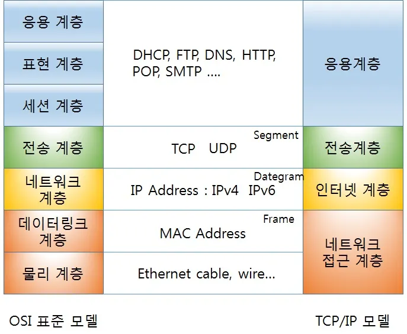
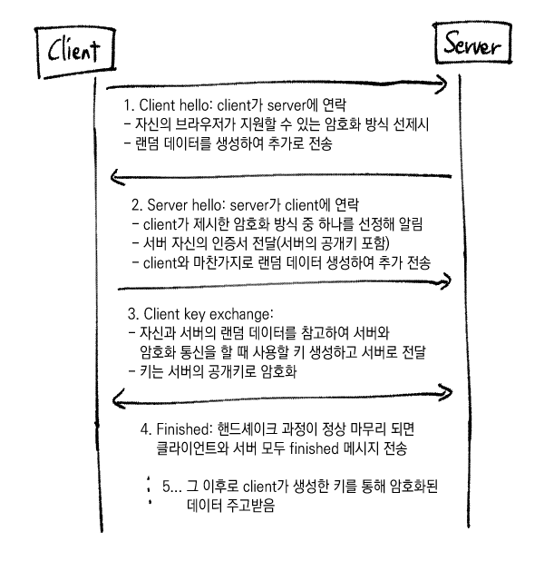

# TLS/SSL HandShake

## SSL/TLS란?

- OSI 7계층: 데이터 통신에 필요한 계층과 역할을 정확하게 정의
- TCP/IP 4계층: 인터넷에서 사용되는 프로토콜 중심 단순화

SSL/TLS는 보안 계층이란 독립적인 프로토콜 계층을 만들어 응용 계층(HTTP, FTP, SMTP 등) 과 전송 계층 사이에 끼워넣는 것. 이 보안 계층 위에 HTTP, FTP, SMTP 등을 얹으면 뒤에 S가 붙는 형식.

이 기술을 구현하기 위해 웹 서버에 설치하는 것이 SSL/TLS 인증서.

## SSL 인증서

Secure Sockets Layer

보안 소켓 계층 인증서=디지털 인증서로 브라우저와 서버 사이의 암호화된 연결을 수립하는 데 사용.

전달되는 모든 데이터는 암호화되고, 특정 유형의 사이버 공격도 차단 가능하다.

하지만 SSL은 옛날 방식이며, 요즘은 TLS가 표준이다. (SSL이라 하는 업체들은 사실상 TLS 암호화를 제공하고 있는 것.)

## TLS 인증서

SSL의 보안 취약점을 개선한 버전. 최신 인증서는 이걸 사용하지만 편의상 SSL 인증서라고 쭉 부른다.

## SSL/TLS 작동 방식
총 세 단계
1. SSL 핸드셰이크
    - TCP 기반이면 SSL 핸드셰이크 전에 3-way 핸드셰이크
    - 데이터를 주고받기 위해 어떤 방법을 사용해야 하는지 서로의 상태 파악
    - 데이터 무결성을 위해 데이터에 디지털 서명을 해 데이터가 조작됐는지를 확인.
2. 전송
    - 협상아 완료되면 SSL 세션이 생성되고 클라이언트가 서버가 원하는 데이터를 주고받음
3. 종료
    - 데이터 전송의 끝을 서로에게 알리며 세션 종료

## SSL/TLS HandShake

- 인증서에 서버 개인키로 서명>클라이언트가 공개키로 복호화해 확인(누가 보냈는지 인증, 데이터 변조 없음-무결성 보장)
- 비대칭키를 통해 생성한 대칭키를 전달, 이후 대칭키 방식으로 소통

## 참고 자료

- [[Network] TCP/IP 4계층에 대하여](https://velog.io/@dyunge_100/Network-TCPIP-4%EA%B3%84%EC%B8%B5%EC%97%90-%EB%8C%80%ED%95%98%EC%97%AC)
- [웹사이트 보안을 위한 방법, SSL이란?](https://blog.naver.com/skinfosec2000/222135874222)
- [TLS/SSL HandShake](https://gyoogle.dev/blog/computer-science/network/TLS%20HandShake.html)
- [SSL이란?, SSL과 TLS 정의 및 차이](https://kanoos-stu.tistory.com/46)
