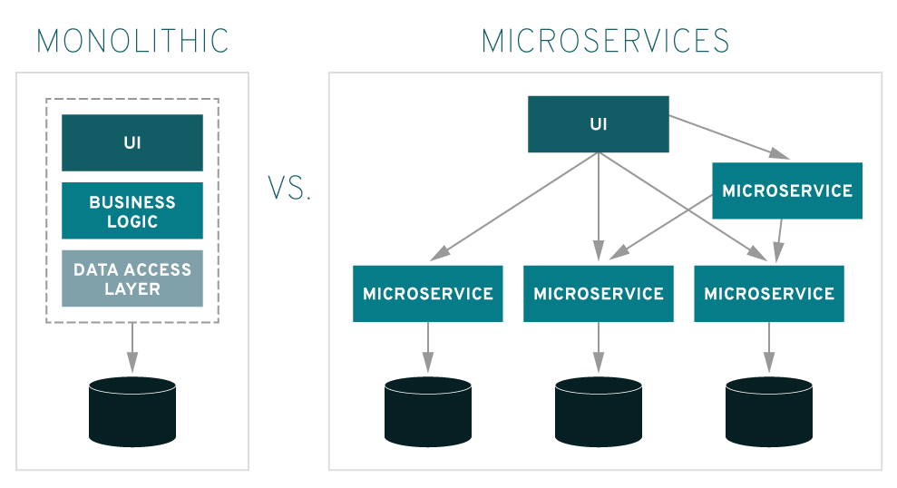

# 마이크로서비스 아키텍처 MSA

MSA가 도입되기 전엔 `모노리틱(Monolithic)` 아키텍처로 개발이 이루어짐.
- Monolithic: 한 덩어리

한 덩어리 구조에 맞게 모든 기능을 한 어플리케이션에서 운영 → 개발을 하거나 환경설정에 있어 간단함 → 작은 프로젝트에선 유리/큰 프로젝트에선 단점

- 수정 어려움: 여러 컴포넌트가 결합되어 수정이 어려움
- 빌드/테스트 시간 증가: 하나를 수정해도 시스템 전체를 빌드해야 함
- 작은 문제가 시스템 전체에 장애: 한 서비스에 트래픽이 몰려 서버가 다운되면 나머지 서비스도 이용 불가
- 확장성 불리: 서비스마다 이용률이 다른데 한 서비스 확장을 위해 전체를 확장해야 함
- 한 Framework와 언어에 종속적: 미리 선택한 프레임워크로만 모듈 작성이 가능

이런 단점을 극복하기 위해 기능(목적)별로 컴포넌트를 분리하여 구축하는 것이 Micro Service Architecture.

### 장점
각 컴포넌트가 `RPC 혹은 API를 통해서만` 다른 서비스와 통신, 모든 서비스는 각각 독립된 서버로 운영하고 배포하기 때문에 의존성이 없다.
> =실질적인 세부사항은 모두 추상화, API에 의해 철저하게 가려짐.

- 각각 개별의 서비스 개발을 빠르게 하며 유지보수도 쉽게 할 수 있도록 한다. (다른 부분 신경 안 써도 되니)
- 의존성이 없기 때문에 서비스 장애가 발생해도 다른 서비스엔 영향을 끼치지 않는다.
- 서비스별로 부분적인 수정, 확장, 배포가 가능하다.
- 각 서비스마다 필요한 기술을 각각 적용할 수 있다.

### 단점
- 서비스 별로 호출할 때 API로 통신하므로 속도가 느림
- 서비스 별로 통신에 맞는 데이터로 맞추는 과정 필요
- DB도 개별적으로 운영되어 트랜잭션으로 묶기 힘들다.
- 개발 환경과 실제 운영 환경을 동일하게 가져가는 게 어려워 통합 테스트가 어렵다.

## 참고 자료
- [마이크로서비스 아키텍처(MSA)](https://gyoogle.dev/blog/computer-science/software-engineering/MSA.html)
- [[MSA] MSA란 무엇인가? 개념 이해하기](https://wooaoe.tistory.com/57)