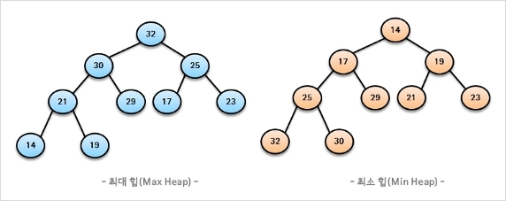

# 힙

우선순위 큐를 위해 만들어진 자료구조로, 완전 이진 트리의 일종.

우선순위 큐는 Array, Linked List, Heap으로 구현이 가능한데, 개중에서 Heap이 가장 효율적이다.

## 특징

- 여러 값 중 최대값과 최소값을 빠르게 찾아내도록 만들어졌다=반정렬 상태
- 중복값을 허용한다.

## 시간복잡도

_시간복잡도가 왜 이렇게 나오는지 추가 조사_

- 삽입: O(logn)
- 삭제: O(logn)

## 종류



- ### 최대 힙
  부모 노드의 키 값이 자식 노드의 키 값보다 크거나 같은 완전 이진 트리
- ### 최소 힙
  부모 노드의 키 값이 자식 노드의 키 값보다 작거나 같은 완전 이진 트리

## 구현

저장하는 표준적인 자료구조는 배열.

```
왼쪽 자식 index=부모 index*2
오른쪽 자식 index=부모 index*2+1
부모 index=자식 index/2
```

### 삽입

1. 힙에 새로운 요소가 들어오면 새로운 노드를 힙 마지막 노드에 삽입
2. 새로운 노드를 부모 노드들과 교환

### 삭제
