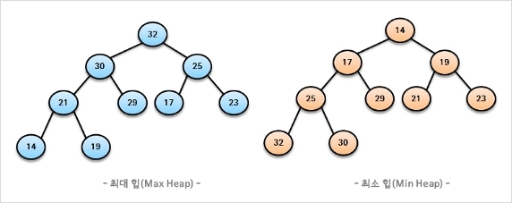

# 힙

우선순위 큐를 위해 만들어진 자료구조로, 완전 이진 트리의 일종.

우선순위 큐는 Array, Linked List, Heap으로 구현이 가능한데, 개중에서 Heap이 가장 효율적이다.

## 특징

- 여러 값 중 최대값과 최소값을 빠르게 찾아내도록 만들어졌다=반정렬 상태
- 중복값을 허용한다.

## 시간복잡도

삽입과 삭제 자체는 O(1)이지만, 정렬하는 과정으로 인해 시간 복잡도가 늘어난다.

완전 이진 트리로 필요 없는 과정을 반씩 쳐내기 때문에 요소 하나에 대한 시간 복잡도는 log n.

요소 n개에 대해 정렬을 하는 경우엔 시간 복잡도가 n log n.

- 삽입: O(log n)
- 삭제: O(log n)
- 정렬: O(n log n)

## 종류



- ### 최대 힙
  부모 노드의 키 값이 자식 노드의 키 값보다 크거나 같은 완전 이진 트리
- ### 최소 힙
  부모 노드의 키 값이 자식 노드의 키 값보다 작거나 같은 완전 이진 트리

## 구현

저장하는 표준적인 자료구조는 배열. index 0은 비우고 시작한다.

```
왼쪽 자식 index=부모 index*2
오른쪽 자식 index=부모 index*2+1
부모 index=자식 index/2
```

### 삽입

1. 힙에 새로운 요소가 들어오면 새로운 노드를 힙 마지막 노드에 삽입.
2. 부모 노드와 값을 비교해 적절한 위치로 교환.

### 삭제

1. 항상 root 노드 삭제. (최대힙은 최대값, 최소힙은 최소값)
2. 마지막 노드를 root 노드에 넣는다.
3. 자식 노드와 값을 비교해 적절한 위치로 교환.

## 참고자료

- [힙(Heap)](https://gyoogle.dev/blog/computer-science/data-structure/Heap.html)
- [[자료구조] 힙(heap) 자료구조](https://mjmjmj98.tistory.com/154)
- [힙[Heap], 삽입 및 삭제](https://johoonday.tistory.com/129)
