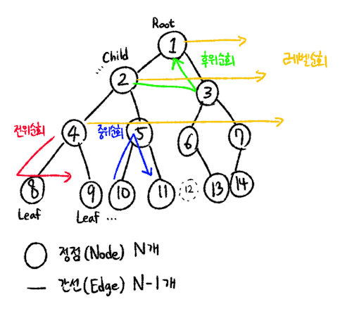

# 트리
값을 가진 Node와 노드를 연결하는 Edge로 이루어진 자료구조.

- Root: 최상위 노드
- Child: 상위 노드에 연결된 하위 노드
- Leaf: 가장 마지막 노드들

## 특징
- 사이클이 존재하지 않음.
- 모든 노드는 자료형으로 표현 가능. >무슨 소리?
- 루트에서 한 노드로 가는 경로는 유일함.
- 노드 개수가 N개면 간선은 N-1개.

## 트리 순회 방식 4가지

### 1. 전위 순회(pre-order)
각 루트를 깊이에 따라 순차적으로 방문. (부모>왼쪽 자식>오른쪽 자식)
> 1>2>4>8>9>5>10>11>3>6>13>7>14

### 2. 중위 순회(in-order)
왼쪽 하위 트리 방문 후 루트를 방문. (왼쪽 자식>부모>오른쪽 자식)
> 8>4>9>2>10>5>11>1>6>13>3>14>7

### 3. 후위 순회(post-order)
하위 트리를 모두 방문한 후 루트를 방문. (왼쪽 자식>오른쪽 자식>부모)
> 8>9>4>10>11>5>2>13>6>14>7>3>1

### 4. 레벨 순회(level-order)
루트부터 레벨별로 방문.
> 1>2>3>4>5>6>7>8>9>10>11>13>14

## 참고 자료
- [Tree](https://gyoogle.dev/blog/computer-science/data-structure/Tree.html)