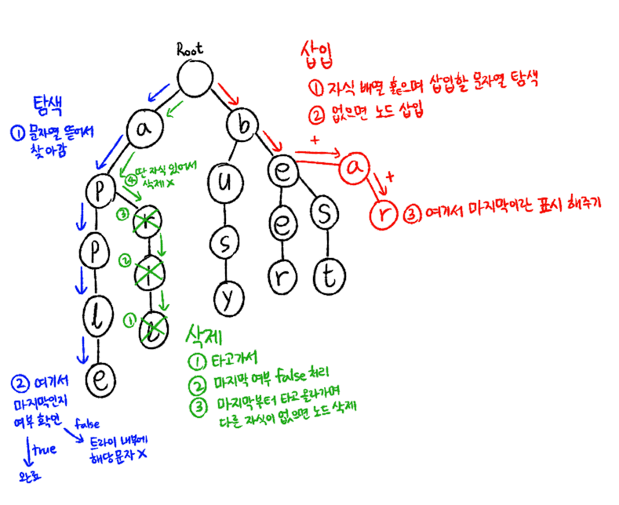

# 트라이

=래딕스 트리(radix tree)=접두사 트리(prefix tree)=탐색 트리(retrieval tree)<br>
트라이는 retrieval의 trie에서 나온 단어다.

**문자열**을 저장하고 빠르게 탐색하기 위한 **트리 형태**의 자료구조.

문자열이 ["apple", "april", "bus", "busy", "beer", "best"]처럼 저장되어 있다면 다음의 형식으로 트리를 이룬다.


### 사용처

- 자동완성 기능
- 사전 검색

## 특징

- 루트 노드
  - 루트 노드는 항상 비어있다.
  - 루트 노드의 자식 노드는 각 단어의 첫 글자들이다.
- 각 노드 구성
  - 각 노드의 자식 노드를 저장. => (단점) 저장 공간이 크다.
  - 해당 노드가 단어의 마지막인지 뜻하는 boolean값을 가진다.
- 문자열 검색 빠름
- 하나하나 비교해서 탐색하는 것보다 시간복잡도 측면에서 효율적.

## 시간복잡도

가장 긴 문자열의 길이 L, 총 문자열의 수를 M이라고 할 때
- 생성: O(M*L)
    - M개에 대해 넣으며, 가장 오래 걸리는 게 L이므로
- 탐색: O(L)
    - 가장 깊게 탐색하는 경우가 L까지 가는 것이므로



## 삽입 방법

1. 루트 노드부터 자식 노드를 담은 배열을 훑으며 삽입할 문자열을 한 문자씩 찾아본다.
   - 자식 노드에 삽입할 문자열의 문자가 있으면 타고 들어간다.
   - 없으면 추가한다.
2. 문자열의 마지막 문자가 되면 노드에 마지막 노드라는 표시를 한다. (위에서 말한 boolean)

## 탐색 방법

원하는 문자열을 문자별로 뜯어서 찾아 들어간다.

1. root node의 자식 중 b를 찾아 이동.
2. b의 자식 중 e를 찾아 이동.
3. e의 자식 중 s를 찾아 이동.
4. s의 자식 중 t를 찾아 이동.
5. t가 마지막인지 여부를 보고 true면 탐색 완료.
6. 마지막이 아닐 경우, 트라이 내부에 해당 문자가 없는 것으로 봄.

## 삭제 방법

1. 탐색 방법으로 삭제하려는 문자열의 마지막 노드로 이동.
2. 마지막 노드에서 마지막 여부를 false로 변경.
3. 마지막에서부터 노드를 타고 올라가며 자식이 없으면 노드를 삭제한다.
4. 자식이 있는 노드는 삭제하지 않고 종료.

## 구현
```java
//node 클래스
class Node{
  HashMap<Character, Node> child;
  boolean endOfWord;
  public Node(){
    this.child=new HashMap<>();
    this.endOfWord=false;
  }
}

//trie 클래스
class Trie{
  Node root;
  public Trie(){
    this.root=new Node();
  }

  public void insert(String s);
  boolean search(String s);
  public boolean delete(String s);
}

//삽입
public void insert(String s){
  Node node=this.root;
  for(int i=0;i<s.length;i++){
    char c=s.charAt(i);
    node.child.putIfAbsent(c,new Node());
    //있으면 node=node.child.get(s.charAt(i));
    //없으면 새로운 노드 생성해서 추가
    //해당 부분까지 하면 너무 길어져서 일단 생략
    node=node.child.get(c); //자식 노드 이동
  }
  node.endOfWord=true; //마지막 노드의 마지막 여부 true
}

//탐색
boolean search(String s){
  for(int i=0;i<s.length;i++){
    char c=str.charAt(i);
    if(node.chlid.containsKey(c)){
      //자식 노드에 c가 있을 때 계속 탐색 진행
      node=node.child.get(c);
    }else{
      return false;
    }
  }
  //마지막 노드 도달시
  return node.endOfWord; //마지막 노드의 마지막 여부 반환
}

//삭제
public boolean delete(String s){
  return delete(this.root, s, 0);
}
private boolean delete(Node node, String s, int idx){
  char c=s.charAt(idx);

  //자식노드에 c가 없으면
  if(!node.chlid.containsKey(c)) return false;

  Node cur=node.chlid.get(c);
  idx++;
  if(idx==s.length){ //문자열 끝에 도달
    if(!cur.endOfWord) return false;
    cur.endOfWord=false; //false 처리
    if(cur.chlid.isEmpty()){ //자식 없으면 지우기
      node.child.remove(c);
    }
  }else{ //문자열 끝이 아닐 때
    //재귀적으로 현재 노드부터 다시 호출
    if(!this.delete(cur,s,idx)) return false;
    //삭제 여부 true를 반환받고 자식 노드가 비었으면 현재 노드 삭제
    //node=부모, cur=현재 노드 | 현재 노드를 부모 노드에서 삭제
    if(!cur.endOfWord&&cur.child.isEmpty()){//다른 단어의 마지막 노드일 수도 있으니 체크
      node.child.remove(c);
    }
  }
  return true;
}
```


## 참고 자료

- [Trie 개념, 직접 구현하기](https://innovation123.tistory.com/116)
- [[자료구조] 트라이 (Trie)](https://velog.io/@kimdukbae/%EC%9E%90%EB%A3%8C%EA%B5%AC%EC%A1%B0-%ED%8A%B8%EB%9D%BC%EC%9D%B4-Trie)
