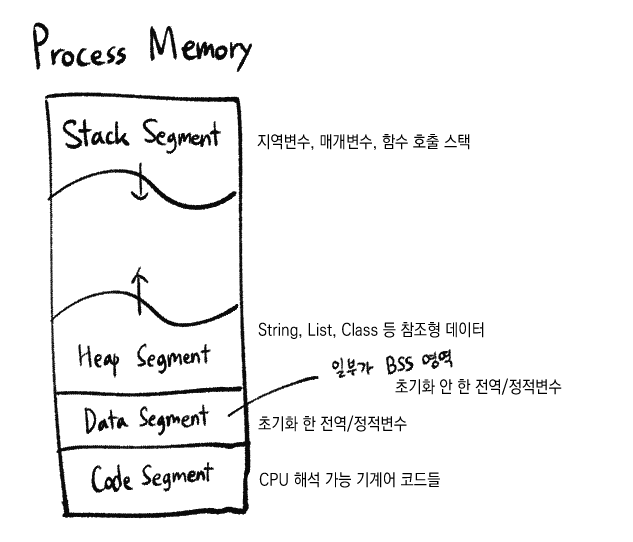
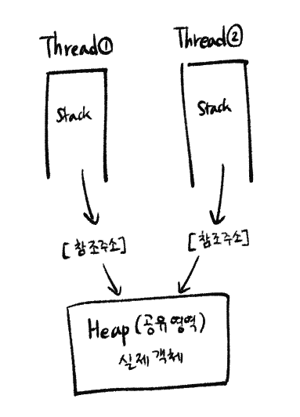

# 프로세스의 주소 공간

프로그램이 CPU에 의해 실행된 것을 프로세스라고 한다. 프로세스가 생성되면 메모리에 프로세스 주소 공간이 할당된다.

#### 요약
- Stack Segment: 함수, 지역 변수 저장
- Heap Segment: 참조형 데이터의 객체 저장
- Data Segment: 전역/정적 변수 저장
- Code Segment: 소스 코드 저장

### 구역이 나뉜 이유
- Code: 프로그램 자체에서 모두 같은 내용이기 때문에 따로 관리해 공유
- Stack, Heap~Data: 스택 구조의 특성과 전역 변수의 활용을 위해 (프로그램의 함수와 지역 변수는 LIFO 특성을 가진 스택에서 실행되므로 분리/전역 변수를 따로 지정해주면 메모리를 아낄 수 있음)

결국 데이터를 공유하여 메모리 사용량을 줄이기 위해서라 볼 수 있다.



## Stack 영역
`지역변수`와 `매개변수`가 저장되는 영역. 함수 호출과 함께 할당되며, 함수 호출이 완료되면 소멸한다.

메모리 높은 주소에서 낮은 주소의 방향으로 할당.

재귀 함수가 너무 깊게 호출되거나 함수가 지역변수를 너무 많이 가지고 있어 `Stack 영역을 초과하면 Stack Overflow 에러` 발생.


## Heap 영역
주로 참조형 데이터의 `실제 객체`가 할당되는 영역. 런타임에 크기가 동적으로 할당 및 해제된다.

메모리 낮은 주소에서 높은 주소의 방향으로 할당.

- 참조형 데이터?<br>
데이터 자체가 아니라 데이터가 저장된 주소를 저장하는 타입. Stack엔 이 주소가 저장되고, Heap엔 실제 객체가 저장된다. <br>
`ex) String, Array, Class, List, Object 등`

```java
Person p1 = new Person("Alice");
Person p2 = p1;
/*
new Person("Alice"): 실제 객체, Heap에 생성
p1: 위 객체의 주소, Stack에 저장
p2: 같은 주소값을 복사해 stack에 저장
*/
```


## Data 영역
`전역변수`나 `정적변수` 등 프로그램이 전체적으로 사용하거나 고정된 데이터를 저장하는 영역. 프로그램의 시작과 함께 할당되며, 프로그램이 종료되면 소멸한다.

단, 초기화 되지 않은 변수가 존재한다면 이는 BSS 영역에 저장된다.

## Code(Text) 영역
CPU가 해석 가능한 기계어 코드가 저장되어 있는 영역. 프로그램이 수정되면 안 되므로 ReadOnly 상태이다.

## 스레드의 공유
`스레드`의 경우 Heap, Data, Code 영역은 공유하지만 `Stack 영역은 따로 할당`받는다. (스레드 내에서 수행되는 함수의 흐름을 각각 관리하기 위해)

- Heap은 따로 갖지 않는가?
<br>
위와 같이 실제 객체는 공유하고 접근하는 Stack의 주소 값을 따로 가진다.