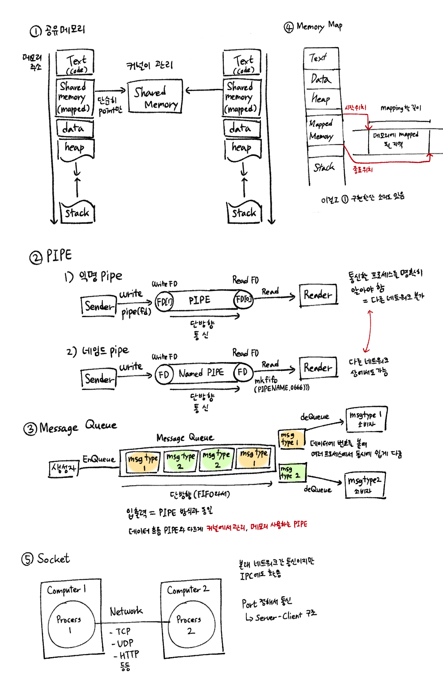

# IPC(Inter Process Communication)

> 스레드는 메모리 공간과 자원을 공유하기 때문에 통신이 쉽지만, 프로세스는 각각 별도의 자원을 할당받아 프로세스끼리 통신하기가 어렵다.  
> ㄴ> 통신을 위한 별도의 공간을 만들어주어야 함.

이런 독립적 구조를 가진 프로세스가 서로 통신해야 하는 상황이 있다. 이를 위해 커널 영역에서 IPC라는 내부 프로세스간 통신(Inter Process Communication)을 제공한다.

## 종류

### 1. 공유 메모리(Shared Memory)

프로세스가 공유 메모리 할당을 커널에 요청하면 커널은 해당 프로세스에 공유 메모리 공간을 할당한다. 이후 모든 프로세스는 해당 메모리 영역에 접근 가능. (read, write 모두 가능)

> 공유 메모리가 각 프로세스에게 첨부하는 방식으로 작동=여러 프로세스의 가상 주소 공간에 첨부=>프로세스는 공유 메모리를 자기 메모리 공간의 일부처럼 사용

- 대량의 정보를 다수의 프로세스에게 배포 가능
- 중개자 없이 바로 메모리에 접근 가능하기에 모든 IPC 중에서 가장 빠르게 작동
- 서로 동시에 쓰면 충돌이 날 수 있으니 동기화(뮤텍스, 세마포어) 필요

#### 뮤텍스(Mutex)

어떤 Critical Section을 한 번에 한 스레드/프로세스만 실행하도록 허용.

#### 세마포어(Semaphore)

개수를 기반으로 스레드/프로세스의 접근을 제어. 한 번에 count개 개만 실행하도록 허용. 
=count 1=mutex

### 2. PIPE

통신을 위해 메모리 공간(버퍼)를 생성해 프로세스가 데이터를 주고 받게끔 한다.

#### 1. 익명 파이프(Anonymous PIPE)

- FIFO 기반의 통신 채널을 만들어 통신.
- 통신할 프로세스를 명확히 아는 경우 사용 
  =다른 네트워크 간 통신 불가.
- 연결하는 두 프로세스에서 한 프로세스는 `Write only`, 나머지 프로세스는 `Read only`로 동작. (반이중 통신)
  - 때문에 전이중 통신을 하고 싶으면 2개의 파이프 필요. -> 구현 복잡

#### 2. 네임드 파이프(Named PIPE)

- 익명 파이프에서 확장된 개념. 다른 네트워크 상에서도 통신할 수 있는 파이프.
  - 어떻게 가능한가? 
    이건 `mkfifo`를 통해 생성하는데, 이것은 통신을 위해 이름이 있는 파일을 사용하기 때문.
- 읽기/쓰기 동시엔 불가. 전이중 통신을 위해선 익명 파이프처럼 2개 필요.

### 3. Message Queue

- FIFO의 자료구조를 가지는 통신설비로 커널에서 관리.
- 입출력 방식은 pipe와 동일.
- 하지만 파이프 같은 데이터 흐름이 아니라 메모리 공간 
  =데이터에 번호를 붙여 올려두어 여러 프로세스가 동시에 다룰 수 있음

#### 메모리에서 여러 프로세스가 동시 접근하는 건 공유 메모리랑 똑같은데?
데이터가 오가는 방식이 다름. 공유 메모리는 `직접 메모리에 접근`하는 것이고, 메시지 큐는 `커널에 접근하는 메시지를 보내 접근`함.

전자는 충돌 방지를 위해 동기화 처리를 해야 하고, 후자는 자동으로 순서가 보장되지만 비교적 느림.

### 4. 메모리 맵
- 무엇이든 주소 공간에 연결하는 기술적 틀. 공유 메모리처럼 메모리 공유 가능.
- 차이점이 있다면 단순 값을 저장하는 게 아니라 열린 파일을 메모리에 Mapping 시킨다. (공유 매개체가 파일+메모리)
- 대용량 데이터를 공유해야 할 때 사용.

#### 공유 메모리가 메모리 맵의 하위 개념이다?
무엇이든 주소 공간에 연결하는 기술적 틀이기 때문에 이걸 통해 공유 메모리를 구현하기도 한다. 실제 리눅스/UNIX 내부 구조와 공식 매뉴얼에서 확인할 수 있다고 하지만 이것까지 알아볼 순 없음+면접에서 무조건 안 나옴이라 체크까진 안 함.

### 5. 소켓
- 클라이언트와 서버가 네트워크 소켓 통신을 통해 데이터 공유.
- 소통할 포트를 정해놓고 원격에서 데이터를 공유할 때 사용.

### + RPC(Remote Procedure Call)
IPC의 일종으로 볼 수도 있지만, 운영체제 수준-저수준 IPC와 계층이 다르다. (IPC 위에서 동작하는, 어플리케이션 수준-고수준 통신 프로토콜)

즉, RPC는 소켓 기반 IPC를 편하게 쓰기 위한 추상화 계층이지 IPC 자체는 아님.

#### 그래서 RPC가 뭐임?
분산 네트워크 망에서 많이 사용되는 방식. 별도의 원격 제어 코딩 없이 다른 주소 공간에서 함수나 프로시저(명령 단위가 수행하는 절차)를 실행할 수 있게 하는 프로세스 간 통신 기술. 
= 함수 또는 프로시저가 로컬에 있든 원격에 있든 상관 없이 동일한 기능 수행

## 참고 자료

- [IPC(Inter Process Communication)](https://gyoogle.dev/blog/computer-science/operating-system/IPC.html)
- [[OS] 프로세스 간 통신에 사용되는 IPC(Inter Process Communication)의 종류](https://rlaehddnd0422.tistory.com/241)
- [[운영체제] IPC 프로세스간 통신](https://heeonii.tistory.com/13)
- [[OS]프로세스 간 통신 방법(Inter Process Communication, IPC)](https://dar0m.tistory.com/233)
- [IPC(Inter-Process Communication)와 RPC(Remote Procedure Call)](https://organizingdata.tistory.com/141#google_vignette)