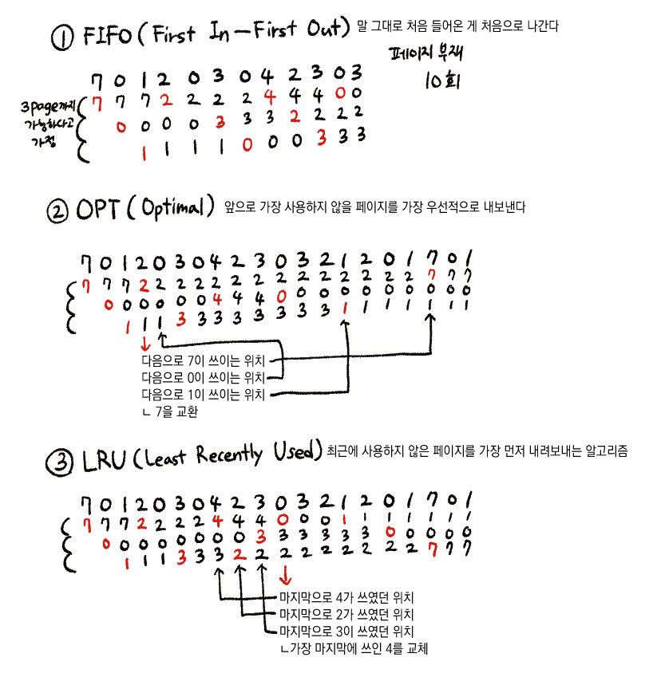

# 페이지 교체 알고리즘
페이지 부재가 발생하면 새로운 페이지를 할당해야 하는데 `현재 할당된 페이지 중 어떤 것을 교체할지 결정`하는 방법을 말한다.

#### 왜 교체하는가?
가상 메모리는 요구 페이지 기법을 통해 필요 페이지만 메모리에 적재하고 사용하지 않는 부분은 그대로 둔다. 하지만 필요 페이지만 올려도 메모리는 가득 차게 되기 때문에 **올라와 있던 페이지 중 사용이 다 된 것들은 out하고 그 자리에 현재 필요한 페이지를 in** 시킨다.

이 때, 기왕이면 수정이 되지 않는 페이지를 out 시키는 게 좋다. (수정되면 메인 메모리에서 내보낼 때 하드 디스크에서 또 수정을 진행해야 하므로 시간이 걸림)

(+out 되는 페이지를 victim page라고 함)

## Page Reference String
CPU는 논리 주소를 통해 특정 주소를 요구한다. 메인 메모리에 올라와 있는 주소들은 페이지 단위로 가져온다. 여기서 이미 올라와있는 페이지를 요구하면 페이지 결함이 발생하지 않는다.

페이지 결함이 일어나지 않는 부분은 생략하여 표시하는 방법이 `Page Reference String`

### 1. FIFO 알고리즘(First in First out)
가장 먼저 메모리에 올라온 페이지를 out 시키는 알고리즘.
- 가장 간단함
- 초기화 코드에 적절함
#### 초기화 코드?
처음 프로세스가 실행될 때 최초 초기화를 시키는 역할만 진행하고 다른 역할은 수행하지 않으므로 메인 메모리에서 빼도 괜찮은 코드.

하지만 처음 실행할 땐 반드시 필요하므로 FIFO 알고리즘을 통해 초기화 후 가장 먼저 내보내면 좋다.

### 2. OPT 알고리즘(Optimal)
앞으로 사용하지 않을 페이지를 우선적으로 내보내는 알고리즘. FIFO에 비해 페이지 결함 횟수를 많이 감소시킬 수 있다.

하지만 페이지가 앞으로 많이 사용되지 않으리란 보장은 없기에 수행하기 어렵다.

### 3. LRU 알고리즘(Lease Recently Used)
최근에 사용하지 않은 페이지를 가장 먼저 내보내는 알고리즘.

최근에 사용하지 않았으면 나중에도 사용하지 않을 것이란 아이디어에서 나왔다. OPT는 미래 예측이지만, LRU는 과고를 보고 판단하므로 실질적 사용이 가능하다.

(확언까진 못하지만 최근에 사용하지 않은 페이지는 앞으로도 사용하지 않을 확률이 높음)

OPT보단 페이지 결함이 더 일어나지만, 실제로 사용 가능한 것 중에선 가장 좋은 방법이다.

## 교체 방식
- Global 교체
    메모리 상의 모든 프로세스 페이지에 대해 교체하는 방식
- Local 교체
    메모리 상의 자기 프로세스 페이지에서만 교체하는 방식

다중 프로그래밍의 경우 메인 메모리에 다양한 프로세스가 동시에 올라올 수 있다. -> 다양한 프로세스 페이지가 메모리애 존재.

페이지 교체 시 다양한 페이지 교체 알고리즘을 통해 victim page를 선정하는데 선정 기준을 **global**로 하느냐 **local**로 하느냐의 차이가 있다.

> 실제론 전체를 기준으로 페이지를 교체하는 게 효율적. 
> 왜?: 자기 프로세스 페이지에서만 교체를 하면 교체가 필요할 때 각각 모두 교체를 진행해야 하므로 비효율적임.