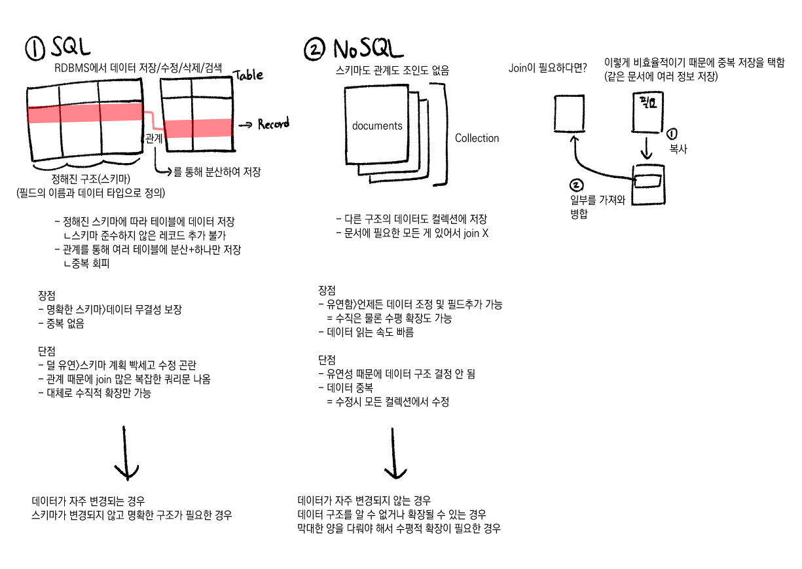

# SQL과 NOSQL

## SQL(관계형 DB)
SQL을 사용하면 RDBMS에서 데이터를 저장/수정/삭제/검색할 수 있다.

특징
- 데이터는 정해진 데이터 스키마에 따라 테이블에 저장
    - 스키마 준수하지 않은 레코드 추가 불가
    - 추가하려면 스키마 수정
- 데이터는 관계를 통해 여러 테이블에 분산
    - 중복 회피

데이터가 테이블에 레코드로 저장되는데 각 테이블마다 명확하게 정의된 구조가 있음.
> 해당 구조는 필드의 이름과 데이터 유형으로 정의.

하나의 테이블에서 중복 없이 하나의 데이터만을 관리하기 때문에 다른 테이블에서 부정확한 데이터를 다룰 위험이 없어짐.

## NoSQL(비관계형 DB)
관계형 DB의 반대, 스키마도 관계도 없음.

- 레코드: 문서(doucments)에 대응. Json과 비슷한 형태.
- 테이블: 같진 않지만 `컬렉션`에 대응. 문서가 담김.

특징
- 다른 구조의 데이터를 같은 컬렉션에 추가 가능.
    - 예시: orders, users, products 테이블로 나누는 것을 NoSQL에선 Orders 컬렉션에서 한번에 관리.
- 필요한 모든 걸 갖춘 문서를 작성하기에 조인 개념 X.
    > 조인하고 싶을 땐 데이터를 복제하여 각 컬렉션 일부분에 속하는 데이터를 산출하도록 한다. 
    > -> 이러면 데이터가 중복되어 서로 영향을 줄 수 있다. 하여 조인을 잘 하지 않는다.  
    > 자주 변경되는 데이터엔 부적합, 자주 변경되지 않는 데이터엔 효율적.

## 확장 개념
두 DB를 비교할 땐 `Scaling` 개념도 존재.
- 수직적 확장: 단순히 DB의 성능을 향상시키는 것
- 수평적 확장: 더 많은 서버가 추가되고 데이터베이스가 전체적으로 분산 (여러 호스트에서 한 DB가 작동)

SQL DB는 일반적으로 수직적 확장만 지원한다. 수평적 확장은 NoSQL에서 가능.
- 왜?

    SQL은 여러 서버에 나뉘면 join이나 트랜잭션 일관성 처리가 어려움.

    NoSQL은 유연하고 비정규화된 구조로 인해 서로 독립적이라 분할 저장해도 됨.

## 장단점
### SQL
- 장점
    - 명확하게 정의된 스키마->데이터 무결성 보장.
    - 각 데이터를 중복없이 한번만 저장.
- 단점
    - 덜 유연. 데이터 스키마를 사전에 계획하고 알려야 함. 수정 힘듦.
    - 관계를 맺고 있어 조인문이 많은 복잡한 쿼리가 만들어질 수 있음.
    - 대체로 수직적 확장만 가능.
### NoSQL
- 장점
    - 유연함. 언제든 데이터를 조정하고 새 필드 추가 가능.
    - 필요한 형식대로 저장되어 데이터 읽는 속도가 빠름.
    - 수직 및 수평 확장이 가능해 앱에서 발생하는 모든 읽기/쓰기 요청 처리 가능.
- 단점
    - 유연성으로 인해 데이터 구조 결정이 안 될 수 있음.
    - 데이터가 여러 컬렉션에 중복되어 있기 때문에 수정시 모든 컬렉션에서 수행해야 함. (SQL은 중복 데이터가 없으니 한번만 하면 됨)

### SQL이 더 좋은 경우
- 관계를 맺는 데이터가 자주 변경되는 경우
- 스키마가 변경될 여지가 없고, 사용자와 데이터에게 중요한 경우

### NoSQL이 더 좋은 경우
- 데이터 구조를 알 수 없거나 변경/확장될 수 있는 경우
- 자주 읽으며, 변경이 잦지 않은 경우
- 데이터베이스를 수평으로 확장해야 하는 경우(막대한 양의 데이터를 다뤄야 하는 경우)

※ 반드시 그렇다는 건 아님. 설계를 잘해서 피할 수도 있고, 중복 데이터를 줄이는 방법을 찾을 수도 있음.

# 문제
1. 다음 중 SQL(관계형 데이터베이스) 의 특징으로 옳지 않은 것은 무엇인가?

A. 데이터는 미리 정의된 스키마에 따라 저장된다. 
B. 데이터 간 관계를 JOIN을 통해 연결할 수 있다. 
C. 각 레코드는 고정된 구조를 가지며, 컬럼의 추가나 변경이 쉽다.

정답:C 
SQL은 스키마가 고정되어 있으므로 컬럼 추가나 구조 변경이 상대적으로 어려움. 유연성보단 일관성과 구조적 안정성을 중시.

2. 다음 중 NoSQL 데이터베이스의 일반적인 특징으로 가장 적절한 것은 무엇인가?

A. 스키마가 고정되어 있으며, JOIN 연산이 필수적이다. 
B. 대량의 비정형 데이터를 처리하기 적합하다. 
C. 트랜잭션 일관성을 보장하지만 수평 확장은 불가능하다. 
D. 모든 NoSQL DB는 문서(document) 기반으로 동작한다.

정답:B 
NoSQL은 수평적 확장이 가능, 비정형(혹은 반정형) 데이터에 적합한 특성 때문에 대량의 비정형 데이터 처리에 적합.

D는? 
NoSQL의 유형에는 문서형(MongoDB), key-value형(Redis), 컬럼형(Cassandra), 그래프형(Neo4j) 등 다양한 유형이 있음.
