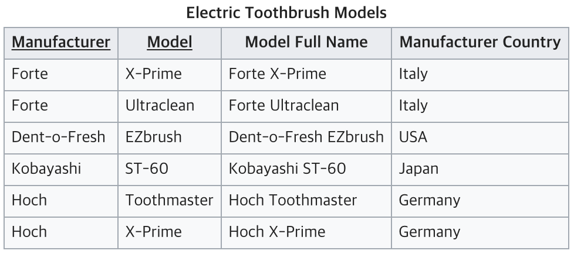
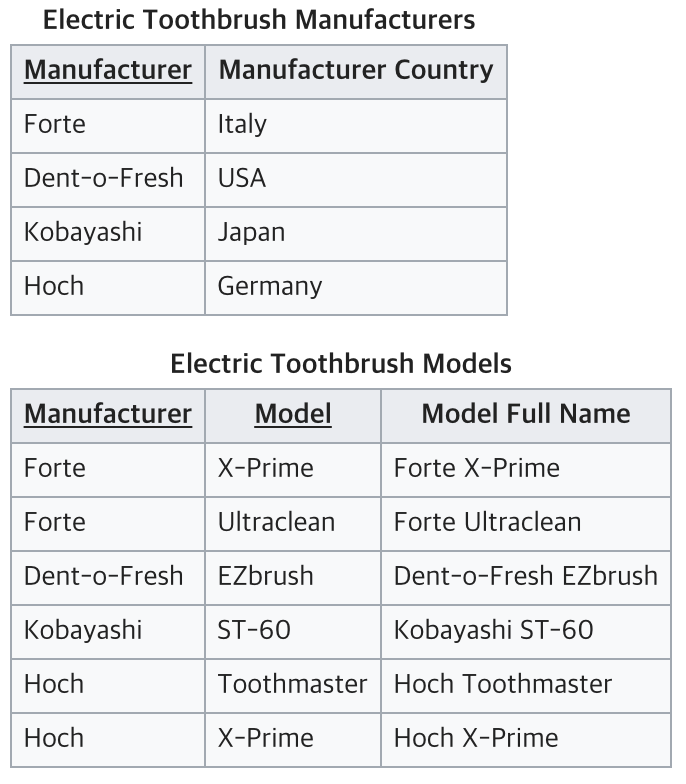
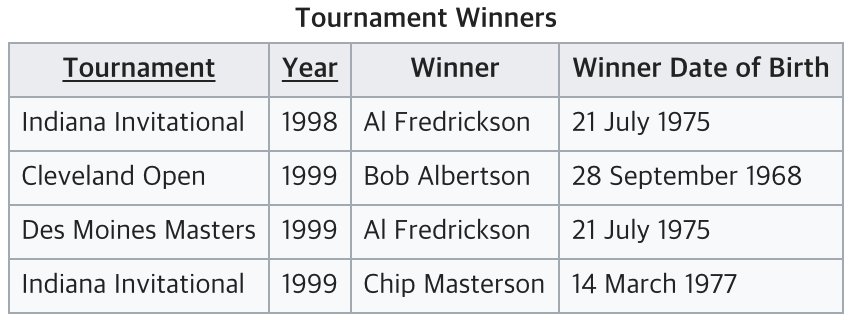
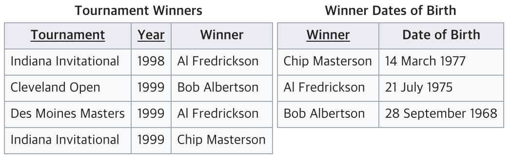

# 정규화 Normalization

테이블 간 중복된 데이터를 허용하지 않는 것.

중복된 데이터를 만들지 않으면 무결성을 유지할 수 있고, DB 저장 용량 또한 효율적으로 관리 가능.

## 목적

- 데이터의 중복을 없애면서 불필요한 데이터를 최소화
- 무결성을 지키고, 이상을 방지
- 테이블 구성을 논리적으로 직관적으로 가능
- 데이터베이스 구조 확장에 용이해짐

정규화엔 여러 단계가 있지만 보통 1~3단계까지 진행

## 1. 제1정규화 (1NF)

table column이 원자값(값 1개)만 갖도록 테이블을 분리시키는 것.

- 어떤 릴레이션에 속한 모든 도메인이 원자값만으로 되어 있어야 함.
- 모든 속성에 반복되는 그룹이 나타나지 않아야 함.
- 기본키를 사용해 관련 데이터의 각 집합을 고유하게 식별 가능해야 함.

<table>
  <tr>
  <th>Customer ID</th>
  <th>First Name</th>
  <th>Surname</th>
  <th>Phone Num</th>
  </tr>
  <tr>
  <td>123</td>
  <td>Park</td>
  <td>sy</td>
  <td>010-5884-0056, 010-6345-0056</td>
  </tr>
  <tr>
  <td>456</td>
  <td>Yu</td>
  <td>jh</td>
  <td>010-1234-1234, 02-2345-2345</td>
  </tr>
  <td>789</td>
  <td>Im</td>
  <td>gs</td>
  <td>010-1234-1234, 02-2345-2345</td>
  </tr>
</table>

전하번호를 여러 개 가지고 있어서 원자값이 아닌 테이블. 1NF에 맞추면 다음과 같음.

<table>
  <tr>
  <th>Customer ID</th>
  <th>First Name</th>
  <th>Surname</th>
  <th>Phone Num</th>
  </tr>
  <tr>
  <td>123</td>
  <td>Park</td>
  <td>sy</td>
  <td>010-5884-0056</td>
  </tr>
  <tr>
  <td>123</td>
  <td>Park</td>
  <td>sy</td>
  <td>010-6345-0056</td>
  </tr>
  <tr>
  <td>456</td>
  <td>Yu</td>
  <td>jh</td>
  <td>010-1234-1234</td>
  </tr>
  <tr>
  <td>456</td>
  <td>Yu</td>
  <td>jh</td>
  <td>02-2345-2345</td>
  </tr>
  <tr>
  <td>789</td>
  <td>Im</td>
  <td>gs</td>
  <td>010-1234-1234</td>
  </tr>
  <tr>
  <td>789</td>
  <td>Im</td>
  <td>gs</td>
  <td>02-2345-2345</td>
  </tr>
</table>

## 2. 제2정규화 (2NF)

테이블의 모든 칼럼이 완전 함수적 종속을 만족.

= 테이블에서 기본키가 복합키(키1, 키2)로 묶여있을 때, 두 키 중 하나의 키만으로 다른 칼럼을 결정지을 수 있으면 안 됨.

= 기본키의 부분집합 키가 결정자가 되어선 안 됨.

Manufacturer, Model: Primary key 
이를 보고 Model Full Name 확인 가능

근데 Manufacturer Country는 Manufacturer만 봐도 확인 가능. (부분 함수 종속) 
=Model과 Manufacturer은 연관 관계가 없음.

이 경우 함수적 충족이 되지 않아 테이블을 나눠야 한다.

## 3. 제3정규화 (3NF)

2NF가 진행된 테이블에서 이행적 종속을 없애기 위해 테이블을 분리하는 것.

제2정규화가 관련없는 기본키에 값이 묶여있는 걸 방지하기 위함이라면 제3정규화는 기본키로 결정하는 기본키 외의 값에 다른 값이 묶이는 걸 방지하는 것.

Tournament, Year: Primary key 
이를 보고 Winner 확인 가능

근데 Winner Date of Birth는 Winner를 보면 확인 가능. (이행적 종속) 
=Winner Date of Birth는 기본키 자체와 연관 관계가 없음.

이 경우도 기본키를 새로 잡아 테이블을 나눠야 한다.

## + BNF?
