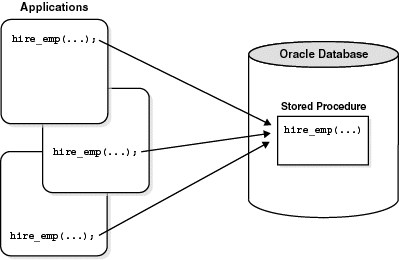

# 저장 프로시저(stored procedure)

> 일련의 쿼리를 하나의 함수처럼 실행하기 위한 쿼리문의 집합=특정 로직의 쿼리를 함수로 만들어 놓은 것

함수와의 차이

- 저장 프로시저:
  - 일련의 작업을 처리한 절차, 리턴값이 없거나 많을 수 있음.
  - 서버에서 실행되기 때문에 속도 빠름.
- 함수:
  - 여러 작업을 위한 기능, 리턴값이 필수.
  - 클라이언트에서 실행되기 때문에 프로시저보다 느림.

데이터베이스에서 SQL을 통해 작업하다보면 한 쿼리문으로 원하는 결과를 얻을 수 없는 상황 발생.

원하는 결과물을 얻기 위해 사용할 여러 줄의 쿼리문을 한 번의 요청으로 실행하면 좋지 않은가?<br>
인자 값만 상황에 따라 바뀌고 동일한 로직의 복잡한 쿼리문을 필요할 때마다 작성한다면 비효율적이지 않을까?

=> 이럴 때 프로시저 사용

프로시저를 만들어두면 애플리케이션에서 여러 상황에 따라 해당 쿼리문이 필요할 때 인자 값만 전달하여 쉽게 원하는 결과물을 받아낼 수 있음.

## 생성 및 호출

```sql
create or replace procedure 프로시저명(
  변수명1 in 데이터타입,
  변수명2 out 데이터타입
) --필수 x
is[
  변수명1 데이터타입;
  변수명2 데이터타입;
  ...
]
begin
  필요한 기능; --인자값 활용 가능
end;

exec 프로시저명; --호출
```

### 예시(in)

```sql
create or replace procedure test(name in varchar2)
is
  msg varchar2(5):="내 이름은";
begin dbms_output.put_line(msg||' '||name);
end;

exec test('승연');
```

```
내 이름은 승연
```

### 예시2

```sql
create or replace procedure test(name out varchar2)
is
begin
  name:='승연'
end;

declare
out_name varchar2(100)

begin
test(out_name);
dbms_output.put_lin('내 이름은'||out_name);
end;
```

```
내 이름은 승연
```

## 장단점

### 장점

#### 1. 최적화&캐시

최초 실행 시 최적화 상태로 컴파일 되며, 이후 프로시저 캐시에 저장.

만약 해당 프로세스가 여러번 사용되면 다시 컴파일 작업을 거치지 않고 캐시에서 가져오게 됨.

#### 2. 유지보수

작업이 변경될 때 다른 작업은 건드리지 않고 프로시저 내부에서 수정만 하면 됨. (단점이기도 함)

#### 3. 트래픽 감소

클라이언트가 직접 SQL문을 작성하지 않고 프로시저명에 매개변수만 담아 전달하면 됨. 즉, SQL문이 서버에 이미 저장되어 있기 때문에 클라이언트와 서버 간 네트워크 상 트래픽이 감소.

#### 4. 보안

프로시저 내에서 참조 중인 테이블의 접근을 막을 수 있음.

### 단점

#### 1. 호환성

구문 규칙이 SQL/PSM 표준과의 호환성이 낮기 때문에 코드 자산으로의 재사용성이 나쁨.

#### 2. 성능

문자 또는 숫자 연산에서 프로그래밍 언어인 C나 JAVA보다 성능이 느림.

#### 3. 디버깅

에러가 발생했을 때, 어디서 잘못됐는지 디버깅 하는 것이 힘들 수 있음.
