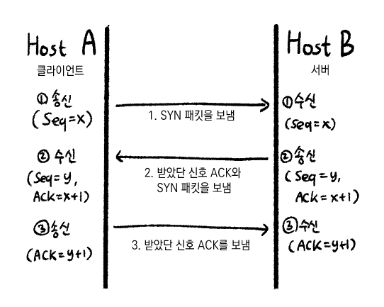
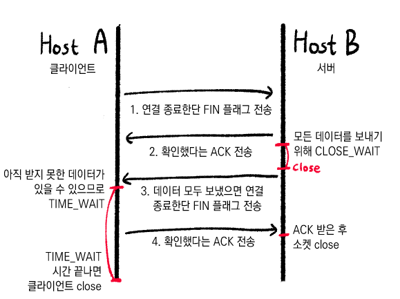

# TCP 3&4 way handshake

## TCP Flag

세션 연결/해제, 데이터 전송/거부, 세선 종료 등의 기능이 패킷 Flag 값에 따라 달라진다. 이런 다양한 종류의 패킷을 통해 통신을 좀 더 수월하게 한다.

> URG | ACK | PSH | RST | SYN | FIN

각각 1비트로 TCP 세그먼트 필드 안에 Control Bit 또는 Flag Bit로 정의되어 있다.

- SYN(Synchronization 동기화): 연결 요청
- ACK(Acknowledgement): 응답
- RST(Reset): 재 연결 종료
  - 재설정을 하는 과정이며 양방향에서 동시에 일어나는 중단 작업.
- PSH(Push): 밀어 넣기
  - 받은 데이터를 즉시 목적지인 OSI 7계층 Application 계층으로 전송하도록 하는 Flag.
  - 상호작용이 중요한 프로토콜에서 사용.
- URG(Urgent): 긴급 데이터
  - 전송하는 데이터 중 긴급히 전달해야 할 내용이 있을 경우 사용하는 Urgent Pointer가 유효한지 표시.
- FIN(Finish): 연결 종료 요청

## 3 way handshake

TCP는 정확한 전송을 보장해야 하기 때문에 상대와 사전에 세션을 수립한다.

이 네트워크 연결을 설정하는 과정을 3-way handshake라고 한다.

1. 클라이언트가 서버에게 SYN 패킷을 보냄
2. 서버가 SYN을 받고 클라이언트로 받았다는 응답 ACK와 SYN 패킷을 보냄
3. 클라이언트가 ACK와 SYN을 받고 서버로 ACK를 보냄

## 4 way handshake

모든 통신이 끝나 연결을 해제하는 과정을 4-way handshake라고 한다.

1. 클라이언트가 서버에게 FIN 패킷을 보냄
2. 서버가 FIN을 받고 확인했다는 ACK를 클라이언트에 보냄 (여기서 모든 데이터를 보내기 위해 close wait 상태가 됨)
3. 서버가 데이터를 모두 보냈다면 연결이 종료되었단 FIN 패킷을 보냄
4. 클라이언트는 FIN을 받고 확인했단 ACK를 서버에 보냄 (아직 받지 못한 데이터가 있을 수 있으므로 time wait 상태가 됨)

- 서버는 ACK를 받은 이후 소켓 close
- 클라이언트는 time wait 시간이 끝나면 close

## 추가

TCP는 연결형이며 전송의 신뢰를 보장해야 하기 때문에 3-way handshaking 과정을 거침.

UDP는 비연결형이며 정확도보다 빠른 전송을 중요시하기에 3-way handshaking 과정을 거치지 않음.

## 참고 자료

- [TCP Flag란?](https://skstp35.tistory.com/250)
- [TCP/UDP와 3-Way Handshake & 4-Way Handshake](https://velog.io/@averycode/%EB%84%A4%ED%8A%B8%EC%9B%8C%ED%81%AC-TCPUDP%EC%99%80-3-Way-Handshake4-Way-Handshake)
- [[TCP] 3 way handshake & 4 way handshake](https://gyoogle.dev/blog/computer-science/network/TCP%203%20way%20handshake%20&%204%20way%20handshake.html)
