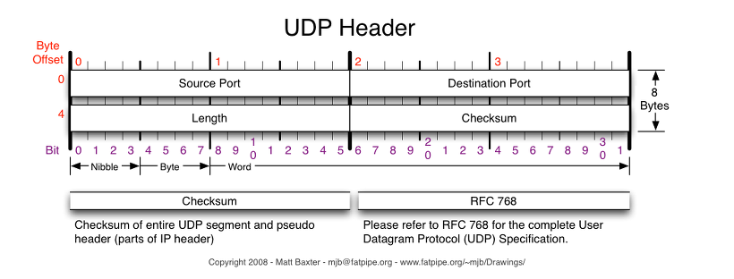

# UDP
## UDP란?
- User Datagram Protocol의 약자. 데이터를 데이터그램 단위로 처리하는 프로토콜.
- 비연결성, 신뢰성 없는 전송 프로토콜.
- 데이터그램 단위로 쪼개면서 전송해야 하기 때문에 전송 계층.

## TCP와 UDP의 등장 배경
1. IP(3, 네트워크 계층)의 역할은 host to host만 지원. 한 장비 안에서 많은 프로그램이 통신할 경우 IP론 한계가 있음.
2. IP에서 오류가 발생하면 ICMP에서 알려주지만 알려주기만 하고 대처를 못해서 IP보다 위(4~, 전송)에서 처리를 해야 함.

1번을 해결하기 위해 포트 번호 등장, 2번을 해결하기 위해 상위 프로토콜인 TCP, UDP 등장.

## TCP와 UDP의 오류 해결법
- TCP
    - 데이터 분실, 중복, 순서 변경을 자동으로 보정하여 송수신 데이터가 정확하게 전달되도록 해줌
- UDP
    - IP가 제공하는 정도만 제공. TCP와 다르게 에러가 날 수 있고, 재전송이나 순서가 뒤바뀔 수도 있다. > 어플리케이션에서 처리.

## UDP를 왜 쓰는가?
- 데이터 처리가 TCP보다 빠름
- 실시간 방송, 온라인 게임에서 활용

응용 계층 프로토콜은 반드시 TCP, UDP 중 하나의 전송 계층 프로토콜을 사용해야 한다. 
DNS(Domain Name Service, 응용 계층 프로토콜)에서 UDP를 사용하는 이유
- request 양이 작아 UDP request에 담길 수 있다
- 3way handshaking으로 연결을 유지할 필요가 없다(유지하면 오버헤드 생김)
- request에 대한 손실을 응용 계층에서 제어가 가능
- 근데 가끔 데이터 크기가 512 bytes를 넘거나 응답을 못받은 경우 TCP로 처리

## UDP Header

- Source port: 시작 포트
- Destination port: 도착지 포트
- length: 길이
- checksum: 오류 검출

## 참고 자료
- [UDP](https://gyoogle.dev/blog/computer-science/network/UDP.html)